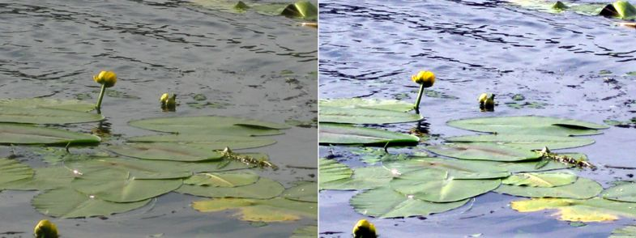

# Автоматическая коррекция и Лаборатория настройки изображения

### Автоматическая коррекция изображения

Наверно каждому из нас хотелось бы, чтобы коррекцию изображения можно было выполнить за один шаг, а не тратить огромное количество времени и сил на исправление дефектов. К счастью такой инструмент есть. Хотя естественно, полагаться на него во всем не нужно, он не избавит вас от необходимости ручной коррекции изображения, однако в некоторых случаях этого оказывается достаточно, чтобы «исправить» изображение должным образом. Поэтому не стоит полностью игнорировать возможности автоматической тоновой коррекции. Во всяком случае, перед началом коррекции изображения имеет смысл сначала попробовать воспользоваться автоматическими средствами.

**Для автоматической коррекции изображения:**

1\. Откройте изображение.  
2\. Выполните команду **Adjust > Auto Adjust** (Настройка > Автонастройка).

Эта команда не вызывает диалоговых окон и не имеет настроек. Коррекция происходит автоматически и вы сразу же получаете результат коррекции.  
Фильтр **Auto Adjust** (Автонастройка) выравнивает тени, промежуточные и светлые тона изображения, автоматически перераспределяя значения пикселей внутри тонового диапазона. Эта настройка выполняется в каждом цветовом канале изображения, приводя к изменениям цвета и тона изображения. Пример использования _Автонастройки_ приведен на рис. 1.

### Лаборатория настройки изображения

В Corel Photo-Paint имеется средство для исправления типичных проблем изображения, присущих цифровым фотографиям, полученным с помощью фотоаппарата или камеры. В ранних версиях Photo-Paint, для исправления тех или иных дефектов, приходилось использовать несколько фильтров. Начиная с Corel Photo-Paint Х3, в состав программы была включена **Image Adjustment Lab** (Лаборатория по корректировке изображений). Идея создания этой лаборатории заключалась в том, чтобы свести все наиболее часто используемые при коррекции фильтры, в один инструмент. Это позволило экономить силы, время и нервы при цветовой и тональной коррекции фотографий. Чтобы получить доступ к средствам лаборатории выполните команду **Adjust > Image Adjustment Lab** (Настройка > Лаборатория по корректировке изображений). Когда Вы впервые откроете диалоговое окно с изменяемыми размерами (рис. 2), Вы обратите внимание, что он включает рабочую область предварительного просмотра слева, регулирующие ползунки справа и ряд кнопок на панели вверху.

Если у вас есть опыт в работе с другими диалоговыми окнами фильтров в Photo-Paint, использование элементов предварительного просмотра и кнопок панели верхней части окна (рис. 3) в Лаборатории по корректировке изображений будет вам знакомо.

1\. Кнопка **Rotates image 90 degrees counterclockwise** (Поворот изображения на 90 градусов против часовой стрелки) – служит для поворота изображения на 90 градусов против часовой стрелки в окне предварительного просмотра.  
2\. Кнопка **Rotates image 90 degrees clockwise** (Поворот изображения на 90 градусов по часовой стрелке) – служит для поворота изображения на 90 градусов против часовой стрелки в окне предварительного просмотра.  
3\. Кнопка **Pan tool** (Панорама) – активирует инструмент Панорама, для прокрутки и масштабирования изображения в окне предварительного просмотра. Чтобы увеличить масштаб, щелкните девой кнопкой мыши и правой, чтобы уменьшить. Удерживайте нажатой левую кнопку мыши при перетаскивании, для панорамирования непосредственно в области предварительного просмотра.  
4\. Кнопка **Zoom in** (Крупнее) – активирует инструмент Крупнее, по сути тот же инструмент Масштаб. При щелчке левой кнопкой мыши – масштаб увеличивается, при щелчке правой– уменьшается.  
5\. Кнопка **Zoom out** (Мельче) – активирует инструмент Мельче, являющийся противоположностью инструмента Крупнее. При щелчке левой кнопкой мыши – масштаб уменьшается, при щелчке правой – увеличивается.  
6\. Кнопка **Displays an image to fit in the window** (Отображение изображения в соответствии с размером окна) – масштабирует изображение в соответствии с размерами области просмотра так, чтобы оно целиком уместилось в этой области.  
7\. Кнопка **Displays an image at normal size** (Отображение изображения обычного размера) – показывает изображение в масштабе 1:1 в области просмотра.  
8\. Кнопка **Full Preview** (Полноэкранный просмотр) – «переключает» область просмотра в «одно-оконный» режим. В этом режиме вы можете видеть изменения, которые вы вносите в изображение, но при этом не сможете видеть исходное изображение, каким оно было до внесения изменений.  
9\. Кнопка **Before and after full preview** (Полноэкранный просмотр «До и после») – «переключает» область просмотра в режим просмотра «До и после», в котором область просмотра разделена на две части, как на рис. 2\. Слева отображается исходное изображение, справа – откорректированное изображение, что позволяет одновременно видеть и исходное изображение и результаты изменений.  
10\. Кнопка **Before and after split preview** (Разделенный просмотр «До и после») – аналогична кнопке **Before and after full preview** (Полноэкранный просмотр «До и после»), однако позволяет менять размеры областей **Original** (Исходное) и **Working Preview** (Рабочий просмотр). Помимо этого изображение в правой части, является как бы «продолжением» изображения в левой части области просмотра.

Ниже области предварительного просмотра вы можете использовать кнопки **Reverses the last operation** (Отмена последней операции), **Redoes the last undo operation** (Восстановление операции, которая была отменена ранее) или **Reset to original** (Сброс до исходного состояния), чтобы изменить недавние изменения, которые Вы внесли.  
Для быстрой коррекции, используйте кнопку **Auto Adjust** (Автонастройка) в сочетании с инструментами – кнопками в виде пипеток, **Select White Point** (Выбор белой точки) и **Select Black Point** (Выбор Черной Точки).

Ползунки позволяют вам изменить цвет и тон изображения. Используйте ползунки **Temperature** (Температура), **Tint** (Оттенок) и **Saturation** (Насыщенность) для тональной и цветовой коррекции. Используйте ползунки **Brightness** (Яркость) и **Contrast** (Контрастность), чтобы добиться необходимой яркости и контраста. Или, используйте ползунки **Highlights** (Светлые тона), **Shadows** (Тени) и/или **Midtones** (Промежуточные тона), для регулирования яркости определенных тональных диапазонов. Позиционируйте указатель мыши на каждом ползунке, чтобы просмотреть информацию в области **Hints** (Советы), расположенной ниже ползунков.

По окончании экспериментов с инструментами, щелкните кнопку **Create Snapshot** (Создать снимок), чтобы сохранить ваши текущие настройки. Пронумерованный миниатюры с текущими настройками добавляются ниже области просмотра всякий раз, когда вы делаете новый снимок. Щелкните непосредственно на миниатюре, чтобы загрузить изображение в область просмотра и настройки примененных в снимке параметров (положение ползунков). Можете попробовать множество различных настроек параметров для оценки результатов, без необходимости запоминать их. На рис. 4 показано несколько снимков с применением различных параметров.

Во время цветовой и тоновой коррекции, чтобы заметить еле заметную разницу в настройках фильтров зачастую трудная задача, требующая опыта. Помимо этого, часто требуется сохранять копии изображения с различными результатами проб и ошибок. При работе с **Image Adjustment Lab** (Лабораторией по корректировке изображений), вам не нужно этого делать, как говорилось выше, достаточно сделать снимки.

А теперь, давайте рассмотрим пример использования Лаборатории по корректировке изображений, для улучшения фотографий.  
На рис. 5 представлена фотография обычного сельского вида, сделанная жарким летним днем.

Несмотря на отсутствие видимых дефектов или искажений цветов, сама фотография оставляет такое впечатление, как будто она «выцвела на солнце». Цвета в изображении тусклые, контраст и цветовая насыщенность также оставляют желать лучшего. Для улучшения данной фотографии, нужно выполнить следующие действия.

1\. Откройте изображение.  
2\. Выполните команду **Adjust > Image Adjustment Lab** (Настройка > Лаборатория по корректировке изображений).  
3\. В окне **Image Adjustment Lab** (Лаборатория по корректировке изображений) переключитесь в один из режимов просмотра, например, в **Before and after full preview** (Полноэкранный просмотр «До и после») (рис. 6).

Как видно на рисунке, окно **Image Adjustment Lab** (Лаборатория по корректировке изображений) в правой части, ниже ползунков, имеет гистограмму. При первом же взгляде на нее, становится заметно, что она имеет пик в средних тонах, но практически нет пикселей в светах и тенях.

Обратите внимание, что область просмотра разделена пунктирной линией, которую можно перемещать влево или вправо, увеличивая и уменьшая области _До_ и _После_ внесения изменений. Сравните также рис. 2 и 7, где показаны разные режимы просмотра, **Before and after split preview** (Разделенный просмотр «До и после») и **Before and after full preview** (Полноэкранный просмотр «До и после»).

4\. Для придания изображению более красочного и привлекательного вида, я установил в окне **Image Adjustment Lab** (Лаборатория по корректировке изображений) следующие значения параметров: **Tint** (Оттенок) – 10; **Saturation** (Насыщенность) – 47; **Contrast** (Контрастность) – 31; **Highlights** (Светлые тона) — (– 47); **Midtones** (Промежуточные тона) – 12 (рис. 7).

Выбор данных параметров достаточно очевиден. Т. к. на переднем плане много зелени, я сделал небольшой «сдвиг» ползунка **Tint** (Оттенок) в область зеленых цветов, а для получения более сочных цветов, увеличил значение **Saturation** (Насыщенности) и **Contrast** (Контрастности). Далее, исходя из полученных промежуточных результатов, настроил яркость в светлых и темных областях. В средних тонах, корректировка яркости не понадобилась.

На рис. 8 исходное изображение слева и откорректированное справа.

Обратите внимание на гистограмму в окне **Image Adjustment Lab** (Лаборатория по корректировке изображений) после внесения изменений. Она немного растянулась, появились пики ближе к светлой и темной области. Для применения изменений, нажмите в диалоговом окне **ОК**.

При любой коррекции изображения, следует учитывать тот факт, что каждый человек выполняет цветовую и тоновую коррекцию по-своему. Понятие красоты весьма субъективное. Разным людям будут нравится совершенно разные результаты коррекции. Поэтому, если вы выполняете ретушь или коррекцию фотографий на заказ, вам придется считаться с вкусами заказчика, которые могут вовсе не совпадать с вашими. Я буду об этом еще не раз упоминать в книге. Точно также, полученный результат в данном примере, может кому-то показаться не улучшением, а ухудшением оригинала. Это дело вкуса. Главная моя задача, показать, как применять те или иные возможности и инструменты Photo-Paint.

Теперь рассмотрим на примере, использование двух инструментов, находящихся в Лаборатории по корректировке изображений – **Select White Point** (Выбор белой точки) и **Select Black Point** (Выбор Черной Точки). Эти два инструмента служат для повышения контраста изображения. Для их использования не предусмотрено каких-либо настроек, это так сказать, «интеллектуальные» инструменты, выполняющие автоматическую коррекцию контраста. Для примера, я взял копию своего старого советского паспорта. Как видно из рис. 9, изображению паспорта не хватает, как минимум, контраста. Задача достичь 100 %-го соответствия оригиналу не ставилась в данном примере.

Для повышения контраста, нужно щелкнуть на кнопке **Select White Point** (Выбор белой точки) и указателем, принявшим вид пипетки, щелкнуть в самом светлом месте герба. Затем щелкнуть на кнопке **Select Black Point** (Выбор Черной Точки) и щелкнуть указателем в области просмотра, в самой темной точке обложки, это мелкий «узор» темно-красного цвета. Как видите, Photo-Paint автоматически откорректировал контрастность изображения. Паспорт, даже после автоматической коррекции стал выглядеть намного лучше.