# Clip Mask (Маска обрезки)

Photo-Paint имеет в своем арсенале еще одно средство, которое связано с прозрачностью объекта и имеет довольно замысловатое название – **Clip Mask** (Маска обрезки). Это средство реализовано в Photo-Paint в виде подменю, в меню **Object** (Объект).  
Каждый объект может иметь **_одну и только одну_** _Маску обрезки_. Она определяет, какие области объекта будут видимы, а какие нет. Те области, которые маскированы _Маской обрезки_, становятся прозрачными.

### Создание Маски обрезки

Для создания _Масок обрезки_ в подменю **Clip Mask** (Маска обрезки), меню **Object** (Объект), имеется целый ряд команд **Create** (Создать). Выполнив любую из них, вы создадите _Маску обрезки_ для активного объекта. Рассмотрим команды пункта **Create** (Создать) подменю **Clip Mask** (Маска обрезки):

*   **То Show All** (Отображать все) – будет создана _Маска обрезки_, заполненная белым цветом. Такая _Маска обрезки_ в точности соответствует выделенному изображению. Все содержимое объекта будет видимо, и для того чтобы маскировать часть объекта, вам надо будет залить соответствующую область _Маски обрезки_ черным цветом;
*   **То Hide All** (Скрывать все) – созданная _Маска обрезки_ будет целиком заполнена черным цветом. Такая _Маска обрезки_ соответствует полностью маскированному изображению. Все содержимое объекта будет невидимо, и для того чтобы сделать видимой часть объекта, вам надо будет залить соответствующую область _Маски обрезки_ белым цветом;
*   _From Mask_ (Из маски) – команда доступна только при наличии в изображении выделенной области. Команда создаст _Маску обрезки_, в которой выделенная область будет залита белым цветом, а остальная часть – черным. В результате видимой будет только выделенная область объекта;
*   **From Inverted Mask** (Из инвертированной маски) – команда доступна только при наличии в изображении выделенной области. Команда создаст _Маску обрезки_, в которой выделенная область будет залита черным цветом, а остальная часть – белым. В результате видимым будет весь объект за исключением выделенной области;
*   **From Object Transparency** (Из прозрачности объекта) – команда создаст **Маску обрезки**, в которой прозрачный фон вокруг объекта будет залит черным цветом, а сам объект – белым. В результате видимым будет весь объект. Если объект имеет частично прозрачные участки, то на _Маске обрезки_ они будут серыми. При создании такой _Маски обрезки_ вы не заметите никаких изменений в изображении.

Чтобы увидеть, о чем шла речь в пунктах **То Show All** (Отображать все) и **То Hide All** (Скрывать все), вам нужно заглянуть в докер **Channels** (Каналы) и щелкнуть на _Маске обрезки_.  
Еще одним способом создания _Маски обрезки_ является команда вставки объекта из буфера обмена внутрь выделенной области. Чтобы сделать это, выполните команду **Edit > Paste > Into Selection** (Правка > Вставить > В выделение). В результате, вставленный объект получает _Маску обрезки_, совпадающую с выделенной областью. Благодаря этому те части объекта, которые выходили за пределы выделенной области, оказываются скрытыми маской и не видны на изображении. Если вы удалите _Маску обрезки_, то увидите скрытую часть объекта. Она также может быть обнаружена при редактировании _Маски обрезки_.

### Объект и его Маска обрезки

После создания _Маски обрезки_, она появляется в докерах **Objects** (Объекты) и **Channels** (Каналы) (рис. 1).

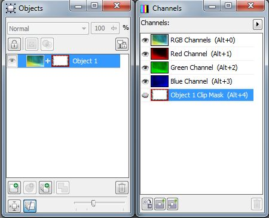

В докере **Objects** (Объекты) миниатюра _Маски обрезки_ видна в строке объекта, справа от миниатюры самого объекта (слева). Между ними Photo-Paint вставляет знак «**+**».  
В докере **Channels** (Каналы) _Маска обрезки_ представлена отдельным каналом. Имя канала _Маски обрезки_ состоит из имени объекта с добавлением слов _**Clip Mask**_. В остальном объект-маска ведет себя так же, как и любой другой альфа-канал.

Заслуживает внимания трансформирование объекта с _Маской обрезки_. Если вы будете, например, перемещать объект, то маска останется на месте и объект будет виден в образованном маской «окне». Такой прием может найти свое применение, но часто возникают ситуации, когда необходимо, чтобы объект перемещался вместе со своей маской. Рассмотрим эту ситуацию на конкретном примере.

### Пример.

Как всегда начнем с постановки задачи и подбора необходимых для ее реализации изобра-жений. Нам нужно создать портрет в рамке. По возможности попробуем даже создать нечто оригинальное. Исходные изображения показаны на рис. 2 и 3.

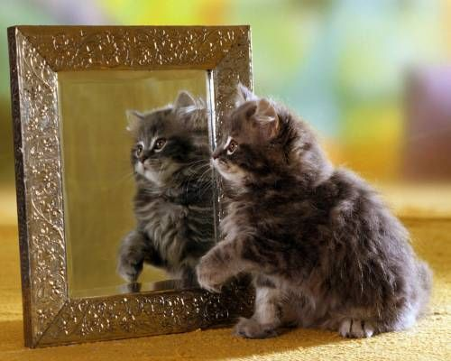

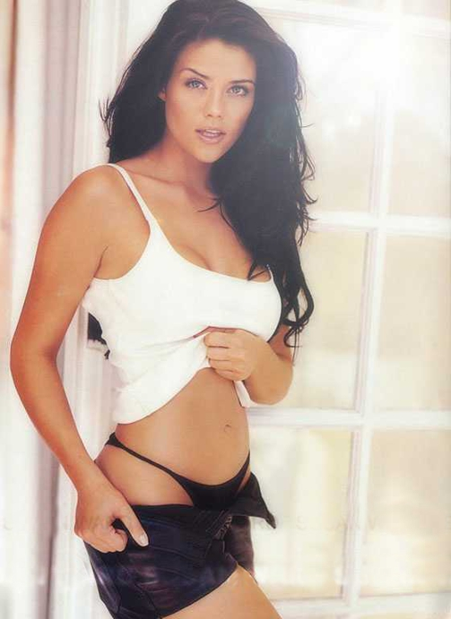

Конечное изображение будет выглядеть следующим образом: котенок сидит и смотрит на фото девушки в рамке. Итак, начали.

1\. Сначала нам нужно в обеих изображениях создать объекты из фона. Тут вы вольны выбрать последовательность действий, т. е. сделать это сразу в обеих изображениях или сначала только в одном (в нашем случае в изображении с котенком). Для этого выполните команду **Object > Create > From Background** (Объект > Создать > Из фона).  
2\. Теперь создадим маску стекла в зеркале, но так, чтобы лапа котенка была за пределами выделенной области (рис. 4). Для этого воспользуемся инструментом **Rectangle Mask** (Прямоугольная маска). Выделите стекло, а затем нажмите клавишу **М**, чтобы выбрать инструмент **Mask Transform** (Преобразование маски). На _Панели свойств_ инструмента выберите режим **Distort** (Искажение), чтобы придать маске необходимую форму и перспективу. Однако в рамку выделения попадет и лапа котенка. Выберите инструмент **Brush Mask** (Маска кисти) и переключаясь между режимами **Additive mode** (Аддитивным режимом) и **Subtractive mode** (Режимом вычитания) сделайте так, чтобы лапа не попадала в выделенную область.

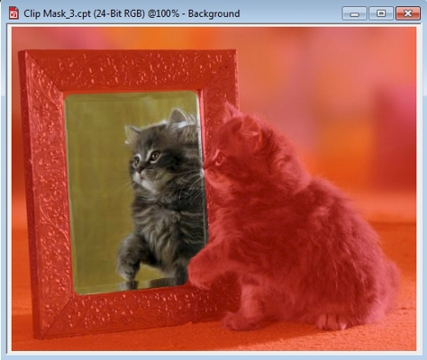

3\. Этот шаг не обязателен, но на всякий случай лучше сохранить маску в альфа-канал.  
4\. Теперь перейдите к изображению с девушкой и скопируйте в Буфер обмена. Если вы на шаге 1 не создали из фона объект, то сделайте это перед копированием.  
5\. Перейдите в изображение с котенком и вставьте изображение девушки. Как обычно бывает в реальных ситуациях, изображения разных размеров. Однако в данном случае, к счастью, это практически на важно. Вид полученного результата, после вставки показан на рис. 5.

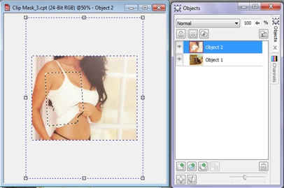

6\. Выполните команду **Object > Clip Mask > Create > From Mask** (Объект > Маска обрезки > Создать > Из маски). Полученный результат и соответствующий вид докера **Objects** (Объекты) показаны на рис. 6.

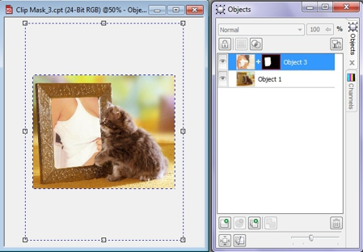

7\. Чтобы выправить создавшуюся ситуацию с фотографией в рамке, выполните следующие действия. Сначала щелкните в докере **Objects** (Объекты) на значке «**+**», между миниатюрой объекта-девушки и миниатюрой _Маски обрезки_. Потом щелкните на миниатюре объекта-девушки, чтобы выделить ее.  
Эти действия позволяют открепить объект от его _Маски обрезки_ и перемещать его независимо от нее.  
8\. Перетащите мышью девушку в желаемую позицию в рамке. Тут все зависит от вашего вкуса. После этого объедините объекты, а потом получившийся объект объедините с фоном. Два возможных варианта окончательного изображения показаны на рис. 7 и 8.

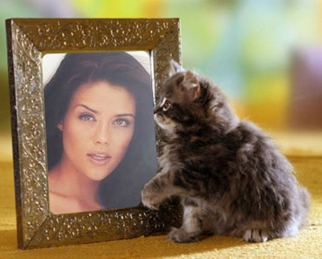

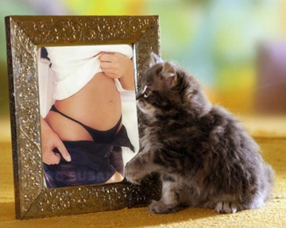

### «Серые маски»

Рассмотрим еще одну, весьма специфичную область применения _Масок обрезки_. Это так называемые «серые маски». Эти «серые маски» применяются для создания причудливых рамок или лучше сказать границ изображений. Использование этих «серых масок» весьма просто. Для их создания требуется изображение – сама «серая маска», созданное в оттенках серого. Образец такого изображения приведен на рис. 9\.

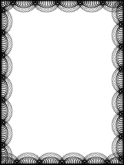

В качестве таких «серых масок» можно использовать векторные рамки, которые можно найти в векторных «Клипартах». В этом случае, нужно с помощью CorelDraw открыть файл с рамкой, а затем преобразовать в растровое изображение. Однако, чтобы результат был правильным, нужно в окне экспорта установить флажок, «Сохранять размер». Теперь рассмотрим пример использования «серых масок». В этом примере я не буду стараться изобразить «шедевр мирового масштаба», а лишь покажу технику использования «серых масок».

В качестве исходных изображений в данном примере было взято изображение цветка и изображение серой маски, показанных на рис. 10.

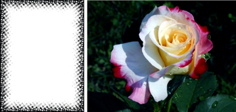

1\. Загрузите изображение цветка.  
2\. Выполните команду Object > Create > From Background (Объект > Создать > Из фона).  
3\. Этот шаг не обязателен и сделан просто для «символического украшения».  
Установите в качестве цвета заливки желаемый цвет. Создайте прямоугольник по размеру на все изображение, с выбранным вами цветом заливки. В докере **Objects** (Объекты) переместите объект-цветок вверх, чтобы прямоугольник оказался под ним.  
4\. Выполните команду **Mask > Load > Load From Disk** (Маска > Загрузить > Загрузить с диска). В качестве маски выберите файл с «серой маской». Курсор примет вид загружаемой маски. Пусть вас не беспокоит точная стыковка маски и объекта. Photo-Paint автоматически подгонит размер маски под размер объекта (рис. 11).

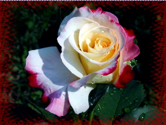

5\. Выполните команду **Object > Clip Mask > Create > From Mask** (Объект > Маска обрезки > Создать > Из маски).  
Полученное изображение приведено на рис. 12.

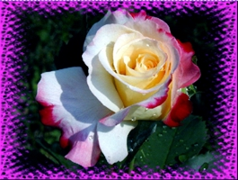

Как видите, такую рамку можно создать за минуту или меньше. Цвет получившейся рамки зависит от цвета заливки прямоугольника, созданного на шаге 3\. Если этого не сделать (прямоугольник), то Photo-Paint сделает прозрачным фон и вы увидите не цветную рамку, а отсутствие фона, в виде «шахматной доски». Как вы помните, Photo-Paint таким образом показывает отсутствие фона. Образцы изображений «серых масок» вы можете бесплатно загрузить на сайте [about.com](http://graphicssoft.about.com/od/freedownloads/l/blframesmain.htm).

### Отключение Масок обрезки

_Маска обрезки_ позволяет сохранить исходное изображение в неприкосновенности, и оно доступно в любой момент. Вы всегда можете оценить результат маскирования временно отключив _Маску обрезки_.  
В подменю **Clip Mask** (Маска обрезки) выберите команду **Disable** (Выключить), и миниатюра _Маски обрезки_ будет перечеркнута красным крестом (рис. 13), а маскированные области объекта станут видны.

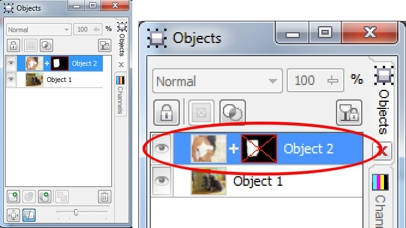

### Удаление Маски обрезки

Чтобы удалить _Маску обрезки_, воспользуйтесь командой **Remove** (Удалить) подменю **Clip Mask** (Маска обрезки), меню **Object** (Объект). После удаления _Маски обрезки_ информация о прозрачности объекта исчезнет.