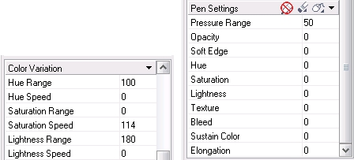

# Докер Brush Settings (Настройки кисти) в Corel PHOTO-PAINT

Теперь рассмотрим расширенные настройки свойств инструмента **Paint** (Кисть), которые нам предоставляет докер **Brush Settings** (Настройки кисти). Для вызова докера выполните команду **Window > Dockers > Brush Settings** (Окно > Окна настройки > Настройки кисти) или сделайте двойной щелчок на инструменте **Paint** (Кисть) на панели **Toolbox** (Набор инструментов). В верхней части докера расположен раскрывающийся список **Paint** (Краска), который является аналогом списка **Merge mode** (Режим слияния) на Панели свойств. Под ним расположена область управления формой и размером кончика кисти (рис. 1).

В левой части области находится интерактивный элемент управления формой кисти, поворотом и прозрачностью. Как видно на рис. 1 (слева) этот элемент управления имеет три манипулятора: верхний позволяет изменять форму кисти (сплющивать); боковой позволяет повернуть кисть на нужную величину; манипулятор в виде черточки (на одной линии с боковым манипулятором) позволяет изменять прозрачность кисти. Управление манипуляторами производится с помощью мыши, перетаскиванием их в нужное положение. На рис. 1 (справа) показано положение манипуляторов и вид кончика кисти, после изменения формы круглой кисти.

Правее интерактивного элемента расположен раскрывающийся список, служащий одновременно окном просмотра, где вы можете видеть форму выбранной кисти и результат примененных к ней изменений. Щелкнув на кнопке в виде стрелки направленной вниз, вы получите доступ к образцам кистей, аналогично как в раскрывающемся списке **Nib shape** (Форма кончика) на Панели свойств.

В нижней части области находится ползунок **Size** (Размер), позволяющий интерактивно менять размер кисти и поле ввода, где отображается текущий размер кисти. В этом поле ввода вы можете с клавиатуры задать точный размер кисти.

Размер кисти можно менять не только на Панели свойств или в докере **Brush Settings** (Настройки кисти). В Photo-Paint имеется возможность интерактивно менять размер кончика кисти с помощью мыши и клавиатуры. При нажатой левой кнопке мыши, нажмите и удерживайте нажатой клавишу **Shift**, перемещение мыши "вперед" (вверх), увеличивает размер; перемещение "назад" (вниз) – уменьшает.

Кроме элементов управления формой и размером кисти, в докере **Brush Settings** (Настройки кисти) имеется несколько специфичных раскрывающихся списков, в которых настраиваются дополнительные свойства кисти. Самый верхний список **Nib Properties** (Свойства кончика) (рис. 2), содержит уже известные нам настройки кисти:

*   **Transparency** (Прозрачность) – поле для ввода числового значения прозрачности;
*   **Rotate** (Повернуть) – поле для ввода числового значения поворота кисти;
*   **Flatten** (Разгладить) – поле для ввода числового значения сжатия кисти. На мой взгляд, более удачный вариант русского перевода для этого атрибута – _Сплющенность_, который был в некоторых более ранних локализованных версиях CorelDraw Graphics Suite.
*   **Soft Edge** (Мягкий край). Чем больше этот параметр, тем более размытые, мягкие края имеет кисть. Чем меньше атрибут, тем жестче края.

Рассмотрим некоторые специфичные элементы управления в этом списке, т. к. они будут нам встречаться в других диалоговых окнах и докерах. Кнопка в виде маленького черного треугольника в правой части заголовка списка. Эта кнопка служит для раскрытия и свертывания списка. На рис. 2 (_а_ и _в_), она направлена вниз, если щелкнуть на ней, список свернется, а кнопка примет вид треугольника направленного вправо. Каждый атрибут имеет поле, для ввода числовых значений. Если щелкнуть в нем мышей, появится мигающий курсор, что позволяет начать ввод значения с клавиатуры, а справа от поля ввода появится кнопка в виде ползунка (рис.2 _в_). Нажатие этой кнопки приводит к появлению под полем ввода ползунка, с помощью которого можно также задать нужное значение. Однако в некоторых элементах управления чувствительность ползунка настолько велика, что требует искусного владения мышью, для установки точных значений.

Если вы обратите внимание, то заметите, что значения в этом списке соответствуют значениям установленным в области управления размером и формой кисти или на Панели свойств. Исключение составляет параметр **Soft Edge** (Мягкий край). Влияние этого параметра на свойства кисти представлено на рис. 3.

Как видно из рисунка, чем больше значение параметра **Soft Edge** (Мягкий край) тем более размытыми становятся края кисти. На рисунке слева направо показаны мазки кисти при значении **Soft Edge** (Мягкий край) равном 0; 50 и 100\. Этот атрибут работает только для круглых и квадратных кистей. Он не действует на кисти произвольной формы. Чтобы убедиться в этом, выберите из списка форм кисти, любую фигурную кисть и параметр **Soft Edge** (Мягкий край) в списке **Nib Properties** (Свойства кончика) отображаться не будет.

В заголовке этого же списка имеется две кнопки, одна из которых дает доступ к меню (рис. 2 _б_), а другая, **Toggle Nib Rotation** (Переключать вращение кончика), позволяет включать и отключать режим случайного наклона кончика кисти. Чтобы наглядно показать влияние этого переключателя, я выбрал кисть в форме стрелы и последовательно сделал несколько щелчков мышью.

На рис. 4 (_б_) хорошо видно действие переключателя **Toggle Nib Rotation** (Переключать вращение кончика):  
_а_ – исходный кончик кисти с выключенным переключателем; _б_ – несколько последовательных мазков; _в_ -- исходный кончик кисти с выключенным переключателем; _г_ – мазок при выключенном переключателе; _д_ – мазок с включенным переключателем.

Кнопка **Nib Options** (Параметры кончика) открывает меню (рис. 2 _б_), в котором имеется список команд управления:

*   **Add Current Nib** (Добавить текущий кончик) – добавляет в список кистей образец с текущими характеристиками;
*   **Delete Current Nib** (Удалить текущий кончик) – удаляет из списка текущую кисть, если она был сохранена в списке;
*   **Create from contents of Mask** (Создать из содержимого маски) – превращает в кисть содержимое выделенной области. При выполнении этой команды, появляется диалоговое окно **Create a Custom Brush** (Создание специальной кисти) (рис. 5). В счетчике укажите нужный размер и нажмите **ОК**. Созданный таким образом образец появится в конце списка форм кистей. По умолчанию, в этом счетчике установлен размер соответствующий выделенной области.

*   **Nib Load** (Загрузка кончика) – позволяет загрузить другой набор кистей из файла с расширением **.NIB** (если таковой существует, кроме файла ppnib.nib). При выборе этой команды, откроется диалоговое окно **Nib Load** (Загрузка кончика), в котором необходимо выбрать нужный файл.
*   **Nib Save As** (Сохранение кончика как) – позволяет сохранить набор кистей в файле под другим именем. В диалоговом окне **Nib Save As** (Сохранение кончика как) присвойте имя файлу и нажмите кнопку **Сохранить**.
*   **Nib Append** (Добавление кончика) – загружает новый набор кистей в дополнение к уже имеющемуся. В открывшемся диалоговом окне **Nib Append** (Добавление кончика), выберите нужный файл и нажмите кнопку **Открыть**.
*   **Reset to Default Nibs** (Сбросить кончики по умолчанию) – восстанавливает набор по умолчанию. Эта команда полезна, когда вы по ошибке удалили кисть.

Следующий список в докере **Brush Settings** (Настройки кисти) – **Stroke Attributes** (Атрибуты мазка) (рис. 6).

В этом списке имеется всего два параметра **Smoothing** (Сглаживание) и **Fade Out** (Затухание).

*   **Smoothing** (Сглаживание) – позволяет сгладить края мазка кисти
*   **Fade Out** (Затухание) – создает «иллюзию затухания» мазка за счет изменения прозрачности по его длине. Этот параметр может менять значения от -100 до 100\. При положительном значении штрих по мере создания меняет прозрачность от исходной до нулевой. При нулевом значении, штрих не меняет прозрачности по всей своей длине. При отрицательных значениях, штрих вначале имеет стопроцентную прозрачность, и по мере создания линии прозрачность увеличивается до заданной. Чем больше значения параметра **Fade Out** (Затухание), тем быстрее увеличивается прозрачность штриха.

В строке заголовка этого списка также есть кнопка **Anti-aliasing** (Сглаживание), дублирующая одноименную кнопку на Панели свойств.  
Под списком **Stroke Attributes** (Атрибуты мазка) расположен список **Dab Attributes** (Атрибуты штриха) (рис. 6).

Параметры в группе **Dab Attributes** (Атрибуты штриха) оказывают значительное влияние на результат полученный с помощью инструмента **Paint** (Кисть). Однако следует отметить, что изменение одного из параметров, при минимальном значении остальных, может никак не сказаться на результатах.

*   **Number of Dabs** (Количество штрихов) – позволяет изменять количество штрихов в мазке кисти. Чтобы изменение значений стало проявляться, нужно использовать этот параметр в сочетании с параметрами **Spacing** (Интервал) и **Spread** (Авторасширение). Влияние этих параметров показано на рис. 7.
*   **Spacing** (Интервал) – расстояние между соседними штрихами в создаваемой линии, которое задается в процентах от диаметра кисти;
*   **Spread** (Авторасширение) – разброс элементов в отдельном мазке. Если параметр больше единицы, то элементы распределяются не по линии движения курсора, а с некоторым разбросом относительно нее. Русский термин этого названия – _Авторасширение_, не совсем удачен. В предыдущих версиях он назывался _Разброс_, что было более подходящим для этого параметра.
*   **Hue** (Оттенок) – указывает вариации оттенка в мазке кисти.
*   **Saturation** (Насыщенность) – указывает вариации насыщенности в мазке кисти.
*   **Lightness** (Осветление) – указывает вариации яркости в мазке кисти.

На рис. 7 показано одновременное влияние трех параметров на мазок кисти, значения указаны в следующем порядке: **Number of Dabs**; **Spacing**; **Spread** (Количество штрихов; Интервал; Авторасширение):  
**а** – 1; 1; 0 – кисть с исходными параметрами;  
**б** – 10; 1; 0 – увеличилось только значение **Number of Dabs** (Количество штрихов). Как видно из рисунка, увеличение только этого параметра не вызвало никаких ощутимых изменений;  
**в** – 10; 90; 0 – изменение **Number of Dabs** (Количества штрихов) и **Spacing** (Интервала), также не оказало заметного влияния;  
**г** – 10; 90; 90 – при изменении значений всех трех параметров, сразу виден результат. Однако следует учитывать, что влияние **Spacing** (Интервала) и **Spread** (Авторасширение), зависит помимо всего и от размера самой кисти. Если у вас будет размер кисти, например, 50, то для получения видимых изменений, значение параметров должно быть, как минимум, больше 100;  
**д** – 10; 145; 145 – как видно из рисунка, увеличение значений приводит к получению мазка с большим разбросом;  
**е** – 20; 145; 145 – значение параметров, как и в предыдущем варианте, увеличено только значение **Number of Dabs** (Количества штрихов).

Следующая группа параметров **Brush Texture** (Текстура кисти) (рис. 8 а).

На рис. 8 показаны группы параметров **Brush Texture** (Текстура кисти) и **Orbits** (Орбиты) – _а_); список текстур – _б_).

*   **Brush Texture** (Текстура кисти) – настройка степени использования текстуры в мазке кисти.
*   **Edge Texture** (Текстура краев) – настройка степени текстурной обработки мягких краев кисти.
*   **Bleed** (Растекание) – Если этот параметр больше нуля, то по мере рисования линии цвет **Foreground Color** (Цвет переднего плана) постепенно заменяется на цвета самого изображения.
*   **Sustain Color** (Сохранение цветов) – значение остаточного цвета при рисовании в режиме **Bleed** (Растекание).

Кнопка в виде папки **Load Texture** (Загрузка текстуры), в заголовке группы **Brush Texture** (Текстура кисти) открывает список с образцами текстур (рис. 8 _б_). Вы можете загрузить другую текстуру, нажав кнопку **Other** (Другая) в нижней части списка. Откроется диалоговое окно **Load Texture** (Загрузка текстуры), где вы можете выбрать нужный файл текстуры.

Ниже располагается группа параметров **Orbits** (Обриты) (рис. 8 _а_):

*   **Number of Orbits** (Количество орбит) – определяет количество мазков в кисти. Влияние этого параметра становится заметным, только если увеличить значение атрибута **Radius** (Радиус);
*   **Radius** (Радиус) – расстояние, на котором размещены мазки по орбите от центра.
*   **Rotation Speed** (Скорость вращения) – при увеличении значения, вы заставляете мазки вращаться вокруг линии движения курсора.
*   **Grow Speed** (Скорость распространения) – регулирует скорость изменения радиуса. Чем больше значение скорости, тем быстрее колеблется радиус орбиты. Влияние этого параметра становится заметным при изменении значений **Grow Amount** (Величина распространения).
*   **Grow Amount** (Величина распространения) – регулирует степень изменения радиуса. Чем больше значение, тем больше колеблется радиус орбиты.

На рисунках ниже показаны результаты применения параметров группы **Orbits** (Обриты).

На рис. 9 показано влияние _Количества орбит_ и радиуса на штрих кисти (т. е. показан результат щелчка мыши). Штрихи были сделаны при следующих значениях параметров **Number of Orbits** (Количество орбит) и **Radius** (Радиус): _а_ – 1; 1 (исходная кисть), _б_ – 25; 1\. _в_ – 25; 10, _г_ – 5; 50.

На рис. 10 показаны мазки той же кистью, в форме звездочки, но дополнительно с изменением значения **Rotation Speed** (Скорость вращения): _а_ – 5; 50; 0, _б_ – 5; 50; 100, _в_ – 5; 150; 100\. Как видно из рисунка, увеличение значений параметров **Radius** (Радиус) и **Rotation Speed** (Скорость вращения) приводит к значительной «деформации» мазка кисти.

На рис. 11 показаны мазки кисти при использовании всех параметров группы **Orbits** (Обриты):  
_а_ – 5; 150; 100; 0; 0  
_б_ – 5; 150; 100; 50; 0  
_в_ – 5; 150; 100; 50; 50

В строке заголовка группы имеется еще две кнопки **Toggle Orbits** (Переключать орбиты) и **Include Center** (Включать центр). Первая из них включает и отключает орбиты, а другая включает и выключает режим рисования центра (рис. 12).

Как видно из рисунка, при нажатии кнопки **Include Center** (Включать центр), в кончик кисти добавляется «центральная точка» (на рисунке вверху показана исходная кисть с отключенным и включенным режимом **Include Center** (Включать центр)). При рисовании становится заметной «центральная линия» мазка (рис. 12 внизу).

В нижней части докера **Brush Settings** (Настройки кисти) имеется еще две группы параметров: **Color Variation** (Вариация цвета) и **Pen Settings** (Настройки пера) (рис. 13).  
В первой из этих групп, как и следует из ее названия, собраны параметры кисти, управляющие цветом кисти.

Параметры в этой группе позволяют изменять значения _Оттенка_, _Насыщенности_ и _Яркости_. При использовании настроек цвета по умолчанию (цвет краски – черный), влияние этих параметров практически не заметен. Однако при использовании других цветов такое влияние становится заметным.

Последняя группа – **Pen Settings** (Настройки пера), позволяет изменять параметры кисти при использовании графического планшета.

**Меню докера Brush Settings (Настройки кисти)**

В верхней части докера **Brush Settings** (Настройки кисти), в строке **Stroke style** (Стиль мазка) расположена маленькая кнопка в виде треугольника, предоставляющая доступ к меню докера (рис. 14).

Если вы изменили настройки кисти, вы можете ее сохранить в списке образцов с помощью команды **Save Brush** (Сохранить кисть) (рис. 15). В открывшемся диалоговом окне **Save Brush** (Сохранение кисти), в поле **Save new brush type as** (Сохранить новый тип кисти как), введите новое имя и нажмите **ОК**. Команда **Delete Brush** (Удалить кисть) удаляет кисть из набора образцов.

Команды **Reset Brush Type** (Сбросить тип кисти) и **Reset All Brush Types** (Сбросить все типы кистей) возвращают параметры по умолчанию для текущей кисти и для всех типов кистей, соответственно.