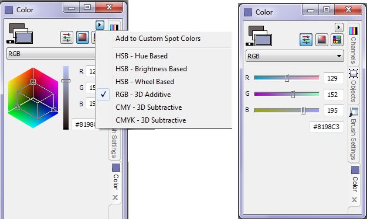

# Докер Color (Цвет)

Докер **Color** (Цвет) открывается командой **Window > Dockers > Color** (Окно > Окна настройки > Цвет). Он имеет два режима редактирования составных цветов и один режим выбора плашечных цветов из фиксированных цветовых палитр, и предназначен для выбора цветов краски и фона. Режимы переключаются тремя кнопками, расположенными под кнопкой открытия меню докера.

Работа в докере **Color** (Цвет) аналогична работе в окне **Select Color** (Выбор цвета). Пожалуй основное удобство при работе с докером заключается в том, что он может быть открытым в течении всего сеанса работы или пока вы его не закроете.