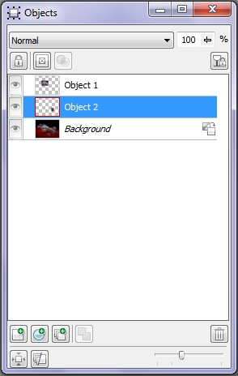

# Докер Objects (Объекты)

Многие манипуляции с объектами легче выполнять в докере **Objects** (Объекты) (рис. 1). Многие из действий выполняемых в докере можно выполнить с помощью команд меню **Object** (Объект), которые по сути продублированы в докере. Однако некоторые возможности доступны только в докере.

В верхней части докера расположены следующие элементы управления:

*   раскрывающийся список **Merge mode** (Режим слияния), знакомый нам по работе с другими инструментами и поле **Opacity** (Непрозрачность). Значения в этом поле можно менять от 0 до 100;
*   параметр **Opacity** (Непрозрачность) является противоположностью знакомого нам по другим инструментам параметра **Transparency** (Прозрачность). Т. е. значение параметра равное 100, соответствует полной непрозрачности объекта.

Ниже, в докере расположен ряд кнопок. Сейчас мы рассмотрим только одну из них – **Lock** (Заблокировать). Эта кнопка в виде замка позволяет заблокировать объект, что препятствует производить любые изменения с объектом. Чтобы разблокировать объект, нужно еще раз щелкнуть на кнопке. Заблокировать объект также можно с помощью команды **Object > Lock** (Объект > Заблокировать). После выполнения этой команды, в меню **Object** (Объект) становится активной команда **Unlock** (Разблокировать).

В нижней части докера также имеется ряд кнопок, часть из которых мы рассмотрим ниже, в соответствующих разделах. Первая из них **New Object** (Создать объект) является аналогом команды **Object > Create > New Object** (Объект > Создать > Новый объект) и создает пустой прозрачный слой, покрывающий все изображение. Однако, пока объект пуст, вы не можете его выделить с помощью инструмента **Object Pick** (Указатель объектов). Кроме того, если вы, например, на этом слое нарисуете что-то _Кистью_, то размеры нового объекта автоматически уменьшатся до размеров мазка и будут увеличиваться по мере добавления вами других элементов рисунка, как было описано в пункте «Создание объекта с нуля». В этом же ряду кнопок, находится кнопка **Delete** (Удалить) (крайняя правая кнопка), служащая для удаления выделенного объекта и является аналогом команды **Object > Delete** (Объект > Удалить).

Для выделения объекта в докере, достаточно щелкнуть на нем мышью. В докере выделенный объект подсвечивается синим цветом.  
С помощью докера вы можете скрыть объект, щелкнув на значке в виде глаза, рядом с названием объекта. Вы можете также переименовать объект, для этого нужно сделать в докере двойной щелчок на объекте или щелкнуть правой кнопкой мыши и выбрать в меню команду **Properties** (Свойства). В диалоговом окне **Object Properties** (Свойства объекта), в поле **Name** (Имя), введите новое название объекта и нажмите **ОК**.

Вы можете настроить отображение миниатюр объектов в докере. Для этого служит безымянный ползунок внизу докера. Перемещение вправо, увеличивает размер миниатюры, перемещение влево – уменьшает.  
Назначение остальных элементов управления докера будет рассмотрено ниже.  
С помощью докера вы также можете менять порядок расположения объектов в изображении. Другими словами размещать объекты друг над другом в необходимом вам порядке. Для этого достаточно мышью перетащить объект вверх или вниз. Объект, находящийся в докере выше по списку, находится над объектами, которые в списке объектов находятся ниже него.