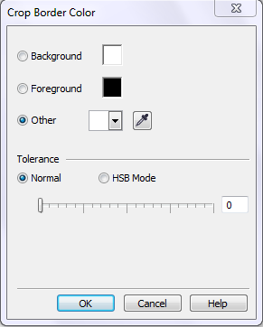

# Дополнительные команды и настройки обрезки изображения в PHOTO-PAINT

Кроме перечисленных настроек инструмента **Crop** (Обрезка), которые нам предоставляет Панель свойств, в меню **Image** (Изображение), также имеется подменю Crop (Обрезка), для работы с обрезкой изображения. Рассмотрим команды этого подменю.

Как я уже говорил выше, по умолчанию обрезаемые части изображения становятся темнее. Этот режим очень удобен, т.к. позволяет оценить вид изображения без обрамляющих областей еще до выполнения операции. Однако, если вас это чем-то не устраивает, вы можете сделать так, чтобы обрезаемые части были такими же, как и область обрезки. Переключение между видами представления обрезаемой части выполняется с помощью команды **Image > Crop > Crop Overlay** (Изображение > Обрезать > Наложение обрезки). Повторное выполнение этой команды возвращает вид представления к предыдущему состоянию.

Когда вы создаете или уже создали рамку обрезки, вы наверняка обратите внимание, что PHOTO-PAINT не даст вам возможности растянуть рамку или переместить ее за пределы изображения. Это очень удобно, т. к. избавляет вас от необходимости беспокоиться о том, что вы кроме части изображения обрежете серый фон окружающий его. Однако в некоторых ситуациях такая возможность вам понадобится. Например, она возникает тогда, когда вам нужно повернуть рамку обрезки, но у вас ничего не получается из-за того, что рамка «уперлась» в край изображения и дальше поворачиваться не хочет, т.к. PHOTO-PAINT по умолчанию такую возможность вам не предоставляет. Для активации такой возможности, выполните команду **Image > Crop > Expand** (Изображение > Обрезать > Расширить).

Еще две команды, не рассмотренные нами. Первая — **Image > Crop > Crop To Mask** (Изображение > Обрезать > Обрезать по выделению), доступна только при наличии маски в документе. Изображение обрезается по границам маски. О масках читайте дальше в этой книге. Вторая команда — **Image > Crop > Crop Border Color** (Изображение > Обрезать > Обрезать по цвету края). Она предназначена для автоматического удаления каймы вокруг изображения. Такая кайма возникает, например, при сканировании.

Переключатель в левой части окна позволяет выбрать цвет рамки, которую вы собираетесь удалить. В положении **Foreground** (Передний план) в качестве образца используется цвет переднего плана (кисти), в положении **Background** (Фон) — цвет фона. Установив переключатель в положение **Other** (Другой) вы можете выбрать произвольный образец цвета. Для этого либо откройте раскрывающийся список образцов, либо щелкните на кнопке с изображением пипетки справа от образца, и курсором укажите нужный цвет на изображении.

Если область, которую нужно обрезать, имеет неоднородный цвет, нужно установить подходящее значение в группе **Tolerance** (Допуск). Чем больше допуск, тем большее число оттенков цвета PHOTO-PAINT отнесет к удаляемому цвету, и тем сильнее будет обрезано изображение. Если установить переключатель в группе Tolerance (Допуск) в положение **HSB Mode** (Режим HSB), вы сможете выбрать допуск отдельно по каждому компоненту модели HSB.  
Из всех перечисленных способов обрезки, Обрезка по цвету края, наверняка будет использоваться вами реже всех остальных.