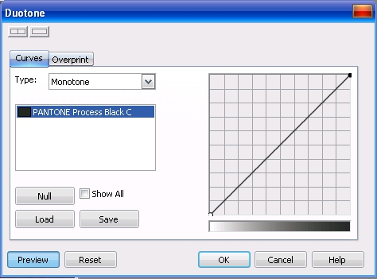
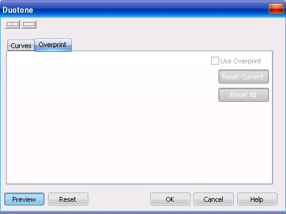
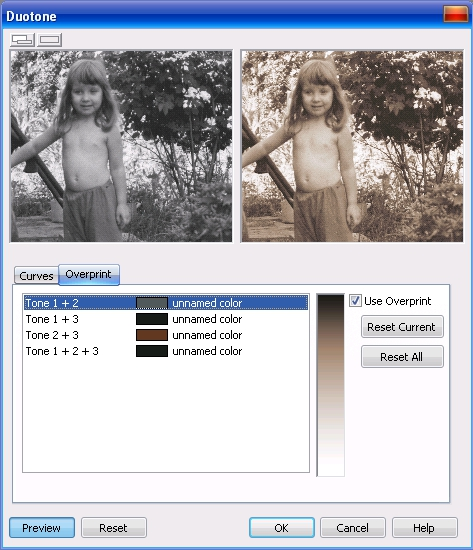

# Двухцветный цветовой режим в Photo-Paint

Двухцветный цветовой режим используется для специальной цветной печати. Двухцветное изображение — это изображение в оттенках серого, улучшенное путем добавления от одного до четырех цветов чернил. Такая специальная цветная печать в полиграфии называется дуплексом.

Одно из определений этого термина в полиграфии звучит так: **_Дуплекс_** – способ двухкрасочного репродуцирования одноцветного полутонового оригинала с помощью растра: одна из красок цветная (коричневая, голубая и т. п.), другая - обычно чёрная или серая. Дуплекс даёт репродукцию более выразительную, чем обычная однокрасочная.  
Широко применяются такие типы дуплексов, как стальной тон (черная краска с холодной голубой), сепия (черная краска с коричневой). Можно подсвечивать тоновое изображение и другими красками.

Для перевода изображения в двухцветное, в PHOTO-PAINT служит команда **Image > Convert to > Duotone (8-bit)** (Изображение > Преобразовать в > Двухцветный (8 бит)). Откроется диалоговое окно Duotone (Двухцветный). Это окно содержит две вкладки: **Curves** (Кривые) и **Overprint** (Наложение).

В отличие от рассмотренных ранее диалоговых окон по преобразованию изображений, в верхней части диалогового окна **Duotone** (Двухцветный) имеется две кнопки управляющие просмотром. Левая кнопка позволяет переключить режим просмотра таким образом, чтобы вы могли видеть вносимые изменения непосредственно в окне документа или просматривать изменения в диалоговом окне, в области просмотра. Область просмотра разделена на два окна, где отображаются исходное изображение и вид изображения после внесения изменений. Режим просмотра, когда вы видите изменения в самом окне документа, очень удобен. В этом случае вы можете видеть не миниатюру, а полномасштабное изображение. Изменение масштаба, как и рассмотренных ранее случаях, производится щелчком левой или правой кнопкой мыши в самом окне документа. Правая кнопка в верхней части диалогового окна переключает область просмотра из двухоконного режима в однооконный, где вы можете видеть только результаты изменений.

Вкладка **Curves** (Кривые) предназначена для выбора красок и задания их распределения по тоновому диапазону изображения. В списке **Туре** (Тип) вы можете выбрать количество красок, используемых при дуплексной печати, от одной (Monotone) до четырех (Quadtone)). Ниже приведены типы двухцветных изображений.

*   **Monotone** (Однотоновый дуплекс): изображение в оттенках серого, в котором используется один цвет чернил.
*   **Duotone** (Двухцветный): изображение в оттенках серого, в котором используются два цвета чернил. По умолчанию в нем находятся краски: один цвет чернил — черный, а другой — желтый.
*   **Tritone** (Трехтоновый): изображение в оттенках серого, в котором используются три цвета чернил. По умолчанию в нем находятся краски: черная, желтая и пурпурная.
*   **Quadtone** (Четырехтоновый): изображение в оттенках серого, в котором используются четыре цвета чернил. По умолчанию в нем находятся краски: черная, желтая, пурпурная и голубая.

При выборе того или иного типа, в поле под раскрывающимся списком, будут видны используемые цвета и их названия. В правой части вкладки **Curves** (Кривые) находится кривая, которая задает распределение краски по градациям яркости. По горизонтали (ось X) отображаются 256 оттенков серого, которые могут быть в изображении в оттенках серого (0 — черный; 255 — белый). По вертикали (ось Y) указывается интенсивность цвета (от 0 до 100 процентов), которая применяется для соответствующих значений оттенков серого. Эта кривая и предназначена для внесения изменений в изображение. По умолчанию, кривая имеет вид прямой диагональной линии, это означает, что при равномерном увеличении яркости равномерно уменьшается количество краски. Для изменения формы кривой, щелкните на ней левой кнопкой мыши, что приведет к появлению контрольной точки, перетаскивая которую вы измените форму кривой. Для удаления ненужной контрольной точки, щелкните на ней и нажмите клавишу **Delete**.

Если вы хотите отменить изменение формы кривой и вернуть ее в исходное состояние, то щелкните в поле на соответствующем ей цвете и нажмите кнопку **Null** (Обнулить). Кнопка **Load** (Загрузить) служит для загрузки сохраненных собственных файлов дуплекса, а также для имеющихся в составе Photo-Paint заготовок. Вы можете также сохранить созданный вами кривые распределения, нажав кнопку **Save** (Сохранить). В открывшемся диалоговом окне **Save Duotone Files** (Сохранение двухтоновых файлов) укажите имя файла и папку для сохранения. При использовании типа дуплекса отличного от **Monotone** (Однотоновый дуплекс), для внесения изменений используется соответствующее количество кривых. Если вы хотите видеть их все сразу, установите флажок **Shaw All** (Показать все). Если вас не устраивают цвета по умолчанию, вы можете их заменить, дважды щелкнув на названии цвета. В открывшемся диалоговом окне **Select Color** (Выбор цвета), на вкладке **Palette** (Палитра), выберите нужный цвет. По умолчанию используется палитра цветов **Pantone solid coated**.

Вкладка **Overprint** (Наложение), при использовании типа **Monotone** (Однотоновый дуплекс), имеет вид, показанный на рис. выше. При этом типе дуплекса, опции на вкладке **Overprint** (Наложение) не активны. При выборе других типов дуплекса, опции для установки параметров печати красок с наложением становятся доступными (рис. ниже).

По умолчанию печать с наложением отключена. Чтобы активировать обработку наложения красок, установите флажок **Use Overprint** (Использовать наложение). На вкладке **Overprint** (Наложение) находится список, в котором приведены все варианты наложения красок дуплекса. Двойной щелчок на любом элементе этого списка открывает диалоговое окно **Select Color** (Выбор цвета), в котором вы можете задать более точный цвет.