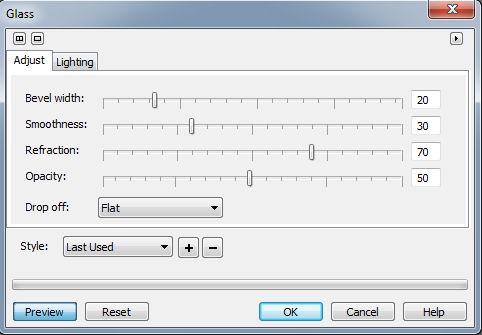
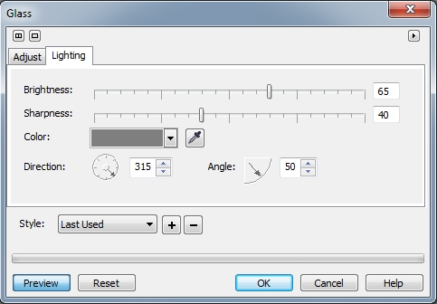
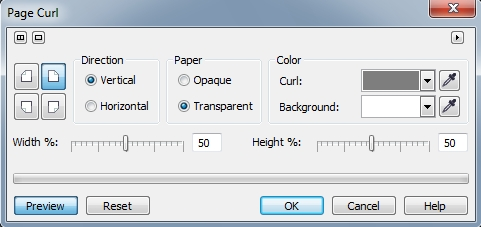

# Эффекты Glass (Стекло) и Page Curl (Загиб края страницы)

### Эффект Glass (Стекло)

Фильтр **Glass** (Стекло) представляет изображение так, как если 6ы поверх него был помещен трехмерный, полупрозрачный стеклянный объект. Посредством изменений установок диалогового окна **Glass** (Стекло), стекло поверх изображения может принимать форму резко очерченной плоскости со скошенными краями или аморфной желеобразной массы. Фильтр **Glass** (Стекло) работает лишь при задании выделенной области, так как форма стеклянного объекта определяется краями выделения. Диалоговое окно фильтра состоит из двух вкладок: **Adjust** (Настройка) (рис. 1) и **Lighting** (Освещение) (рис. 2).

**Для загрузки заготовки типа отражающего стекла:**

1\. Определите защищенную область.  
2\. Выполните команду **Effects > 3D Effects > Glass** (Эффекты > Трехмерные эффекты > Стекло), перейдите на вкладку **Adjust** (Настройка).  
3\. Выберите заготовку вида из окна списка **Style** (Стиль).

**Для создания вида отражающего стекла:**

1\. Определите защищенную область выделения.  
2\. Выполните команду **Effects > 3D Effects > Glass** (Эффекты > Трехмерные эффекты > Стекло).  
3\. Проделайте следующее:

На вкладке **Adjust** (Настройка):

*   Переместите ползунок **Bevel width** (Ширина скоса) для задания ширины скоса. Скос представляет собой область вокруг выделенного объекта, наклоненную таким образом, чтобы произвести впечатление трехмерного пространства.
*   Переместите ползунок **Smoothness** (Сглаживание) для задания резкости краев скоса. Низкие значения соответствуют получению более резких краев, но могут также выявить этапы, используемые для создания рельефа. Высокие значения соответствуют удалению шероховатых краев, создавая округлые края.
*   Переместите ползунок **Refraction** (Отражение) для задания угла изгиба света на скосе. Происходит искажение изображения на уровне скоса.
*   Переместите ползунок **Opacity** (Непрозрачность) для задания уровня прозрачности стеклянной плоскости. Чем более непрозрачным будет стекло, тем в большей степени лежащее под ним изображение будет приобретать оттенок цвета стекла.
*   Выберите один из вариантов в раскрывающемся списке **Drop off** (Падение): **Gaussian** (По Гауссу), **Flat** (Плоский) или **Mesa** (Плато). Область вне изображения является смежной области действия эффекта скоса.

На вкладке **Lighting** (Освещение):

*   Выберите цвет стекла из раскрывающегося списка **Color** (Цвет) или выберите цвет прямо из изображения с помощью _Пипетки_.
*   Переместите ползунки **Brightness** (Яркость) и **Sharpness** (Резкость), чтобы установить интенсивность бликов стекла.
*   Переместите диски **Direction** (Направление) и **Angle** (Угол) для задания направления и угла света, падающего на скос.
*   Выберите готовые параметры Освещения из раскрывающегося списка **Style** (Стиль).

**Для сохранения настроенного стиля отражающего стекла:**

1\. Настройте стиль, используя предыдущую процедуру.  
2\. Нажмите кнопку «Плюс».  
3\. В диалоговом окне **Save Preset** (Сохранение заготовки), наберите имя стиля в поле **Save new preset** (Сохранить заготовку как).

**Для удаления стиля отражающего стекла:**

1\. Определите защищенную область выделения.  
2\. Выполните команду **Effects > 3D Effects > Glass** (Эффекты > Трехмерные эффекты > Стекло).  
3\. Выберите предварительно установленный стиль, который вы хотите удалить из раскрывающегося списка **Style** (Стиль) на вкладке **Adjust** (Настройка).  
4\. Нажмите кнопку «минус».

### Эффект Page Curl (Загиб края страницы)

Фильтр **Page Curl** (Загиб края страницы) (рис. 3) используется, чтобы произвести впечатление, что угол изображения был подвернут. Элементы управления диалогового окна позволяют выбрать угол, ориентацию, размер загиба и уровень его прозрачности. При работе с фильтром задается цвет завитка, а также для фона, который делается видимым в результате загиба изображения.

Для применения эффекта к части изображения, выделите перед выбором эффекта нужную область. Страница будет загибаться только внутрь выделенной области.

**Для загибания угла изображения:**

1\. Выполните команду **Effects > 3D Effects > Page Curl** (Эффекты > Трехмерные эффекты > Загиб края страницы).  
2\. Нажмите одну из четырех кнопок в левой части окна фильтра, чтобы выбрать угол для загиба.  
3\. Переместите ползунки **Width** (Ширина) и **Height** (Высота), чтобы определить форму загиба.  
4\. Включите переключатель **Opaque** (Непрозрачный) или **Transparent** (Прозрачный). Параметр **Opaque** (Непрозрачный) используется, чтобы обратная сторона загиба имела собственный непрозрачный цвет. Параметр **Transparent** (Прозрачный) используется, если нужно, чтобы через загиб просматривалась закрываемая им часть изображения.