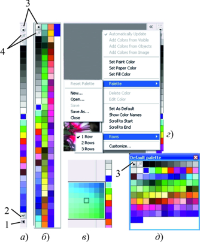
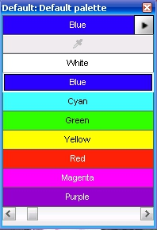
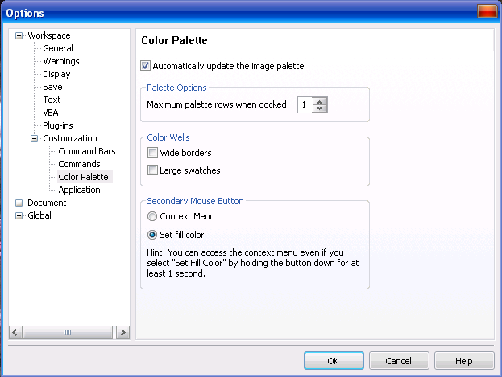

# Экранная цветовая палитра в Corel Photo-Paint

Несмотря на кажущуюся естественность и простоту работы с цветовой палитрой расположенной на экране, Corel Photo-Paint предоставляет в ваше распоряжение огромное количество возможностей по работе с цветом посредством цветовых палитр.

Чаще всего и наиболее просто выбирать цвет для работы именно в цветовой палитре расположенной по умолчанию справа в окне приложения (рис. 1)

По умолчанию, экранная палитра цветов расположена в одну строку (рис. 1\. _а_), что не позволяет вам видеть все цвета имеющиеся в палитре. Для навигации по палитре и получения доступа к остальным цветам, можно щелкнуть на кнопке в виде стрелочки, в верхней или нижней части палитры (на рис. кнопка 2). Можно также полностью раскрыть палитру (рис. 1 _б_), чтобы были видны все ячейки цвета. Для этого щелкните самую нижнюю кнопку на цветовой палитре (рис. 1 _а_, кнопка 1). Если вас по какой-то причине не устраивает расположение палитры по умолчанию, вы можете разместить у любого края окна приложения. Для этого просто перетащите ее к нужному краю окна приложения. Палитру можно также разместить не только по краям, но и внутри окна программы. В этом случае палитра будет иметь вид показанный на рис. 1 _д_. В верхней части палитры имеется кнопка для доступа к меню палитры (на рис. кнопка 3). Это же меню можно вызвать щелкнув правой кнопкой мыши в области кнопок, в верхней или нижней части палитры.

Как видно из рис. 1, это меню позволяет задать цвета переднего плана, фона и заливки. Подменю **Palette** (Палитра) (рис. 1 _г_) предоставляет набор команд для работы с палитрой:

*   **Reset Palette** (Сброс палитры). По умолчанию эта команда не активна, т. к. вы не внесли в палитру никаких изменений. При выполнении этой команды, можно восстановить исходное состояние цветовой палитры, если вы конечно перед этим не сохранили изменения.
*   **New** (Создать). При выполнении этой команды, открывается диалоговое окно **New Palette** (Создание палитры). Здесь вы можете указать имя новой палитры и папку, в которой она будет сохранена. Файл палитры будет сохранен в формате **.xml**, по умолчанию в папке **My Palettes**, которая находится в папке _Мои документы_. В предыдущих версиях Corel Photo-Paint, файл палитры имел расширение **.cpl**. После присвоения имени и сохранения файла, вы увидите в окне приложения новую палитру, которая будет совершенно пустой, т. к. в нее еще не было добавлено ни одного цвета.
*   **Open** (Открыть). Эта команда вызывает диалоговое окно **Open Palette** (Открыть палитру). По умолчанию открывается папка **My Palettes**, которая находится в папке _Мои документы_. В раскрывающемся списке **Тип файлов** вы можете выбрать файлы палитр не только созданных в Photo-Paint Х5, но и палитры созданные в более ранних версиях или палитры созданные в других программах. В этом случае, открываемая палитра появится рядом с палитрой по умолчанию (если вы перед этим ее не переместили или не закрыли).
*   **Save** (Сохранить). Эта команда позволяет сохранить текущую палитру, если вы внесли в нее изменения. Если изменения не вносились, команда остается неактивной.
*   S**ave As** (Сохранить как). Позволяет сохранить палитру под новым именем или в другой папке. Файл палитры будет сохранен в формате **.xml**.
*   **Close** (Закрыть). Если палитра вам больше не нужна в работе, вы можете ее закрыть с помощью этой команды.

Команды **Delete Color** (Удалить цвет) и **Edit Color** (Изменить цвет) не активны при работе с палитрой по умолчанию, которая входит в состав самого Photo-Paint. Эти команды становятся доступны только при работе с пользовательскими палитрами, независимо от того, сделали вы их палитрами по умолчанию или нет.

Созданную вами или заимствованную палитру вы можете сделать палитрой по умолчанию, выбрав в меню команду **Set As Default** (По умолчанию). Команда **Show Color Names** (Показать имена цветов) открепляет палитру от края окна и переводит в оконный режим (рис. 2) и вместо квадратных ячеек цветов вы видите прямоугольные ячейки с названиями каждого цвета. Чтобы вернуть палитру в исходное состояние, нужно в меню сбросить флажок **Show Color Names** (Показать имена цветов).

Если вы переместились при выборе цвета в среднюю часть палитры и хотите перейти в ее начало или конец, выберите в меню команды **Scroll to Start** (Перейти в начало) или **Scroll to End** (Перейти в конец).

Несмотря на то, что обычный вид палитры устраивает практически всегда, вам может понадобится возможность видеть одновременно большее количество цветов. Photo-Paint позволяет это сделать путем отображения палитры в две или три строки. Для этого в меню палитры, в подменю **Rows** (Строки) (рис. 1 _г_), укажите нужное вам количество строк (от 1 до 3).

Кроме этого имеется возможность выбирать не только конкретный цвет из палитры, но и получить доступ к оттенкам выбранного вами цвета. Для этого нажмите левой кнопкой мыши на цветовую ячейку палитры и удерживайте ее нажатой некоторое время (чуть больше секунды). При этом раскроется маленькое «окно» или область (рис. 1 в), в которой вы получите доступ к оттенкам выбранного вами цвета.

И наконец, последняя команда в меню палитры – **Customize** (Настройка), открывает диалоговое окно **Options** (Параметры) на странице **Color Palette** (Цветовая палитра), где вы можете настроить дополнительные параметры для работы с цветовой палитрой (рис. 3).

На странице **Color Palette** (Цветовая палитра) вы можете указать количество строк палитры, когда она находится в закрепленном состоянии с помощью счетчика **Maximum palette rows when docked** (Максимальное число строк в закрепленном состоянии). В области **Color Wells** (Цветовые ячейки), вы можете с помощью флажков **Wide borders** (Широкие границы) и **Large swatches** (Крупные ячейки) задать отображение цветовой палитры. Конечно, как на мой вкус, установка флажка **Large swatches** (Крупные ячейки) приводит уж к слишком большому увеличению ячеек палитры. Для настроек реакции на щелчок правой кнопки мыши, служит область **Secondary Mouse Button** (Правая кнопка мыши). С помощью переключателей можно задать, будет ли при щелчке правой кнопки мыши на цветовой ячейке появляться контекстное меню, переключатель **Context Menu** (Контекстное меню) или будет задан цвет заливки – переключатель **Set fill color** (Цвет заливки).