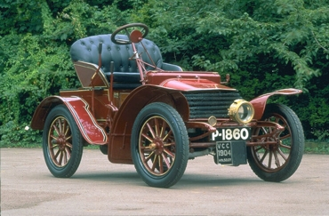
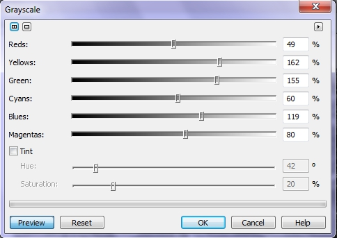
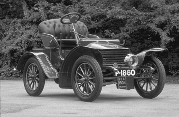
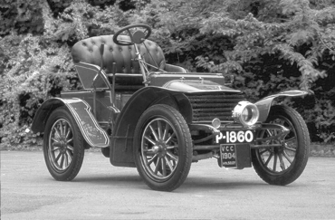
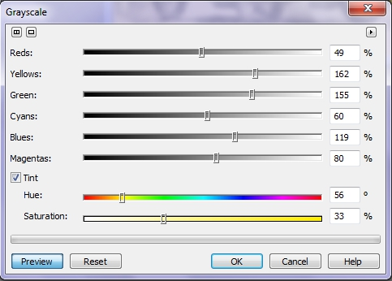
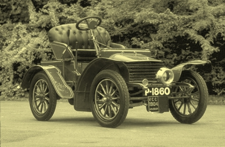
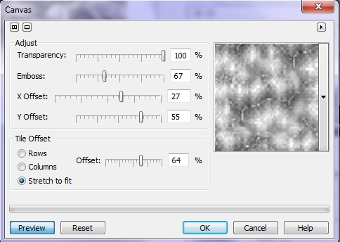
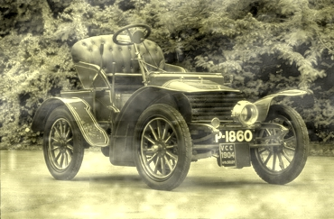
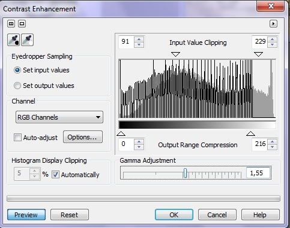
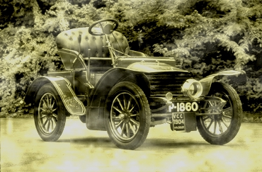

# Фильтр Grayscale (Оттенки серого)

Этот фильтр является новинкой версии Photo-Paint Х5\. Он не служит для исправления каких-либо дефектов в фотографии. Он предназначен для преобразования изображения в оттенки серого, но при этом изображение остается 24-битным, что позволяет применять к нему те же фильтры, что и к цветным, что недоступно при обычном преобразовании в оттенки серого. Помимо этого, этот фильтр позволяет придать изображению какой-либо оттенок. Давайте познакомимся с работой этого фильтра на конкретном примере. На рис. 1 представлено исходное изображение.

Наша задача, превратить это изображение в старую фотографию. Мы в этом примере попытаемся не только состарить фотографию, но и придать ей некоторые дефекты, характерные для старых фотографий.

Но сначала проанализируем нашу фотографию. Как видно на рисунке, в изображении присутствует в основном три цвета: зеленый – деревья позади автомобиля; красный – сам автомобиль и синий – сидение и синеватый оттенок колес.

Выполните команду **Adjust > Grayscale** (Настройка > Оттенки серого). В открывшемся диалоговом окне находятся ползунки соответствующие определенным цветам. Значения задаваемые этими ползунками, определяют интенсивность оттенков серого в изображении при преобразовании его из цветного в черно-белое. Диалоговое окно **Grayscale** (Оттенки серого) представлено на рис. 2.

Как только вы откроете окно фильтра, к изображению буду применены изменения с настройками по умолчанию. Очень часто они дают удовлетворительный результат. Полученное изображение показано на рис. 3.

На первый взгляд изображение выглядит достаточно неплохо. Однако мы видим слишком темные участки среди деревьев, а также сам автомобиль выглядит достаточно темным. Так как ползунки задают интенсивность соответствующих цветов, то увеличим ее для красного, синего и зеленого цветов. Выбранные значения приведены на рис. 2.

После изменения значений параметров в окне фильтра, изображение стало более светлым, детали в темных участках фотографии стали видимы и более различимы.  
Результат применения фильтра после изменения значений показан на рис. 4\.

Значения этих параметров в фильтре **Grayscale** (Оттенки серого) можно менять от -200 до 300\. В нижней части окна находится флажок **Tint** (Оттенок), который по умолчанию сброшен. При установке данного флажка, становятся активны два параметра: **Hue** (Оттенок) и **Saturation** (Насыщенность). Этот флажок позволяет добавлять определенные оттенки в фотографию. Для придания фотографии желтого оттенка (получения эффекта сепии), нам нужно установить флажок и переместить ползунок **Hue** (Оттенок) в область, примерно между оранжевым и желтым цветом. С помощью ползунка **Saturation** (Насыщенность) подобрать насыщенность, что цвет изображения соответствовал цвету старой фотографии (рис. 5).

После применения оттенка, получился снимок показанный на рис. 6.

Теперь, после придания нужного оттенка, нам нужно еще немного состарить фотографию, придав ей вид выцветшего местами изображения. Для этого сначала применим фильтр из меню **Effects** (Эффекты). Выполните команду **Effects > Texture > Canvas** (Эффекты > Текстура > Холст). Окно с настройками для получения эффекта показано на рис. 7, а получившийся результат на рис. 8.

Теперь нам осталось немного поработать над контрастом с помощью фильтра **Contrast Enhancement** (Увеличение контрастности) (рис. 9).

Окончательный результат показан на рис. 10.

