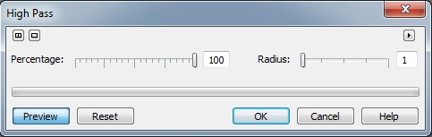
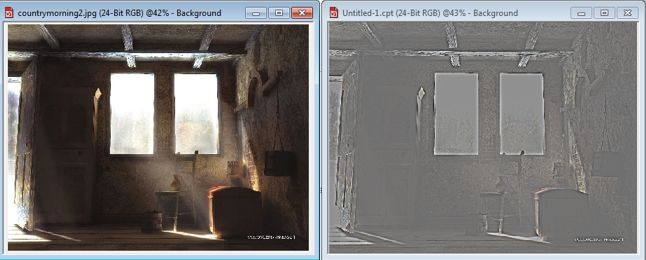
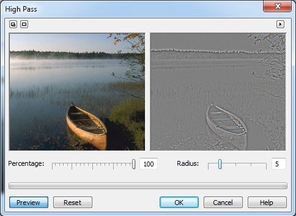
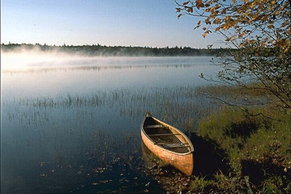

# Фильтр High Pass (Удаление мелких деталей)

Фильтр **High Pass** (Удаление мелких деталей) удаляет низкочастотные детали и затенение. Этот эффект может придать изображению воздушный светящийся вид. Он подчеркивает блики света и освещенные участки изображения. При высоких установках фильтр **High Pass** (Удаление мелких деталей) удаляет большинство деталей изображения, оставляя четко видимыми лишь детали края изображения. Если требуется лишь подчеркнуть блики света, используйте установки с меньшим значением процента. Однако он также влияет на цвет и тон изображения. Диалоговое окно фильтра показано на рис. 1.

**Для применения фильтра High Pass (Удаление мелких деталей):**

1\. Выполните команду **Effects > Sharpen > High Pass** (Эффекты > Повышение резкости > Удаление мелких деталей).  
2\. Переместите ползунок **Percentage** (Процент), чтобы установить интенсивность проявления эффекта.  
Высокие значения удаляют большую часть деталей изображения, оставляя четко видимыми лишь детали краев. Низкие установки процента подчеркивают лишь световые блики.  
3\. Переместите ползунок **Radius** (Радиус), чтобы определить, как далеко по направлению от краев будет происходить растекание цветов. Значения радиуса представляют число задействованных пикселей.

На рис. 2 показано применение фильтра **High Pass** (Удаление мелких деталей) с значениями параметров: **Percentage** (Процент) = 87; **Radius** (Радиус) = 10.

Сейчас я хочу привести пример применения фильтра **High Pass** (Удаление мелких деталей) для улучшения фотографии и придания более резких очертаний границам объекта. Исходное изображение приведено на рис. 3.

Наша задача, не разрушая великолепный вид раннего утра и тумана, что придает небольшую естественную размытость в изображении, подчеркнуть границы лодки и листвы деревьев переднего плана.

Итак, для выполнения данной задачи проделайте следующие действия:  
1\. После открытия изображения, нажмите комбинацию клавиш **Ctrl + A**, чтобы выделить все изображение.  
2\. Теперь нам потребуется копия изображения. Для этого нажмите комбинацию клавиш **Ctrl + стрелка вверх**, чтобы создать объект копированием выделения. Вы можете убедиться в этом, заглянув в докер **Objects** (Объекты). Там вы обнаружите два объекта – фон и только что созданный объект (копию изображения).  
3\. Выполните команду **Effects > Sharpen > High Pass** (Эффекты > Повышение резкости > Удаление мелких деталей).  
4\. В диалоговом окне фильтра **High Pass** (Удаление мелких деталей), установите следующие значения параметров: **Percentage** (Процент) = 100; **Radius** (Радиус) = 4 (рис. 4).  
5\. В докере **Objects** (Объекты) выберите режим наложения **Overlay** (Перекрытие).  
6\. Нажмите комбинацию клавиш **Ctrl + стрелка вниз**, чтобы объединить объект с фоном.

На рис. 5 приведен конечный результат наших действий. Если вас не устраивает полученный результат, можно изменить параметр **Opacity** (Непрозрачность) в докере **Objects** (Объекты). Также можно изменить режим наложения и применить вместо режима **Overlay** режимы **Hard Light** (Жесткий свет) или **Soft Light** (Мягкий свет). Здесь все зависит лишь от вашего вкуса.

