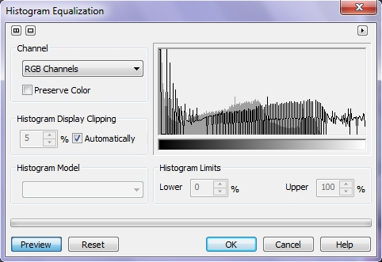
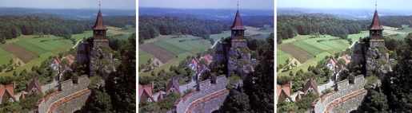

# Фильтр Histogram equalization (Выравнивание гистограммы)

Название этого фильтра говорит само за себя. Он служит для управления выравниванием пикселов по градациям тонового интервала. Этот фильтр вызывается командой **Adjust > Histogram equalization** (Настройка > Выравнивание гистограммы) (рис. 1).

В области гистограммы серым цветом показана исходная гистограмма, а черным – гистограмма после выравнивания. Как видно из рисунка, этот фильтр «растягивает» (выравнивает) гистограмму по всему тональному диапазону. Этот фильтр выполняет коррекцию на основе гистограммы изображения. Он осветляет светлые участки изображения, делает большую глубину цвета в тенях и улучшает контраст по всему изображению. Однако следует помнить, что такое «принудительное» выравнивание гистограммы полезно далеко не во всех случаях.

Если ваша задача — коррекция яркости, то следует установить флажок **Preserve Colors** (Сохранить цвет). В этом случае выравнивание каналов происходит без цветового сдвига. В области **Histogram Display Cilippng** (Обрезка гистограммы) устанавливают процент обрезки наибольших значений гистограммы.

В раскрывающемся списке **Histogram Model** (Модель гистограммы) выберите алгоритм выравнивания. Значение **Uniform** (Однородный) соответствует линейному выравниванию, **Hyperbolic** (Преувеличенный) – гиперболическому распределению. Опять же следует отметить неудачную локализацию термина **Hyperbolic**. Первое значение действует сильнее, зато второе лучше сохраняет соотношение яркостей. В области **Histogram Limits** (Ограничения гистограммы) выставляют порог черного и белого.

При отключенном режиме **Preserve Color** (Сохранить цвет) становится доступен раскрывающийся список каналов вверху слева. По умолчанию в нем выбран составной канал, однако при необходимости можно выбрать любой из цветовых каналов и произвести выравнивание в каждом из каналов изображения по отдельности. На рис. 2 приведен пример использования фильтра **Histogram equalization** (Выравнивание гистограммы). Слева – исходное изображение; по центру – после применения фильтра с настройками по умолчанию; справа – результат действия фильтра с установленным флажком **Preserve Color** (Сохранить цвет).

