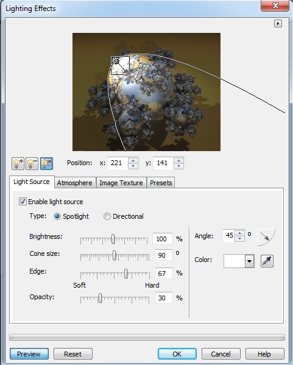
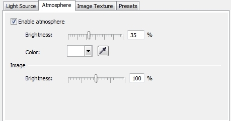

# Фильтр Lighting Effects (Эффекты освещения)

Фильтр **Lighting Effects** (Эффекты освещения) предлагает диапазон инструментов для добавления 19 световых источников к изображению RGB. Это позволяет добавлять яркие специальные эффекты: выделять точечный источник света в изображение или использовать цветовую подсветку для передачи настроения. Управляющие элементы в диалоговом окне **Lighting Effects** (Эффекты освещения) обеспечивают управление цветом, яркостью и контрастностью: источник света может быть даже использован в качестве способа определения значений рельефной текстуры. Фильтр **Lighting Effects** (Эффекты освещения) предлагает два различных типа источников света.

Диалоговое окно фильтра **Lighting Effects** (Эффекты освещения) состоит из довольно большой области предварительного просмотра (к сожалению, этот фильтр не имеет функции предварительного просмотра в окне изображения), области управления источником света и четырех вкладок (рис. 1). Работа с этим фильтром, в отличие от предыдущего, требует большей тренировки. Для достижения необходимого результата иногда требуется сначала поэкспериментировать с настройками фильтра. К счастью, фильтр снабжен целым списком готовых заготовок, с которых можно начать знакомство с ним.

**Для добавления источников освещения к изображению:**

1\. Выполните команду **Effects > Camera > Lighting Effects** (Эффекты > Камера > Эффекты освещения).  
2\. Установите флажок **Enable light source** (Включить источник света). По умолчанию, этот флажок установлен.  
3\. Выберите источник освещения, щелкнув один из переключателей, **Spotlight** (Точечный источник) или **Directional** (Направленный).

*   **Spotlight** (Точечный источник) соответствует световому пучку с четко определенными краями. Его можно направлять, поднимать и фокусировать.
*   **Directional** (Направленный) соответствует работе с рассеянным светом: этот источник обеспечивает ровное освещение без яркого центра. Однако его можно нацеливать. Это особенно полезно для подчеркивания текстуры при использовании в изображении рельефа.

4.Выберите цвет из **Указателя цвета**.  
5\. Щелкните и перетащите указатель источника света для задания местоположения, угла и высоты источника. Чтобы скрыть источник света в окне предварительного просмотра, нажмите кнопку **Скрыть/отобразить источник света**, крайняя правая кнопка над вкладками.  
6\. Для добавления или удаления дополнительных источников нажмите кнопки **Добавить** или **Удалить источник света**, также расположенные над вкладками. Можно добавлять и задавать положение до 19 источников света.

Помимо интерактивного способа задания положения источника с помощью мыши, которым вероятнее всего вы и будете всегда пользоваться, положение источника можно точно задать с помощью группы счетчиков **Position** (Положение). Кроме того, при выборе типа источника – **Directional** (Направленный), часть параметров становится неактивной.  
После того, как вы проделали предварительную работу, т. е. выбрали место расположения, количество и цвет источников света, можно приступать к дополнительной настройке в окне фильтра.

**Для каждого источника света проделайте следующее:**

1\. Переместите ползунок **Brightness** (Яркость) для задания яркости источника.  
2\. Переместите диск **Angle** (Угол) для задания вертикального угла источника (от 0 до 90 градусов). При величине 90 градусов луч света направлен прямо вниз на изображение. Этот параметр также влияет на размер освещаемой области.  
3\. Переместите ползунок **Cone size** (Размер конуса), для управления шириной освещенного участка (от 0 до 180 градусов). Чем выше значение, тем более широким и рассеянным будет луч света.  
4\. Переместите ползунок **Edge** (Край) для управления величиной потока света на края освещенного участка. Этим определяется степень мягкости края, выраженная в процентах от самого резко-го уровня фокусировки.  
5\. Переместите ползунок **Opacity** (Непрозрачность), для настройки плотности света.

Элементы управления вкладки **Atmosphere** (Атмосфера) (рис. 2) диалогового окна **Lighting Effects** (Эффекты освещения) предназначены для определения общей освещенности изображения и заданию яркости атмосферы.

Для задания текстурирования изображения служит третья вкладка. Но для получения сколь-нибудь ощутимых результатов, я бы рекомендовал сначала на вкладке **Presets** (Заготовки) выбрать заготовку текстуры, а затем изменить ее параметры на вкладке **Image Texture** (Текстура изображения).