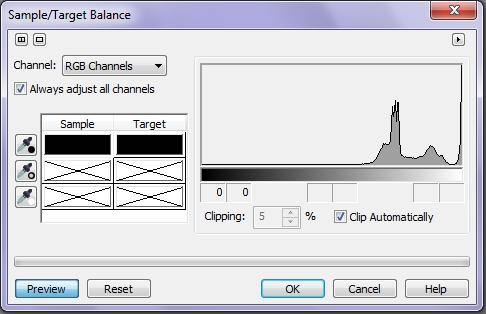
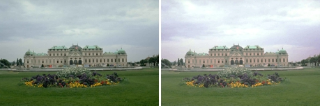
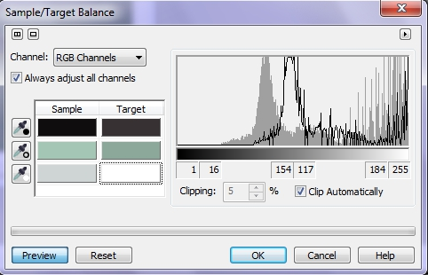
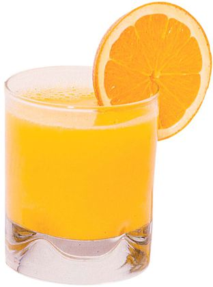
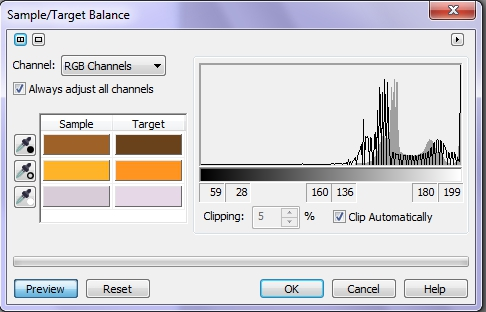
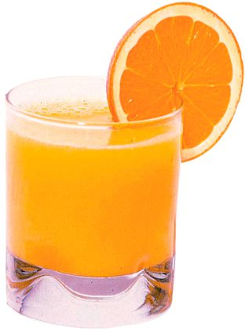

# Фильтр Sample/Target balance (Балансировка по образцам)

Фильтр **Sample/Target balance** (Балансировка по образцам) позволяет выполнять коррекцию цвета изображения путем смещения цветовых значений от цвета-образца (взятого из исходного изображения) к цвету, выбранному из цветовой модели. Для корректировки цветов изображения используйте фильтр **Sample/Target balance** (Балансировка по образцам). Фильтр **Sample/Target balance** (Балансировка по образцам) можно применять для настройки цвета по отдельности в тенях, средних тонах или светах.

В диалоговом окне **Sample/Target balance** (Балансировка по образцам) показана гистограмма изображения (рис. 1).

Значения яркости располагаются от черного цвета слева (со значением 0) до белого справа (со значением 255). Выступы на гистограмме обозначают количество пикселей в изображении на каждом уровне яркости. Под гистограммой расположен набор ячеек, по две для каждого диапазона значений (темных, средних и ярких тонов). При задании цветов-эталонов в ячейках появляются значения этих цветов. Цвет-образец появляется слева, а целевой цвет – справа. Фильтр вызывается командой **Adjust > Sample/Target balance** (Настройка > Балансировка по образцам).

**Для смещения цветового баланса изображения:**

1\. Выполните команду **Adjust > Sample/Target balance** (Настройка > Балансировка по образцам).  
2\. Выберите из списка **Channel** (Канал) цветовой канал, значение которого нужно изменить. Какие каналы появятся в списке, зависит от цветового режима изображения: один совмещенный канал и по одному каналу для каждого цветового компонента данного режима.  
3\. Выберите инструмент _Пипетка теней_ (кнопка с пипеткой и черной точкой).  
4\. Щелкните на точке темного цвета на изображении. Цветовая ячейка _Тени_ (в столбце **Sample** (Образец)) примет выбранный цвет. Это и есть цвет-образец.  
5\. Щелкните на ячейке целевого цвета (в столбце **Target** (Назначение)) для параметра _Тени_.  
Появится диалоговое окно **Select Color** (Выбор цвета).  
6\. Выберите целевой цвет в диалоговом окне **Select Color** (Выбор цвета)  
Все цвета с таким же, как у цвета-образца или меньшим уровнем яркости, смещаются в направлении целевого цвета.  
7\. Повторите шаги 2 - 5 для параметров _Средние тона_ и _Света_ с помощью двух других пипеток.

С помощью параметра **Clipping** (Обрезка) можно задать масштаб отображения гистограммы. Установите флажок **Automatically** (Автоматически), чтобы все пики гарантированно умещались на гистограмме, либо введите в счетчике **Clipping** (Обрезка) процент обрезки.

В режиме **Lab** фильтр **Sample/Target balance** (Балансировка по образцам) недоступен.

Вообще нужно заметить, что этот фильтр можно использовать в двух целях. Не только для коррекции, но и для замены цветов, с целью получения определенных эффектов. Помимо этого, фильтр можно использовать повторно, добиваясь поэтапной коррекции изображения. Пример использования фильтра приведен на рис. 2.

Слева – исходное изображение; справа – после применения фильтра **Sample/Target balance** (Балансировка по образцам).

Окно фильтра с использованными настройками приведено на рис. 3\. Следует также отметить, что при выборе целевого цвета в окне **Select Color** (Выбор цвета), целесообразно выбрать соответствующий режим просмотра. Если вы хотите откорректировать яркость, то в окне **Select Color** (Выбор цвета) в списке **Options** (Параметры), целесообразно выбрать **Color Viewers > HSB – Brightness Based** (Программы просмотра цветов > HSB – яркость).

Теперь рассмотрим пример замены цветов в изображении, для придания желаемого вида. На рис. 4 показано исходное изображение.

Вид стакана свежего апельсинового сока с прикрепленной долькой апельсина выглядит довольно симпатично и аппетитно. Здесь нет каких-либо изъянов в изображении и оно не нуждается в какой либо коррекции для улучшения. Однако мы с помощью фильтра **Sample/Target balance** (Балансировка по образцам) изменим цвет, чтобы получить то же изображение, но с желаемыми цветами. Окно фильтра показано на рис. 5, а результат изменений на рис. 6.

Как видите, применение этого фильтра довольно обширно. Тем более, что его можно применять и к выделенным областям или к отдельным цветовым каналам.