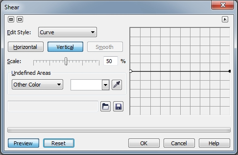
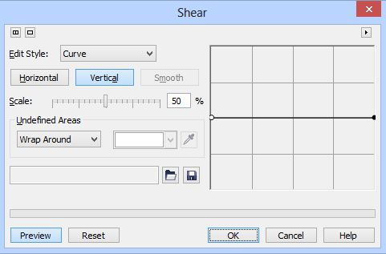
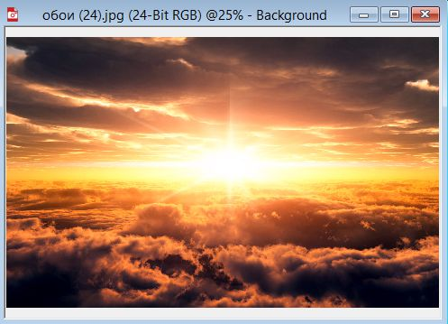
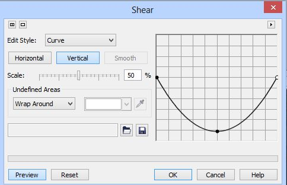
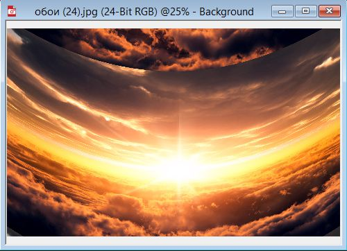
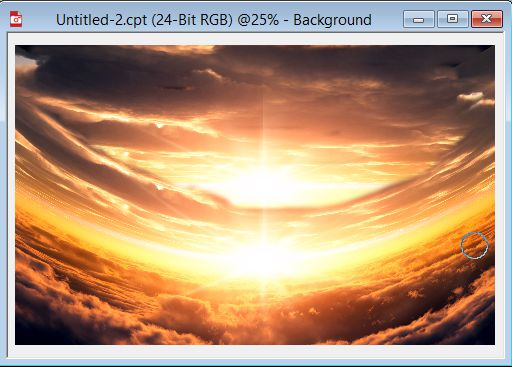
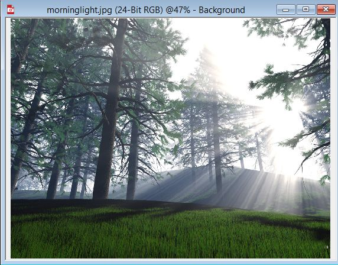
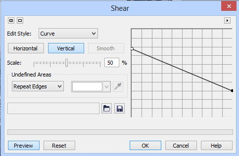
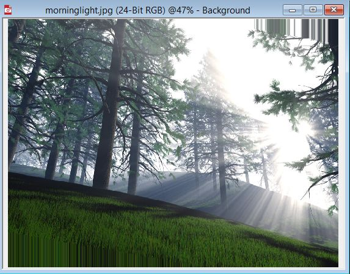
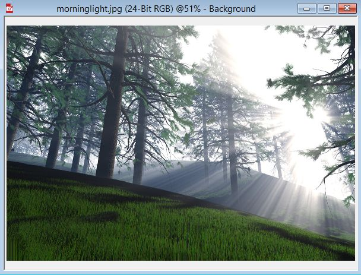

# Фильтр Shear (Перекос)

Фильтр **Shear** (Перекос) (рис. 1) искажает изображение вдоль траектории, определяемой с помощью кривой излома.

Манипулируя узлами на кривой перекоса, можно получать кривые, которые определяют форму и величину излома. Изображение будет соответствовать полученной таким образом кривой. Имеются три варианта заполнения области, оставшейся пустой в результате смещения. Функция **Other Color** (Другой цвет) позволяет заполнить пустую область цветом краски, функция **Wrap Around** (Обтекание) создает эффект мозаики, а функция **Repeat Edges** (Повтор краев) позволяет получить эффект растяжения. Эти функции доступны в раскрывающемся списке области **Undefined Areas** (Неопределенные области).

**Для искажения изображения вдоль траектории:**

1\. Выполните команду **Effects > Distort > Shear** (Эффекты > Искажение > Перекос).

2\. Выберите один из пунктов раскрывающегося списка в области **Undefined Areas** (Неопределенные области):  
> **Wrap Around** (Обтекание) – производит заполнение открытых областей содержимым противоположной стороны изображения;  
> **Repeat Edges** (Повтор краев) – растягивает края изображения для заполнения открытых областей  
> **Other Color** (Другой цвет) – заполняет открытые области цветом краски выбранной в _Указателе цвета_ или выбранной с помощью _Пипетки_.

3\. Выберите стиль правки из раскрывающегося списка **Edit Style** (Стиль):  
> Пункт **Curve** (Кривая) позволяет искажать изображение вдоль кривой. В этом режиме можно добавлять на кривой дополнительные точки изгиба;  
> Пункт **Straight** (Прямая) позволяет проводить искажение вдоль прямой траектории;  
> Пункт **Freehand** (Свободная) позволяет проводить искажение по заданной траектории неправильной формы;  
> Пункт **Gamma** (Гамма) позволяет искажать изображение вдоль плавной кривой. Однако в отличие от стиля **Curve** (Кривая) на кривой нельзя добавить дополнительные точки.

4\. С помощью кнопок **Horizontal** (По горизонтали) или **Vertical** (По вертикали) задайте направление траектории искажения. Кнопка **Smooth** (Сглаженный) становится активной только при выборе пункта **Freehand** (Свободная) в раскрывающемся списке **Edit Style** (Стиль) и позволяет сгладить зубцы на кривой.

5\. Правьте кривую излома, щелкая по ней и перетаскивая в различных направлениях.

Перемещение ползунка **Scale** (Масштаб) позволяет устанавливать интенсивность искажения. Поэтому лучше задать вначале плавную кривую. Используйте затем ползунок для проведения экспериментов с различными исходными установками.

Вообще нужно заметить, что с помощью фильтра **Shear** (Перекос) в некоторых случаях можно получить довольно оригинальное искажение. Именно тот факт, что искажение задается формой кривой, позволяет получить искривление практически любой сложности. В дополнение к этому, для удобства работы, можно менять масштаб сетки. Для этого в любой месте области кривой, щелкните мышью, удерживая при этом нажатой клавишу **Alt** (рис. 2). Сравните рис.1 и 2, и вы увидите разницу в масштабе сетки.

Добавлять точки на кривой также можно различными способами. Можно щелкнуть непосредственно на кривой, а можно в нужной точке, в области сетки. При втором способе, не только добавляется точка, но и кривая автоматически изогнется соответствующим образом. Если вы случайно добавили точку не в том месте (или лишнюю точку), то можно отменить добавление последней точки, нажав **Ctrl+Z**. Можно также удалить любую добавленную точку, выделив ее мышью и нажав клавишу **Del**.

В этом фильтре также есть довольно неплохая возможность – начать искажение с плавной кривой, выбрав в раскрывающемся списке **Edit Style** (Стиль) вариант **Curve** (Кривая), а затем в ходе изменения формы кривой, переключиться на вариант **Freehand** (Свободная) и продолжить менять форму кривой. Таким образом часть кривой будет иметь плавный изгиб, а нужные участки произвольную форму.

При выборе стиля **Freehand** (Свободная) можно редактировать уже искривленную кривую, перетаскивая мышью нужные участки. Сложно это описать, но вы можете попрактиковаться в этом и вы быстро поймете о чем идет речь. Таким же образом можно сглаживать те участки кривой, которые получились «зубчатыми», что может случиться при работе в режиме **Freehand** (Свободная).

Если вы любите смотреть фильмы, то наверняка видели в некоторых из них такой эффект, когда при съемке неба из самолета или океана с лодки, специально делают искривление пейзажа по окружности. Такой же эффект довольно легко получить при помощи фильтра **Shear** (Перекос). На рис. 3 показано исходное изображение неба.

Применим фильтр: **Effects > Distort > Shear** (Эффекты > Искажение > Перекос) (рис. 4).

Изображение исказиться, как показано на рис. 5.

После восстановления участка неба с помощью инструмента **Clone From Saved** (Клонирование из сохраненного), получим окончательный вариант (рис. 6).

В некоторых случаях можно также использовать этот фильтр вместо фильтра **Cylinder** (Цилиндр), где эффект «оборачивания» получится гораздо лучше при использовании фильтра **Shear** (Перекос).

Также фильтр **Shear** (Перекос) можно использовать для получения более простеньких эффектов, но которые в некоторых случаях надо обязательно получить. Ниже приведен пример такого простенького эффекта.

На рис. 7 показано исходное изображение.

Выполните команду **Effects > Distort > Shear** (Эффекты > Искажение > Перекос) (рис. 8).

Получим искажение, как на рис. 9.

Искажение травы в левом нижнем углу исправляем инструментом инструмента **Clone From Saved** (Клонирование из сохраненного), а искажение в верхнем правом углу удаляем, просто обрезав верхнюю часть изображения (рис. 10).

Сравним рисунки 7 и 10\. Что мы видим? Вместо ровного участка леса, мы получаем ощущение, что лес растет на какой-то пологой гористой местности. Похожий результат может быть, если бы мы снимали держа фотоаппарат под углом к земле (т. е. с перекосом). Как видите, такой незамысловатый, но иногда необходимый эффект, легко создается с помощью фильтра **Shear** (Перекос).