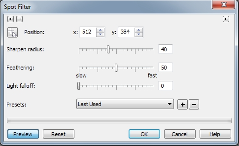
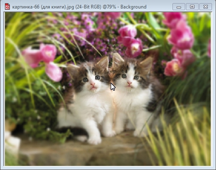

# Фильтр Spot Filter (Фильтр теней)

Этот фильтр позволяет увеличивать глубину резкости изображений, определяя участки, которые будут в фокусе (выглядеть резче) и снижая фокус для остальных областей изображения (смягчает окружающую область применяя размытие _по Гауссу_). Диалоговое окно фильтра **Spot Filter** (Фильтр теней) показано на рис.1.

Это опять же тот случай, когда русификация была сделана из рук вон плохо. Работа этого фильтра никаким образом не связана с тенью, хотя в нем и можно слегка затемнить размываемые участки изображения. В одной из более ранних локализованных русских версий Photo-Paint, этот фильтр был назван _Точечный фильтр_, что хоть чуть-чуть является более удачным вариантом перевода.

Элементы управления позволяют менять точку фокуса, радиус эффекта, плавность перехода от резкого к нерезким участкам и степень затемнения в областях вне фокуса. Также имеется набор заготовок, имитирующих наиболее популярные фотографические приемы. Однако вы врядли будете прибегать к этому фильтру, т. к. можно достичь гораздо лучших результатов, используя другие инструменты и фильтры Photo-Paint.

Но тем не менее, давайте рассмотрим влияние элементов управления фильтра на получаемый результат. На рис. 2 показаны два симпатичных котенка сидящих среди травы и цветов.

Обратите внимание на достаточно хорошую резкость окружающей растительности (хотя конечно она немного местами размыта). Попробуем с помощью фильтра **Spot Filter** (Фильтр теней), сфокусировать внимание на котятах, размыв окружающую зелень, а заодно и поэкспериментируем с различными значениями параметров.

Откройте фильтр **Spot Filter** (Фильтр теней), выполнив команду **Effects > Camera > Spot Filter** (Эффекты > Камера > Фильтр теней).  
Вверху окна расположена кнопка **Position** (Положение), с помощью которой можно интерактивно задать центр размытия в окне изображения. После нажатия этой кнопки, указатель мыши примет вид стрелочки с маленьким знаком «**+**». Когда вы щелкните в нужном месте изображения, то область вокруг этой точки будет оставаться резкой, но по мере удаления от этой точки, изображение будет все более и более размытым. Положение этой точки можно также задать точно, введением координат в счетчиках **х:** и **y:**, в верхней части окна.

При установках параметров по умолчанию, щелкните на кнопке в виде стрелки с знаком «**+**», а потом между мордочками котят. При этом изменения в изображении будут столь малы, что вы, скорее всего их сразу не заметите. Не изменяя значения параметра **Sharpen radius** (Радиус заострения), увеличьте значение **Feathering** (Размытие) с 50 (по умолчанию) до 75 (рис.3). Трава и цветы стали заметно размыты, хотя мордочки котят остались четкими.

Также немного стали размыты спинки и лапы. Другими словами, начиная с некоторого расстояния от места щелчка мышью, изображение становится размытым. Увеличение значения параметра **Feathering** (Размытие) приведет к еще большему размытию.

Оставив без изменения значение **Feathering** (Размытие), т. е. 75, увеличим значение параметра **Sharpen radius** (Радиус заострения) с 40 (по умолчанию) до 80\. В результате четкая область изображения увеличится (рис. 4).

Если уменьшить значение параметра **Feathering** (Размытие) до 0, оставив значение **Sharpen radius** (Радиус заострения) равным 40 (по умолчанию), то изображение останется без изменений, либо они будут просто незаметны.

Соответственно наоборот, уменьшив значение **Sharpen radius** (Радиус заострения) до 0, но оставив значение **Feathering** (Размытие) равным 50 (по умолчанию), мы практически полностью размоем картинку (рис. 5).

Еще один параметр – **Light falloff** (Падение света) позволяет создать эффект затенения размытых областей. Понятно, чем больше значение, тем больше затемнение, что позволяет дополнительно подчеркнуть или сфокусировать внимание на нужном фрагменте.

На рис. 6 показан результат применения фильтра **Spot Filter** (Фильтр теней) с следующими значениями параметров: **Feathering** (Размытие) 75; **Sharpen radius** (Радиус заострения) 40; **Light falloff** (Падение света) 100.

Сравнив рис. 6 с исходным изображением, вы заметите, что кроме размытия, зелень по краям изображения стала немного темнее.