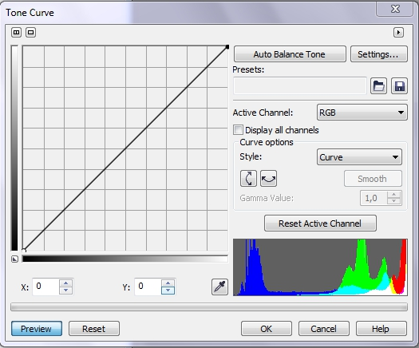
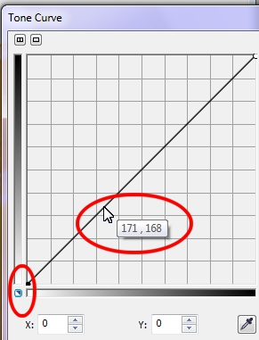

# Фильтр Tone curve (Цветовая кривая)

Фильтр **Tone curve** (Цветовая кривая) позволяет выполнить тонкую или глобальную коррекцию тонов и цветов, как и фильтр **Contrast enhancement** (Увеличение контрастности), но предлагает более тонкое управление отдельными уровнями значений. Редактирование на основе кривой позволяет точно определить область воздействия и производить в ней слабые или сильные изменения. Их эффект ослабляется по мере удаления от выбранной области. В тоже время, фильтр **Contrast enhancement** (Увеличение контрастности) влияет на все пиксели выбранного диапазона в одинаковой степени.

Как и фильтр **Contrast enhancement** (Увеличение контрастности), фильтр **Tone curve** (Цветовая кривая) изменяет яркость пикселей. Как и гистограмма, кривая наглядно отображает баланс между тенями, средним тоном и бликами. Можно выбрать одну из нескольких заранее подготовленных кривых или создать и сохранить свою кривую.

Пожалуй не об одном фильтре не написано столько статей и обучающих материалов, как о фильтре **Tone curve** (Цветовая кривая). В Photoshop этот инструмент называется **_Curves_**. Однако использование этого инструмента требует определенных навыков и тренировки. Но это того стоит, когда вы освоите этот инструмент, я думаю, он станет одним из ваших любимых инструментов. Диалоговое окно фильтра **Tone curve** (Цветовая кривая) показано на рис. 1.

Кривая – это график изменения яркости пикселов. Он дает возможность сколь угодно точно задать распределение пикселов изображения по яркостям. По горизонтальной оси X откладываются исходные градации яркости (входного диапазона), по вертикальной оси Y – яркости, которые будут иметь пикселы после коррекции (выходного диапазона). Таким образом, настраивая форму кривой, можно изменить яркость любого тонового интервала изображения. При отсутствии изменений исходные яркости равны конечным и график представляет собой прямую линию под углом 45°. Шкалы градаций яркости вдоль осей показывают значения яркостей. Как видите, яркость возрастает снизу вверх и слева направо.

Щелкнув на кнопке в левом нижнем углу, вы поменяете направления осей тоновой кривой. Теперь нулевое значение размещается в верхнем правом углу. При перетаскивании цветовой кривой исходные (ось x) и скорректированные (ось y) значения пикселей отображаются рядом (рис. 2). Значения по осям Х и Y также отображаются в счётчиках **Х:** и **Y:** под графиком.  
Первый способ предпочитают люди имеющие опыт в допечатной подготовке, в то время, как фотографы отдают предпочтение второму варианту.

Элементы управления цветовой кривой находятся в области **Curve options** (Параметры кривой), справа от графика. Раскрывающийся список **Style** (Стиль) позволяет выбрать один из режимов создания кривой:

*   **Curve** (Кривая) – режим по умолчанию. Для изменения формы кривой вы создаете точки, смещаете их в произвольном направлении, а программа строит между точками плавную кривую;
*   **Straight** (Прямая) – режим, при котором вы также создаете точки и смещаете их, но между точками программа строит отрезки прямых, получается ломаная линия;
*   **Freehand** (Свободная) — режим, позволяющий произвольно изменять тоновую кривую как обычную линию перетаскиванием курсора, создавая сколь угодно сложный график;
*   **Gamma** (Гамма) – режим изменяющий в основном средние тона, позволяющий только изменять изгиб кривой, не проставляя дополнительные точки. Если вы выберите режим **Gamma** (Гамма), установите в счетчике **Gamma Value** (Значение гаммы) значение, для корректировки значений кривой.

Верхняя и нижняя точка кривой соответствуют точкам черного и белого. Наклон кривой – это контраст. Чем выше наклон, тем контрастнее данный тоновый диапазон. Перетаскивая точки по вертикали, вы уменьшаете наклон кривой (снижаете контраст) и уменьшаете тоновый диапазон изображения.

Для выбора конкретной точки на изображении, служит кнопка в виде пипетки, в нижней части окна. При выборе _Пипетки_, указатель примет вид пипетки, а щелчок на изображении, добавит точку на кривой, соответствующую данной точке изображения.

В комплект Photo-Paint входит несколько заготовок цветовых кривых, доступ к которым осуществляется кнопкой в виде открытой папки, в области **Presets** (Заготовки). Щелчок на этой кнопке вызывает диалоговое окно **Load Tone Curve Files** (Загрузка файлов кривых тона). Вы можете также сохранить свои заготовки кривых, щелкнув на кнопке _Сохранить_, в виде дискеты.

В дополнение к перечисленным элементам управления, вы можете автоматически настроить тональный диапазон, щелкнув на кнопке **Auto Balance Tone** (Автоматический баланс цветов). Чтобы отсечь пиксели по краям тонового диапазона, нажмите кнопку **Settings** (Параметры) и введите значения в диалоговом окне **Auto-adjust Range** (Автокоррекция диапазона).

Фильтр **Tone curve** (Цветовая кривая) также позволяет выполнять коррекцию не только в составном канале, но и в каждом канале в отдельности, который можно выбрать в раскрывающемся списке **Active Channel** (Активный канал).  
Не смотря на важность и широкое применение фильтра **Tone curve** (Цветовая кривая), мы не будем сейчас рассматривать примеры его применения. Случаи применения этого фильтра будут рассмотрены в другой главе, где он будет использоваться совместно с другими инструментами и функциями Photo-Paint. В этом кратком разделе мы только лишь рассмотрели элементы диалогового окна **Tone curve** (Цветовая кривая) и элементы его управления.