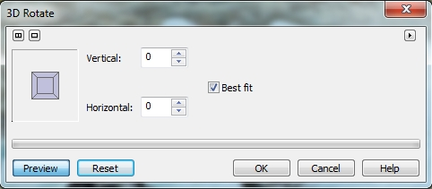

# Фильтры 3D Rotate (Трехмерный поворот) и Cylinder (Цилиндр)

### Фильтры группы 3D Effects (Трехмерные эффекты)

Название этой группы эффектов говорит само за себя. Эти эффекты служат для имитации объема или изменения изображения в пространстве. Собственно применение фильтров этой группы не представляет каких-либо затруднений, т. к. элементы управления диалоговых окон и названия элементов управления интуитивно понятны. Поэтому у вас врядли возникнут какие-либо трудности в освоении этих фильтров.

### Фильтр 3D Rotate (Трехмерный поворот)

Этот фильтр размещается первым в этой группе. Чтобы воспользоваться фильтром выполните команду **Effects > 3D Effects > 3D Rotate** (Эффекты > Трехмерные эффекты > Трехмерный поворот).  
Диалоговое окно фильтра **3D Rotate** (Трехмерный поворот) показано на рис. 1).

Фильтр **3D Rotate** (Трехмерный поворот) вращает изображение в горизонтальном или вертикальном направлении в соответствии с заданными ограничениями по горизонтали и вертикали Изображение вращается, как если бы оно представляло собой одну сторону трехмерного блока. В окне предварительного просмотра показывается перспектива изображения с текущими установками счетчика. Затемненная плоскость блока представляет изображение. Функция **Best fit** (Подогнать под размер) обеспечивает, чтобы части вращающегося изображения не выпадали за пределы Окна изображения.

В диалоговом окне **3D Rotate** (Трехмерный поворот) трехмерный поворот можно задать интерактивно, с помощью элемента управления в виде куба или задав значения угла поворота в счетчиках **Vertical** (По вертикали) и **Horizontal** (По горизонтали).

В верхнем правом углу диалогового окна фильтра расположена маленькая кнопка в виде треугольника направленного вправо. Нажатие этой кнопки приводит к появлению меню **Effects** (Эффекты), что позволяет получить доступ к другим фильтрам без необходимости закрывать окно и снова заходить в меню **Effects** (Эффекты) со строки меню. Этот элемент управления в виде маленького треугольника имеется в окнах всех фильтров.

### Эффект Cylinder (Цилиндр)

Это пожалуй один из самых простых фильтров, примерно такой же, как и _Трехмерное вращение_. Простота таких фильтров вполне понятна. Минимум элементов управления, а те которые имеются, интуитивно понятны и без особого разъяснения. Этот фильтр (рис. 2), применяется для придания эффекта обтекания или лучше сказать, облегания объекта. Среди обычных окружающих нас предметов, за пример можно взять бутылку, на которой наклейка с текстом повторяет форму бутылки. Чтобы получить подобный результат в Photo-Paint и служит фильтр **Cylinder** (Цилиндр).

В диалоговом окне фильтра расположен всего один элемент управления – ползунок **Percentage** (Процент), который отвечает за величину или степень искривления. И хотя в окне фильтра имеется что-то типа области с сеткой, для визуального ориентира о применяемом эффекте, однако этот элемент на мой взгляд не очень информативен и полезен в работе. Так же имеется два переключателя в области **Cylinder Modes** (Режимы цилиндров), **Horizontal** (По горизонтали) и **Vertical** (По вертикали), отвечающие за то, в каком направлении будет применен эффект.