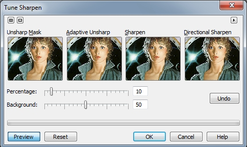
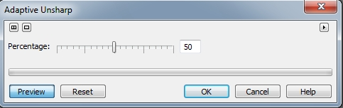
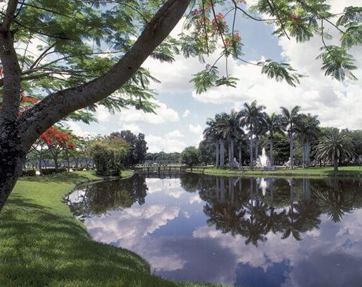
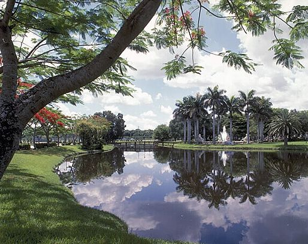

# Фильтры Adaptive Unsharp и Directional Sharpen

### Фильтры группы Sharpen (Повышение резкости)

Фильтры из подменю **Sharpen** (Повышение резкости) увеличивают контрастность пикселей изображения для улучшения фокусировки и улучшения отображения краев. Эта группа включает в себя пять фильтров. Доступ к четырем из них можно получить другим путем. В Photo-Paint имеется еще одна команда, вызывающая фильтр для настройки резкости, в котором можно настраивать четыре типа резкости. Этот фильтр похож по своему устройству на фильтры **Tune Noise** (Настройка) и **Tune Blur** (Настройка размытости). Чтобы вызвать этот фильтр, выполните команду **Image > Correction > Tune Sharpen** (Изображение > Коррекция > Настройка повышения резкости). Окно фильтра показано на рис. 1.

Ползунок **Percentage** (Процент) служит для задания степени увеличения резкости, которая будет применяться при каждом нажатии кнопки эскиза. Для задания порога этого эффекта, переместите регулятор **Background** (Фон). Чем ниже значения, тем больше пикселей будет изменено при использовании эффекта повышения резкости.  
Теперь вернемся к фильтрам подменю **Sharpen** (Повышение резкости) и рассмотрим их.

### Фильтр Adaptive Unsharp (Понижение резкости маски)

Если вы внимательно присмотритесь к русской версии подменю **Sharpen** (Повышение резкости), то вероятно заметите одну особенность, в этом подменю имеется две одинаковых команды соответствующих разным фильтрам. Первая из них **Adaptive Unsharp** (Понижение резкости маски), а вторая **Unsharp Mask** (Понижение резкости маски). Сложно сказать, чем руководствовались переводчики, когда русифицировали Photo-Paint. Первый фильтр раньше назывался _Адаптивная резкость_, что наверно было более правильно.  
Диалоговое окно фильтра **Adaptive Unsharp** (Понижение резкости маски) показано на рис. 2.

Фильтр **Adaptive Unsharp** (Понижение резкости маски) подчеркивает детали краев путем анализа значений соседних пикселей. Этот фильтр сохраняет больше деталей изображения, чем другие эффекты резкости, применяемые к изображению. Ползунок **Percentage** (Процент) служит для определения степени резкости.

Давайте посмотрим на действие фильтра **Adaptive Unsharp** (Понижение резкости маски). На рис. 3 показано исходное изображение.

На первый взгляд вполне нормальное изображение с симпатичным пейзажем. Но присмотритесь к нему повнимательней… Мне бы хотелось улучшить резкость листьев на ближнем к зрителю дереве и траву. Попробуем это сделать с помощью фильтра **Adaptive Unsharp** (Понижение резкости маски). Так как более отдаленные части пейзажа также не отличаются резкостью, то мы применим фильтр ко всему изображению. Выполните команду **Effects > Sharpen > Adaptive Unsharp** (Эффекты > Повышение резкости > Понижение резкости маски). В диалоговом окне фильтра установите максимальное значение параметра **Percentage** (Процент), т. е. 100 и щелкните **ОК**. Результат показан на рис. 4.

Посмотрите насколько четче стали листья на переднем плане и трава. Также заметно стало лучше видно мост, который находится в отдалении и деревья на правом берегу стали выглядеть гораздо лучше. Другими словами, с помощью этого фильтра можно повысить резкость без искажения изображения. Конечно, этот фильтр (впрочем, как и остальные тоже) нельзя применять ко всем изображениям подряд. В некоторых случаях, эффект от этого фильтра может быть столь малозаметным, что вы его просто сразу и не увидите. Поэтому целесообразность применения этого фильтра определяется индивидуально для каждого изображения.

### Фильтр Directional Sharpen (Направленное повышение резкости)

Фильтр **Directional Sharpen** (Направленное повышение резкости) проводит анализ пикселей аналогичных оттенков для определения направления приложения наибольшей резкости. В диалоговом окне фильтра, как и в предыдущем, имеется всего один элемент управления – ползунок **Percentage** (Процент), служащий для определения степени резкости. Т. к. диалоговое окно этого фильтра идентично предыдущему, я не буду здесь его показывать.

Дополнительно можно сказать, что результат применения фильтра **Directional Sharpen** (Направленное повышение резкости) будет часто выглядеть точно также, как и результат применения фильтра **Adaptive Unsharp** (Понижение резкости маски).