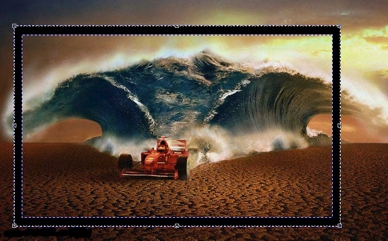

# Фильтры Bevel Effect и Emboss

### Фильтр Bevel Effect (Эффект скоса)

Следующий фильтр в группе **3D Effects** (Трехмерные эффекты) – фильтр **Bevel Effect** (Эффект скоса). Применение этого эффекта требует наличия маски. Если изображение или какая-то его часть не выделена, то Photo-Paint выведет окно с предупреждением (рис. 1).

Эффекты скоса позволяют создать видимость приподнятой поверхности путем скоса края редактируемой области. Например, эффекты скоса можно использовать для придания глубины тексту или его можно использовать для создания рамок. Диалоговое окно **Bevel Effect** (Эффект скоса) состоит из двух вкладок (рис. 2 и рис. 3).

На вкладке **Bevel** (Скос) (рис. 2), задаются геометрические параметры эффекта, т. е. ширина и высота. Эти параметры задаются соответствующими ползунками **Width** (Ширина) и **Hight** (Высота). При этом параметр **Hight** (Высота) может принимать значения от 1 до 200, а **Width** (Ширина) от 3 до 100.  
Ползунок **Smoothness** (Сглаживание) придает более сглаженный вид полученному эффекту. Чем меньше значение параметра **Smoothness** (Сглаживание), тем более скошенными (более резкими) кажутся края (границы) скоса. Довольно хорошо начать экспериментировать с параметрами этого фильтра с текста. Создайте новый документ с белым фоном и крупным шрифтом наберите слово или фразу. Создайте из текста маску и примените эффект **Bevel Effect** (Эффект скоса). На тексте будет очень отчетливо видно влияние значения параметров.

Последний элемент управления на этой вкладке – флажок **Preserve interior** (Сохранять внутреннюю часть). Этот флажок отвечает за применение параметров освещения и текстуры для внутренней области скоса.  
В нижней части вкладки находится раскрывающийся список **Presets** (Заготовки) предоставляющий доступ к списку заготовок эффекта. Вы можете выбрать любую из них. Справа от списка расположены две кнопки в виде знаков «**+**» и «**—**», позволяющие сохранить пользовательские настройки в виде заготовки или удалить пользовательскую заготовку из этого списка. В случае сохранения заготовки, после нажатия кнопки со знаком «**+**» Photo-Paint выведет диалоговое окно **Save Preset** (Сохранение заготовки) (рис. 4), в котором вам будет предложено ввести название вашей заготовки в поле **Save new preset** (Сохранить заготовку как).

Вкладка **Lightning** (Освещение) диалогового окна показана на рис. 3\. На этой вкладке расположены элементы управления эффектом освещения применяемого при создании скоса. С помощью ползунков **Brightness** (Яркость) и **Ambient** (Рассеянный) вы можете управлять яркостью части изображения, к которой применен эффект. Счетчики **Direction** (Направление) и **Angle** (Угол) предназначены для задания направления и угла падения света от мнимого источника света.

Вы можете эффекту назначить цвет с помощью раскрывающегося списка **Color** (Цвет) или текстуру, выбрав ее в раскрывающемся списке **Texture** (Текстура). Щелкнув на кнопке в виде открытой папки, вы можете загрузить другую текстуру в открывшемся диалоговом окне **Load Bevel Effect Texture Files** (Загрузка файлов текстуры эффекта скоса).  
Как и на вкладке **Bevel** (Скос), вкладка **Lightning** (Освещение) в нижней части имеет раскрывающийся список **Presets** (Заготовки), в котором вы можете выбрать одну из имеющихся в вашем распоряжении заготовок.

**Пример.**

Рассмотрим пример использования эффекта **Bevel Effect** (Эффект скоса). На рис. 5 показано исходное изображение.

Теперь создадим нечто наподобие рамки, как у картины. Для этого определимся с тем, какая часть изображения будет в нашей «картине». Все изображение помещать в рамку нет смысла. Выделим только центральную часть.  
Итак, наши действия:  
1\. На панели **Toolbox** (Набор инструментов) выберите инструмент **Rectangle** (Прямоугольник). На _Панели свойств_ отключите заливку, щелкнув кнопку **Disable fill** (Выключить заливку), также убедитесь, что кнопка **New object** (Создать объект) находится в нажатом состоянии. В счетчике **Outline width** (Толщина абриса) установите значение равным 15.  
2\. Нарисуйте прямоугольник по центру изображения.  
3\. Нажмите комбинацию клавиш **Ctrl + M**, чтобы создать из объекта маску (рис. 6).

4\. Выполните команду **Effects > 3D Effects > Bevel Effect** (Эффекты > Трехмерные эффекты > Эффект скоса).  
Значения параметров в диалоговом окне **Bevel Effect** (Эффект скоса) приведены на рис. 7 и рис. 8.

4\. Теперь для удаления лишней части изображения на панели **Toolbox** (Набор инструментов) выберите инструмент **Crop** (Обрезка) и обрежьте части изображения выступающие за края рамки.

Окончательный вид изображения показан на рис. 9\. Естественно, как вы уже сами знаете, нужно удалить маску и объединить объект-прямоугольник с фоном.

### Эффект Emboss (Рельеф)

Следующий фильтр в группе 3**D Effects** (Трехмерные эффекты) – фильтр **Emboss** (Рельеф).  
Фильтр **Emboss** (Рельеф) трансформирует изображение в рельеф, представляя детали изображения в качестве "рубцов и щелей" на плоской поверхности. Функция **Direction** (Направление) указывает на расположение источника света по отношению к изображению (в центре круга). В качестве цвета рельефа может использоваться исходное изображение, серый, черный цвет или цвета выбираемые из палитры представленной в виде раскрывающегося списка. Фильтр **Emboss** (Рельеф) лучше всего работает с изображениями средней и высокой контрастности. Диалоговое окно фильтра представлено на рис. 10.

**Для применения эффекта рельефа:**

1\. Выполните команду **Effects > 3D Effects > Emboss** (Эффекты > Трехмерные эффекты > Рельеф).  
2\. Переместите ползунок **Depth** (Глубина) для задания величины рельефа вокруг краев. От этого зависит, насколько глубокими будут казаться щели и рубцы рельефа.  
3\. Щелкните по краю элемента управления **Direction** (Направление) для выбора местонахождения источника света.  
4\. Включите один из переключателей области **Emboss color** (Цвет рельефа) для задания цвета рельефного изображения.  
Ползунок **Level** (Уровень) служит для установки содержания исходных цветов в конечном изображении. Влияние значения параметра **Level** (Уровень) показано на рис. 11.

На рис. 11, слева направо: исходное изображение; значение параметра **Level** (Уровень) = 100 (по умолчанию); значение параметра **Level** (Уровень) = 300; значение параметра **Level** (Уровень) = 500\. Остальные параметры по умолчанию.