# Фильтры Blocks (Блоки) и Displace (Замещение)

### Фильтр Blocks (Блоки)

Фильтр **Blocks** (Блоки) разбивает изображение на прямоугольные фрагменты заданного размера. Размер блоков задается в окне фильтра (рис. 1) с помощью ползунков **Block width** (Ширина блока) и **Block height** (Высота блока).

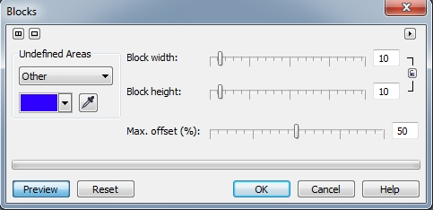

Изменять размеры можно синхронно или по отдельности по ширине и высоте. Для этого в окне фильтра служит кнопка, в виде маленького замочка между этими двумя ползунками. Смещение блоков относительно друг друга происходит на случайное расстояние, не превышающее заданного значения **Max offset (%)** (Макс. смещение (%)). Для выбора заполнения промежутков между фрагментами служит раскрывающийся список в области **Andefined Areas** (Неопределенные области). Можно заполнить пикселами исходного изображения – **Original image** (Оригинал), его негативной копии – **Inverse image** (Обратить изображение), черным цветом – **Black** (Черный), белым – **White** (Белый) или любым сплошным цветом – **Other** (Другой). В последнем случае становится доступным _**Указатель цвета**_.  
Хотя область применения этого фильтра на первый взгляд не совсем очевидна, в сочетании с другими фильтрами эффектов, можно получить оригинальные результаты. Естественно, у вас может возникнуть очевидный вопрос, что можно толкового придумать, разбив изображение на кусочки. Если вы попробуете применить этот фильтр к разноцветному фону, например, результат вас никак не вдохновит, точно так же, если применить его к фотографии. Но давайте не будем спешить с категорическими выводами. Попробуем все-таки что-то с его помощью сделать. Здесь, как я и обещал в разделе о фильтре [Zoom (Масштаб)](http://cdrpro.ru/node/3166), мы рассмотрим пример использования этого фильтра с фильтром **Blocks** (Блоки).  
На рис. 2 показано исходное изображение.

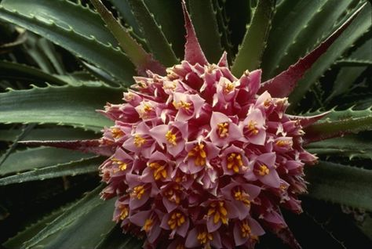

Применим к нему фильтр **Blocks** (Блоки). Выполните команду **Effects > Distort > Blocks** (Эффекты > Искажение > Блоки). Установите в окне фильтра параметры, как на рис. 3.

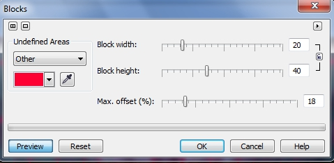

Как и следовало ожидать, изображение разбилось на прямоугольные блоки, промежутки между которыми заполнены красным цветом (рис. 4).

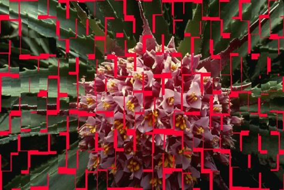

Теперь применим размывающий фильтр **Zoom** (Масштаб). Для этого выполните команду Effects > Blur > Zoom (Эффекты > Размытость > Масштаб). Установите значение параметра **Amount** (Количество) равным 84\. Щёлкните на кнопке установки центра в виде указателя с крестиком, чтобы задать центральную точку размытия. Щелкните мышью ниже центра цветка и щелкните в окне фильтра **ОК**. Получим изображение, как на рис. 5.

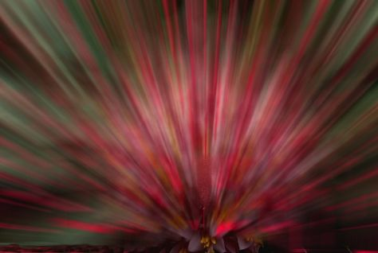

Чтобы придать желаемый вид, я конечно немного подчистил немного самый низ фотографии и исправил яркую красную полоску, которая была по центру. Но это уже были «мелкие косметические поправки». Так что в комбинации с фильтром размытия, можно с успехом применять фильтр **Blocks** (Блоки). Особенно эффективно можно применять этот фильтр для создания абстракций.

### Фильтр Displace (Замещение)

Фильтр **Displace** (Замещение) изменяет изображение с использованием текстуры замещения. В Соrеl Photo-Раint имеется собственный набор текстур замещения, однако в качестве такой текстуры может быть использовано любое растровое изображение. По умолчанию, набор текстур хранится в папке C:\Program Files\Corel\CorelDRAW Graphics Suite X5\Custom Data\Displace, при условии, что вы используете Windows 7\. Фильтр Displace (Замещение) анализирует значения цвета пикселей в обоих изображениях и затем сдвигает активное изображение в соответствии со значениями в текстуре замещения. В результате значения из текстуры замещения используются в качестве образцов формы, цвета и деформации изображения. Перемещая ползунки, можно сдвигать изображение по горизонтали или вертикали, управляя направлением и углом замещения основного изображения, в то время как второе изображение остается на месте.  
Диалоговое окно фильтра **Displace** (Замещение) показано на рис. 6.

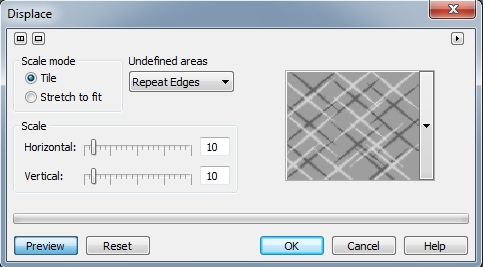

**Для искажения изображений с использованием текстуры замещения:**

1\. Выполните команду **Effects > Distort > Displace** (Эффекты > Искажение > Замещение).

2\. В раскрывающемся списке с образцами текстур, выберите текстуру. Для загрузки текстуры, в этом же списке нажмите кнопку **Other** (Другой).

3\. В диалоговом окне **Load Displacement Map Files** (Загрузка файлов карты смещения) выберите файл с текстурой и нажмите кнопку **Import** (Импорт).  
Изображение появляется в раскрывающемся списке с образцами текстур.

4\. В области **Undefined Areas** (Неопределенные области) выберите в раскрывающемся списке один из вариантов:  
> Опция **Wrap Around** (Обтекание) производит заполнение открытых областей содержимым противоположной стороны изображения  
> Опция **Repeat Edges** (Повтор краев) растягивает края изображения для заполнения открытых областей

5\. Включите один из переключателей раздела **Scale mode** (Режим):  
> Опция **Tile** (Плитка) повторяет изображение замещения для покрытия области изображения  
> Опция **Stretch to fit** (Подгонка) использует одиночную текстуру, растянутую поверх всей области изображения.

6\. В области **Scale** (Масштаб) переместите ползунки **Horizontal** (По горизонтали) и **Vertical** (По вертикали) для задания величины замещения.

Хотя применять фильтр **Displace** (Замещение) вам придется не часто, как и большинство других фильтров группы **Distort** (Искажение), но как это всегда бывает, иногда возникает ситуация, когда нужно получить какой-то «замысловатый» эффект и тогда приходится прибегать к редко используемым фильтрам. Давайте создадим некий абстрактный узор. Замечу, что подобный эффект можно использовать при создании абстрактных фонов.

1\. Создадим документ. Я выбрал черный фон и разрешение в 300 **dpi**.  
2\. Нажмите клавишу **J**, чтобы выбрать инструмент **Ellipse Mask** (Эллиптическая маска) и создайте круглую маску. Размер маски лучше выбрать побольше, чтобы наш «узор» не получился «микроскопическим».  
3\. Нажмите клавишу **F**, чтобы перейти к инструменту **Fill** (Заливка). На _Панели свойств_ выберите **Fountain** (Фонтанную) заливку. Нажмите кнопку **Edit fill** (Изменить заливку). В диалоговом окне **Fountain Fill** (Фонтанная заливка) выберите в списке **Presets** (Заготовки) заготовку _Conical-Gold_. (рис. 7)

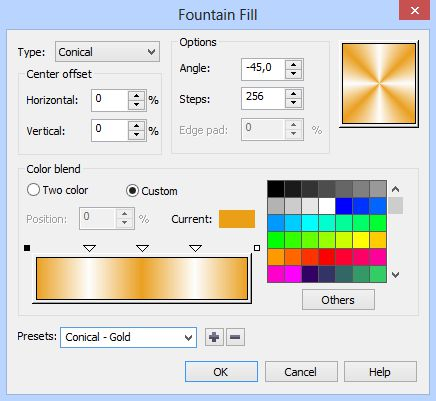

Залейте выделенную область (рис. 8).

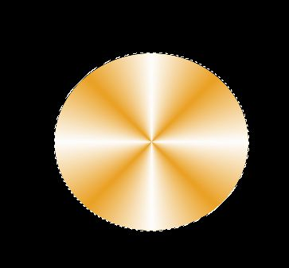

4\. Выполните команду **Effects > Distort > Displace** (Эффекты > Искажение > Замещение) и установите параметры, как на рис. 9.

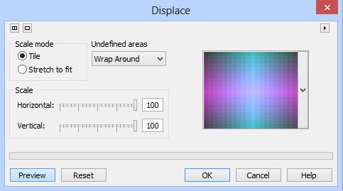

В результате получим изображение на рис. 10.

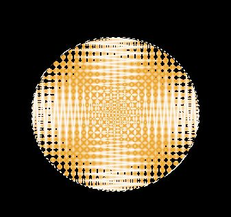

Как видите, залитая область довольно оригинально деформировалась. подобное искажение трудно добиться с помощью какого-либо другого фильтра.

5\. Теперь применим фильтр **Pinch/Punch** (Вдавливание/Выдавливание). Выполните команду **Effects > 3D Effects > Pinch/Punch** (Эффекты > Трехмерные эффекты > Вдавливание/Выдавливание). Установите значение параметра равным 100\. Полученный результат показан на рис. 11.

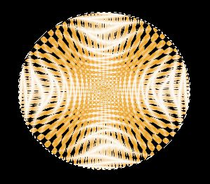

Можно из этого, например, сделать симпатичный шарик, воспользовавшись плагином _LensPro III_ (рис. 12).

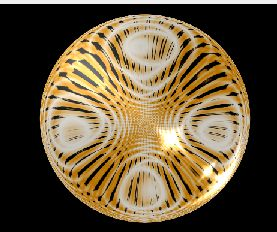

Иногда даже можно использовать фильтр **Displace** (Замещение) для более оригинальных целей. Давайте немного «поиздеваемся» над военной техникой. На рис. 13 показано исходное изображение.

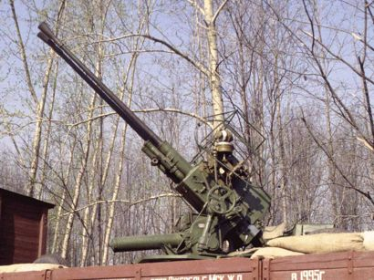

Выполните команду **Effects > Distort > Displace** (Эффекты > Искажение > Замещение) и установите параметры, как на рис. 14.

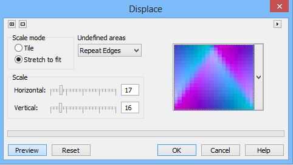

В итоге получим такую вот пушку (рис. 15).

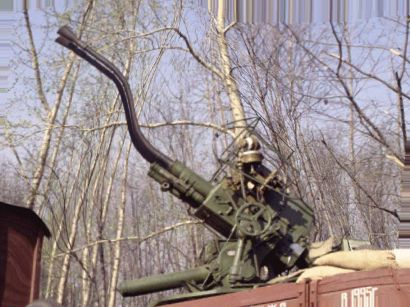

Искажение вверху изображения легко потом можно убрать с помощью инструмента _Клонирование из сохраненного_. Также следует отметить, что в случае использования изображения большего размера, значения **Horizontal** (По горизонтали) и **Vertical** (По вертикали) нужно также увеличить. Однако выбор значений не будет представлять для вас проблемы, т. к. они определяются интерактивно, исходя из нужной степени деформации, которую вы будете видеть в окне изображения в ходе изменения параметров.