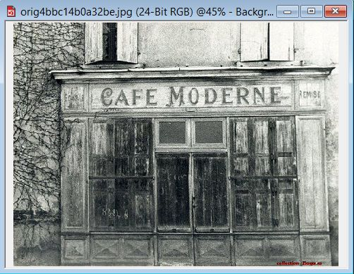
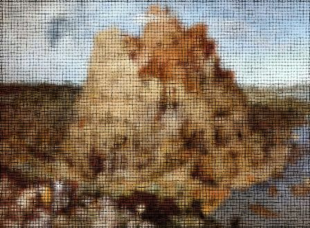

# Фильтры Brick Wall, Bubbles и Screen Door

### Фильтры группы Texture (Текстура)

Это довольно большая группа эффектов в Photo-Paint X5\. Эта группа содержит 12 фильтров, способных удовлетворить практически все потребности пользователей при создании различных эффектов. Эти фильтры можно использовать в самых различных ситуациях, как при создании изображений «с нуля», так и для добавления эффектов в готовых изображениях и фотографиях. Как и в случаях с другими фильтрами Photo-Paint, фильтры группы Texture (Текстура) чаще используются в сочетании с другими инструментами и фильтрами.

### Фильтр Brick Wall (Кирпичная стена)

Это первый фильтр, находящийся в подменю **Texture** (Текстура). Для вызова этого фильтра выполните команду **Effects > Texture > Brick Wall** (Эффекты > Текстура > Кирпичная стена) (рис. 1).

Как и следует из названия фильтра, он служит для создания текстуры в виде кирпичной стены. Элементы управления в окне фильтра имеют недвусмысленные названия, что позволяет легко понять их назначение. Эффект **Brick Wall** (Кирпичная стена) можно применять, как к готовому изображению, так и при создании картинки с нуля.

Давайте немного поэкспериментируем с настройками этого фильтра, чтобы посмотреть, как они влияют на результат. Начнем эксперименты с самого простого случая. Создайте новый документ, нажав **Ctrl + N**. Я создал документ с разрешением 96 **dpi** с белым фоном, размер особого значения не имеет. Затем залил изображение цветом более или менее близким к кирпичному. Для этого дважды щелкнул на указателе цвета заливки в **Color control area** (Области управления цветом) и в диалоговом окне **Uniform Fill** (Однородная заливка) выбрал цвет _**Red Brown**_ (Красно-коричневый).

Теперь давайте экспериментировать с параметрами в окне фильтра. С настройками по умолчанию, получилась такая вот стена (рис. 2).

Неплохой результат. Оставив без изменения все параметры, изменим только значения **Roughness** (Шероховатости). На рис. 3 слева – **Roughness** (Шероховатость) = 0; справа – **Roughness** (Шероховатость) = 75.

Как видите, этот параметр пожалуй сильнее остальных влияет на внешний вид стены.

Думаю не нужно объяснять назначение группы счетчиков **Brick Width** (Ширина кирпича) и **Brick Height** (Высота кирпича), они отвечают за размеры кирпича. Назначение маленькой кнопки в виде замочка, также очевидно. При нажатом состоянии (замочек защелкнут), ширина и высота кирпича изменяются одновременно, при отжатом положении (замочек открыт), значения ширины и высоты можно задавать независимо друг от друга.

Теперь посмотрим на влияние **Grout Width** (Ширины раствора). С помощью этого элемента управления можно сделать, как и обычный вид стены, так и весьма экзотический. На рис. 4 приведен пример влияния величины **Grout Width** (Ширины раствора), значения остальных параметров были взяты по умолчанию. Слева значение **Grout Width** (Ширины раствора) = 5, а справа – **Grout Width** (Ширина раствора) = 25.

Для продолжения нашего эксперимента, зададим сначала значения параметров: **Roughness** (Шероховатость) = 15 и **Grout Width** (Ширина раствора) = 15\. Не изменяя этих значений изменим значение **Light Direction** (Направления света). На рис. 5 показано влияние **Light Direction** (Направления света) на конечный результат. Слева значение по умолчанию – **Light Direction** (Направление света) = 315 градусов, справа – **Light Direction** (Направление света) = 135 градусов.

Как видите, меняя только направление света, можно получить довольно оригинальную кирпичную стену.

Теперь давайте посмотрим, как этот фильтр можно использовать в готовом изображении. На рис. 6 показано исходное изображение.

Предположим, вы решите поменять штукатуренную стену на более привлекательную кирпичную. В качестве примера поменяем часть стены над вывеской. Сначала нужно выделить эту часть. Т. к. этот фрагмент имеет правильную геометрическую форму, то я выделил ее с помощью инструмента **Rectangle Mask** (Прямоугольная маска). Затем применил фильтр **Brick Wall** (Кирпичная стена) с значениями параметров, как на рис. 7.

Надо заметить, что размеры кирпича были выбраны достаточно большими, т. к. и само изображение достаточно большое. Результат показан на рис. 8.

Создавать видимость кирпичной стены вручную, в подобной ситуации, задача неблагодарная. А с помощью фильтра **Brick Wall** (Кирпичная стена) это можно сделать за пару щелчков мыши.

### Фильтр Bubbles (Пузыри)

Этот фильтр позволяет создавать в изображении пузыри разных размеров и плотности, и является пожалуй самым незатейливым из всех фильтров. Окно фильтра показано на рис. 9.

С помощью ползунка **Diameter** (Диаметр) можно задавать размер пузырей в пределах от 20 до 400\. На мой взгляд, минимальное значение диаметра не позволяет создавать мелкие пузыри, что является недостатком этого фильтра. Кроме того, этот фильтр сам генерирует пузыри различного размера, независимо от значения параметра **Diameter** (Диаметр). Понятное дело, что чем больше диаметр, тем больше будет самый маленький пузырек.

С помощью ползунка **Coverage** (Область покрытия) задается плотность пузырей. Другими словами – количество пузырей на единицу площади изображения, назовем это так.

Изменяя эти два параметра и достигается определенный эффект. Вообще, на мой взгляд, сложно найти пример, где можно использовать этот фильтр. Если бы с его помощью можно было создать эффект наподобие пузырьков в воде или мыльных пузырей, можно было бы его использовать в соответствующих случаях. Однако такой эффект данный фильтр не создает. Поэтому мои попытки придумать хоть сколь-нибудь толковый пример его применения ничем не закончились.

### Фильтр Screen Door (Экранная дверь)

Фильтр **Screen Door** (Экранная дверь) позволяет добавить в изображение текстуру в виде сетки. Мне кажется, что разработчики его добавили для пополнения количества эффектов, а не для сколько-нибудь реального применения. Добавляемая фильтром незамысловатая текстура чем-то напоминает мешковину, но достаточно грубую. Управлять процессом создания тоже проблематично, т. к. этот фильтр не позволяет менять направление линий сетки, отчего область его применения сводится практически к нулю. Окно фильтра вызывается командой **Effects > Texture > Screen Door** (Эффекты > Текстура > Экранная дверь) рис. 10.

Применим этот фильтр к изображению показанному на рис. 11.

Установки параметров в окне фильтра показаны на рис. 10 выше. После применения фильтра изображение примет вид, как на рис. 12.

Теперь наша картинка стала напоминать рисунок на грубом холсте. Как я уже сказал выше, если бы этот фильтр был более гибким в работе, то можно было бы с его помощью получить реалистичный эффект старого холста потрескавшегося от времени.