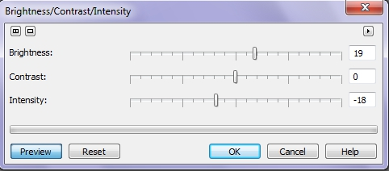

# Фильтры Brightness/Contrast/Intensity и Gamma

### Фильтр Brightness/Contrast/Intensity  
(Яркость/Контрастность/Интенсивность)

Фильтр **Brightness/Contrast/Intensity** (Яркость/Контрастность/Интенсивность) корректирует яркость, контрастность и интенсивность тонов в изображении. Элемент управления **Brightness** (Яркость) сдвигает все значения пикселей вверх или вниз в диапазоне тонов. Когда корректируется яркость, все цвета становятся светлее или темнее соответственно. Ползунок **Contrast** (Контрастность) корректирует разницу между светлыми и темными пикселями в изображении. Повышение интенсивности делает ярче светлые области изображения без осветления темных. Контрастность и интенсивность работают аналогично, поскольку увеличение контрастности иногда скрывает детали в тенях или бликах, а повышение интенсивности может эти детали вернуть. Изменение контрастности и интенсивности обычно используют совместно, так как увеличение контрастности иногда снижает четкость деталей, и повышение интенсивности может ее повысить.

Диалоговое окно **Brightness/Contrast/Intensity** (Яркость/Контрастность/Интенсивность) (рис. 1) содержит три ползунка. Каждый из них управляет одним параметром, изменяя его от -100 до +100\. Значение атрибута отображается и может быть введено в поле рядом с ползунком. Нулевое значение соответствует отсутствию изменений, положительное смещение – увеличению параметра, отрицательное – уменьшению.

В нижней части окна размещена кнопка управления просмотром. Чтобы просмотреть результат коррекции, не закрывая окна, надо щелкнуть на кнопке **Preview** (Просмотр).

Кнопка **Reset** (Сброс) приводит все ползунки в нулевое состояние, а редактируемые объекты – к исходному виду (на момент открытия диалогового окна).

### Фильтр Gamma (Гамма)

Гамма-это метод тональной коррекции, основанный на восприятии оттенков человеческим глазом. Фильтр Гамма позволяет выделить детали в слабо контрастном изображении без нарушения теней и бликов. Можно получить такие же результаты при использовании фильтра _Цветовая кривая_, который включает параметр гаммы.

Команда **Gamma** (Гамма) меню **Adjust** (Настройка) открывает одноименное диалоговое окно, в котором имеется единственный ползунок, который позволяет менять гамму от 0,10 до 10\. Значение 1 соответствует неизмененной гамме изображения.