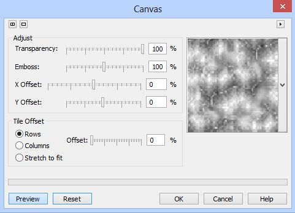
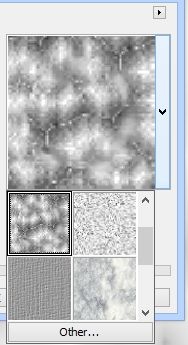
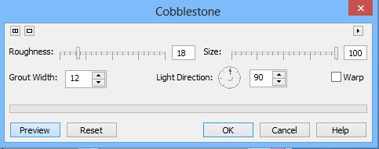
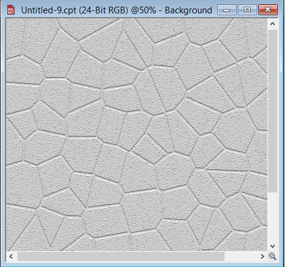
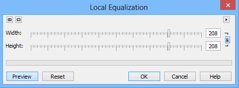
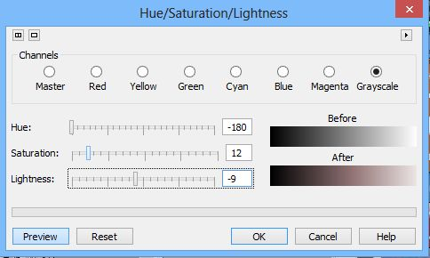
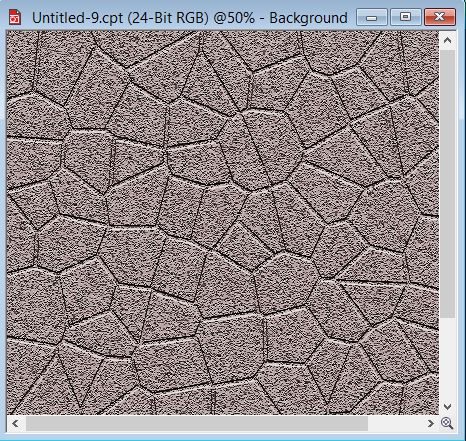
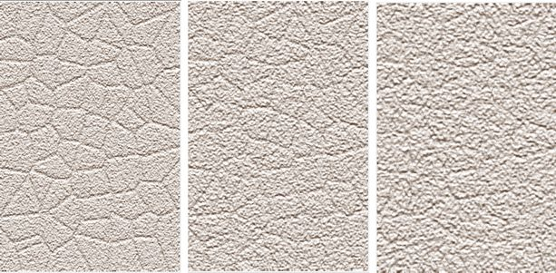

# Фильтры Canvas и Cobblestone

### Фильтр Canvas (Холст)

Это один из моих любимых фильтров. С его помощью можно получить самые различные эффекты, от эффекта сепии до создания в изображении текстуры. Самый распространенный способ применения этого фильтра, это наложение на изображение текстуры с последующей обработкой другими фильтрами и/или изменением режимов наложения. Разнообразие ситуаций, в которых можно применять этот фильтр, также огромно. Окно фильтра показано на рис. 1.

Окно фильтра разделено на три области, в которых объединены соответствующие элементы управления. В области **Adjust** (Настройка), собраны элементы управления отвечающие за внешний вид текстуры (холста), а в области **Tile Offset** (Смещение плиток), отвечающие за то, как текстура будет заполнять изображение. И наконец, третья область, имеет всего один элемент управления – раскрывающийся список с образцами текстур. Если вы раскроете этот список (рис. 2), то обнаружите весьма скромный арсенал заготовок.

Для добавления текстуры, не входящей в этот список, щелкните кнопку **Other** (Другие). В открывшемся окне **Load Canvas Map Files** (Загрузка файла карты прорисовки), можете выбрать другой файл с текстурой. Из этого следует вполне очевидный вывод, Photo-Paint может использовать в качестве текстуры, как целые изображения (типа обычных фотографий), так и непосредственно изображения текстур. Использование части фотографии в качестве заготовки для фильтра **Canvas** (Холст) было рассмотрено [ЗДЕСЬ](http://cdrpro.ru/node/2568). Такая возможность, использовать произвольное изображение, либо создавать самому файлы заготовок, расширяет возможности использования фильтра. Поэтому варианты использования этого фильтра ограничиваются пожалуй только вашим воображением.

Следует отметить, что по умолчанию, в области **Tile Offset** (Смещение плиток), переключатель установлен в положение **Rows** (Строки), что является в большинстве случаев не самым удачным вариантом, точно также, как и вариант **Columns** (Столбцы). Наиболее часто приходится пользоваться вариантом **Stretch to fit** (Подгонка). В этом случае Photo-Paint растягивает текстуру на все изображение, вместо того, чтобы заполнить его мелкими плитками текстуры.

Вообще нужно сказать, что назначение элементов управления этого фильтра интуитивно понятно, что делает освоение работы с ним очень легким. Поэтому я не буду здесь останавливаться на описании каждого параметра. Также, я не буду приводить примеры с использованием этого фильтра, т. к. они есть на этом сайте (например [ЗДЕСЬ](http://cdrpro.ru/node/3009)), а также встречаются в книге выше.

### Фильтр Cobblestone (Булыжник)

Будем откровенны, как на мой взгляд, это самый заурядный и неказистый фильтр в Photo-Paint. Ничего особенного он делать не может и как следствие, область его применения тоже не слишком широка. Название у фильтра тоже соответствующее. Если вы примените его, то получите замысловатую мозаику в виде плиток, чем-то напоминающую брусчатку. Ну, раз это напоминает брусчатку, то давайте попробуем создать текстуру с неким подобием дороги мощенной камнями.

1\. Создайте новый документ с серым фоном. Выберите для этой цели цвет – 20 % серого.

2\. Выполните команду **Effects > Texture > Cobblestone** (Эффекты > Текстура > Булыжник) и сделайте в окне фильтра настройки, как на рис. 3.

Получим «заготовку» брусчатки (рис. 4).

3\. Теперь придадим нашим «булыжникам» видимость некоторой рельефности или может лучше сказать, добавим маленько дефектов (шероховатости), чтобы они не казались такими идеальными. Для этого воспользуемся фильтром **Local equalization** (Местное выравнивание) (рис. 5).

4\. Ну и наконец, добавим немного другой оттенок, чтобы наша брусчатка выглядела более симпатично. Т. к. у нас брусчатка серого цвета, то оттенок ей придадим с помощью фильтра **Hue/Saturation/Lightness** (Оттенок/Насыщенность/Яркость) (рис. 6).

В итоге получим вот такую симпатичную брусчатку (рис. 7)

Вы конечно можете по своему усмотрению выбрать другой цвет или оттенок, но я остановился именно на этом варианте.

Элементы управления этого фильтра очень похожи на те, которые мы рассматривали при знакомстве с фильтром **Brick Wall** (Кирпичная стена), но в фильтре **Cobblestone** (Булыжник), параметр Roughness (Шероховатость) оказывает очень сильное влияние на конечный результат. Если выполнить те же действия, как в рассмотренном примере, но увеличить значения **Roughness** (Шероховатости), то можем получить результаты, как на рис. 8.  
На рис. 8: слева – **Roughness** (Шероховатость) = 50; по центру – **Roughness** (Шероховатость) = 75; справа **Roughness** (Шероховатость) = 100.

Если посмотреть на рис. 8 (справа), то видно, что большое значение параметра **Roughness** (Шероховатость), превратило нашу брусчатку, в какую-то мешанину. Поэтому, для увеличения шероховатости, в описанном выше примере и был использован фильтр **Local equalization** (Местное выравнивание), а не применялось увеличение значения **Roughness** (Шероховатости).