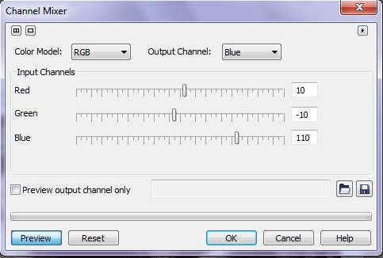
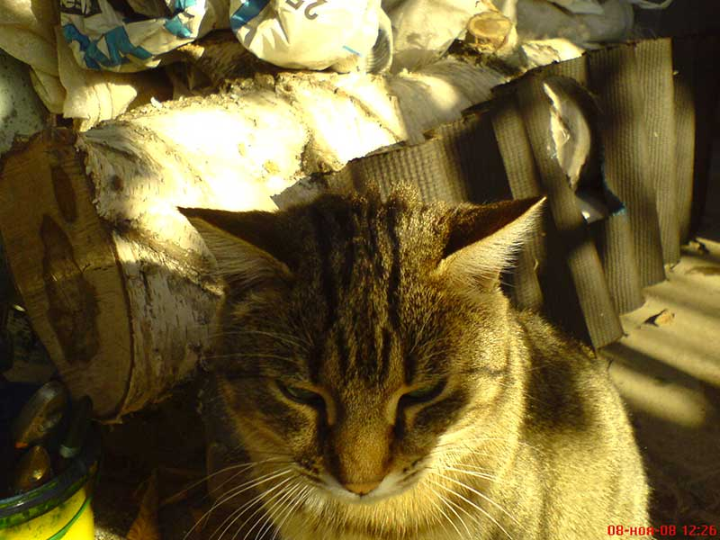
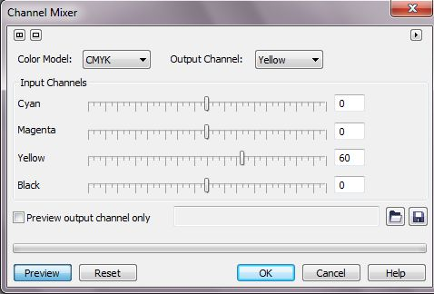
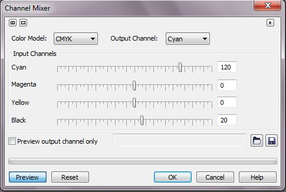
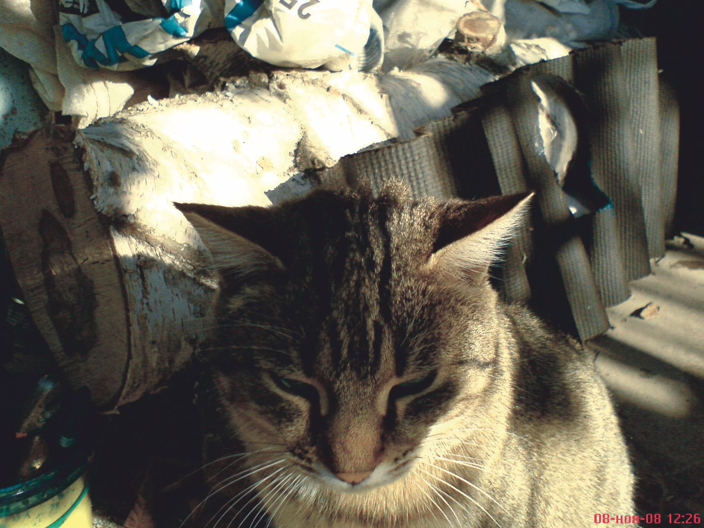
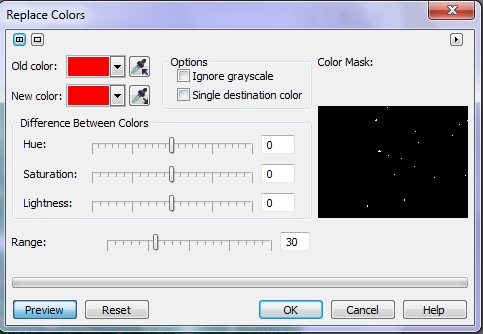
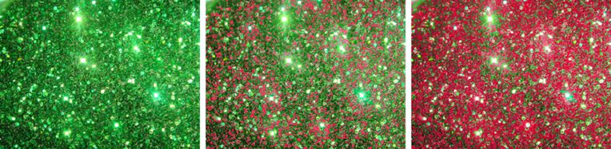

# Фильтры Channel mixer и Replace colors в Photo-Paint

### Фильтр Channel mixer (Смешивание каналов)

С помощью фильтра **Channel Mixer** (Смешивание каналов) производят замену и смешение цветовых каналов изображения. Непосредственно в окне фильтра вы можете менять модель представления каналов изображения, выбрав ее в раскрывающемся списке **Color Model** (Модель цвета) (рис. 1).

В соответствии с выбранной моделью в области **Input Channels** (Каналы входа) появятся соответствующие ползунки каналов. Это входные каналы изображения. Вверху справа в раскрывающемся списке **Output Channel** (Канал вывода) выберите выходной канал. Для просмотра только редактируемого выходного канала установите флажок **Preview output channel only** (Просмотр только канала вывода). Установки смесителя каналов можно сохранять в виде файлов заготовок. Для этого после выполнения нужных настроек, щелкните на кнопке в виде дискеты.

Рассмотрим пример использования фильтра **Channel Mixer** (Смешивание каналов) для цветовой коррекции.

На рис. 2 вы видите фотографию, сделанную осенним днем и низкостоящее солнце дало желтый оттенок по всему изображению.

Для исправления этого дефекта, в диалоговом окне **Channel Mixer** (Смешивание каналов), были использованы параметры показанные на рис. 3 и 4.

Обратите внимание, что я специально для этой цели выбрал в раскрывающемся списке **Color Model** (Модель цвета) модель **CMYK**, а в раскрывающемся списке **Output Channel** (Канал вывода) – каналы **Yellow** (Желтый) и Cyan (Голубой).

Результат коррекции показан на рис. 5

Также надо помнить о том, что, в диалоговом окне вы лишь меняете модель редактирования, а не цветовое пространство изображения, а также то, что команда **Channel Мiхег** работает с каналами, а не с цветами, как **Ние/Saturation** или **Selective Соlог**.

### Фильтр Replace colors (Заменить цвета)

Название фильтра говорит само за себя, он предназначен для замены выбранного цветового интервала по всему изображению или в выделенной области изображения. В указателе цвета **Old color** (Старый цвет) показан образец исходного цвета, в указателе цвета **New color** (Новый цвет) – заменяющий цвет (рис. 6). Для выбора образцов прямо из изображения служат пипетки. Кроме того, можно щелкнуть на образце и выбрать нужный цвет в открывшемся списке.

Для определения нового цвета используется область **Difference Between Colors** (Разница между цветами). В ней определяется изменение каждого из компонентов цвета в модели **HLS**. Параметр **Hue** (Оттенок) определяет разницу в цветовом тоне, увеличение параметра соответствует смещению вправо по цветовому кругу, уменьшение – смещению влево. Параметры **Saturation** (Насыщенность) и **Lightness** (Осветление), задают разницу в насыщенности и яркости. Значения меньше нуля соответствуют уменьшению параметров, больше нуля – увеличению. Чтобы замена цвета не слишком бросалась в глаза, насыщенность и яркость нового цвета должны приближаться к исходным значениям.

Для задания диапазона цветов, близких к выбранному, предназначена шкала **Range** (Область). Чем меньше заданное в ней значение, тем уже диапазон заменяемых цветов. Увидеть, какие области изображения подвергаются изменению цвета, можно как на самом изображении, так и в области **Color Mask** (Цветовая маска). В ней представлена уменьшенная копия изображения, на которой белым цветом помечены области, затрагиваемые изменениями, черным — области, маскированные (защищенные) от изменений. Чем больший диапазон цветов выбран, тем больше белых областей появляется на маске.

Фильтр **Replace colors** (Заменить цвета) можно с успехом использовать для замены цветов в текстурах, а различные настройки параметров, позволяют получать различные результаты (рис. 7).

На рис. 6 показано слева – исходное изображение, по центру и справа - после замены зеленого цвета на красный, но с различными параметрами.

Диалоговое окно **Replace colors** (Заменить цвета) еще имеет два дополнительных режима, управляемых флажками:

*   **Ignore grayscale** (Игнорировать оттенки серого) – при установленном флажке замена не распространяется на точки нейтрального, серого цвета;
*   **Single destination color** (Один конечный цвет) – если установить этот флажок, то при замене не учитывается яркость пикселов.