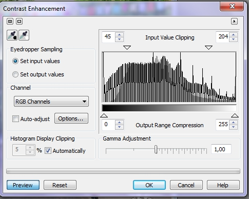
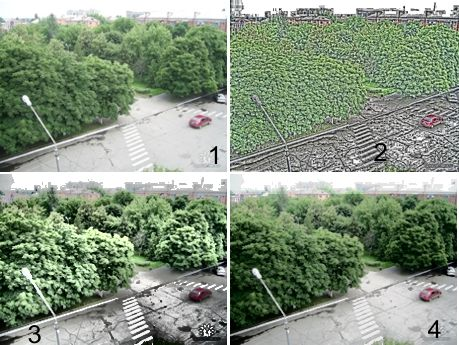

# Фильтры Contrast Enhancement (Увеличение контрастности) и Local Equalization (Местное выравнивание)

Название этого фильтра говорит само за себя, он служит для увеличения контраста в изображении. Вызывается он, как вы догадываетесь, командой **Adjust > Contrast Enhancement** (Настройка > Увеличение контрастности).

Фильтр **Contrast Enhancement** (Увеличение контрастности) предоставляет мощный инструмент для повышения качества изображения. Он позволяет скорректировать тени, средние тона и блики. Этот фильтр позволяет сохранить информацию о тенях и бликах, которая может быть потеряна при использовании фильтра _Яркость-Контрастность-Интенсивность_.

Можно автоматически перераспределить значения пикселей, по всему диапазону тонов, или использовать любой из корректирующих элементов. Пипетки и отображаемая гистограмма упрощают управление характеристиками яркости изображения. Достаточно задать начальную и конечную точки диапазона тонов, и фильтр расширит или сожмет находящуюся между ними область. Фильтр **Contrast Enhancement** (Увеличение контрастности) переназначает оттенки от темных к светлым между заданными начальным и конечным значениями. Гистограмма отображает переназначение пикселей по яркости. Этот фильтр можно использовать для искусственного создания градаций цветов, если случайно произошла постеризация, для осветления или затемнения любой комбинации теней, средних тонов или бликов, для приведения значений яркости к ограничениям печати и для коррекции гаммы в изображении.

Для первого знакомства с диалоговым окном фильтра **Contrast Enhancement** (Увеличение контрастности) откройте любое изображение и выполните команду **Adjust > Contrast Enhancement** (Настройка > Увеличение контрастности) (рис. 1).

Рассмотрим теперь элементы управления этого диалогового окна. Как и в большинстве подобных диалоговых окон, в верхней части окна расположены две кнопки управляющие предварительным просмотром исходного изображения и результата изменений. С их помощью можно просматривать результаты коррекции, как в самом окне изображения, так и в окне фильтра. Для включения и отключения просмотра вносимых изменений служит кнопка **Preview** (Просмотр), в левом нижнем углу окна. Основную часть окна фильтра занимает гистограмма с элементами управления сверху и снизу. Сверху расположена группа элементов управления **Input Value Clipping** (Обрезка входных значений), состоящая из двух счетчиков и двух ползунков, в виде направленных вниз треугольников. Значения в этой группе можно устанавливать вводом значений в счетчиках или буксировкой ползунков с помощью мыши.

Элементы управления группы **Input Value Clipping** (Обрезка входных значений) используются для установки новых значений черной и белой точек, что позволяет сократить диапазон яркостей изображения и повысить его контрастность. Например, установка в левом счетчике значения 20, приведет к тому, что все цвета имеющие значения яркости меньше этого значения, станут черными. Соответственно, установка значения 200 в правом счетчике, приведет к обращению всех яркостей в диапазоне 200 ÷ 255\. В результате диапазон яркостей понизится с 255 до 180, а контрастность возрастет.

Снизу диаграммы, расположена другая группа элементов управления – **Output Range Compression** (Сжатие выходного диапазона), аналогичная по своей структуре группе элементов над гистограммой. Однако в отличие от ранее рассмотренной группы, здесь перемещение левого ползунка приведет к осветлению более темных пикселей, а перемещение правого ползунка затемняет более светлые пиксели. Например, задав в левом счетчике значение равное 30, вы настраиваете на эту величину яркость самого темного пикселя, что приводит к повышению уровня освещенности изображения. С помощью правого счетчика или ползунка, вы можете установить более низкое значение самого светлого пикселя. В итоге это приводит к снижению контрастности изображения.

Под элементами управления в области гистограммы находится ползунок **Gamma Ajustment** (Настройка гаммы). Этот ползунок позволяет управлять значениями яркости в средних тонах изображения. По умолчанию, значение **Gamma Ajustment** (Настройка гаммы) равно 1\. Установка меньшего этого значения приводит к затемнению изображения. Установка значения больше 1, приводит к осветлению изображения.

В левой части окна расположен флажок **Auto-adjust** (Автокоррекция) предназначенный для автоматической коррекции изображения. Смысл автоматической коррекции заключается в отбрасывании заранее установленного количества пикселей изображения. По умолчанию, это значение – 5%. Это значение можно изменить, нажав кнопку **Options** (Параметры). В результате откроется диалоговое окно **Auto-adjust Range** (Автокоррекция диапазона) (рис. 2).

В этом диалоговом окне имеется всего два счетчика: **Black limit to** (Ограничение черного) и **White limit to** (Ограничение белого).

Счетчик **Black limit to** (Ограничение черного) показывает текущее значение процента пикселей, выходящих за предел цветового диапазона, как слишком темные, которые Photo-Paint будет игнорировать при автокоррекции. Счетчик **White limit to** (Ограничение белого) показывает текущее значение процента пикселей, выходящих за предел цветового диапазона, как слишком яркие, которые Photo-Paint будет игнорировать при автокоррекции.

Производить коррекцию света и тени можно и отталкиваясь от самого изображения, указав на нем самую светлую и самую темную точки и приравняв эти точки к максимальному и минимальному возможным значениям выходной яркости. Чтобы задать белую и черную точку входного диапазона, установите переключатель в области **Eyedropper Sampling** (Пипетка) в положение **Set input values** (Задает входные значения). Нажмите кнопку с изображением пипетки и белой точки в левом верхнем углу диалогового окна. Курсор тоже примет вид пипетки. Поместите курсор на самую светлую точку изображения. Щелкните, и выбранная точка станет белой. Соседняя кнопка с изображением пипетки и черной точки предназначена для выбора точки черного, устанавливающей нижнюю границу входного тонового диапазона. Используйте ее для выбора самой темной точки изображения.  
Если вы переведете переключатель **Eyedropper Sampling** (Пипетка) в положение **Set output values** (Задает выходные значения), то сможете задать граничные точки выходного диапазона. Например, щелкнув на светлой точке белой пипеткой, вы дадите команду сузить выходной диапазон таким образом, чтобы все точки, светлее данной, были приведены к указанному значению яркости.

Если в изображении пикселы распределены неравномерно, то уровни с малым их числом становятся плохо различимыми. Чтобы рассмотреть уровни более внимательно, можно задать режим отображения лишь части пикселов, «обрезав» верхнюю часть гистограммы. Для этого введите процент отсекаемых пикселов в счетчике **Histogram Display Clipping** (Обрезка гистограммы). Например, введя значение 20%, вы велите программе показывать только 80% пикселов на уровнях, отбросив верхние значения. В таком режиме лучше видны уровни с небольшим содержанием пикселов. Чтобы изменить значения в этом счетчике, сбросьте флажок **Automatically** (Авто).

После применения фильтра **Contrast Enhancement** (Увеличение контрастности), при повторном его вызове, настройки от предыдущего сеанса работы с ним остаются. Чтобы вернуть настройки фильтра к значениям по умолчанию, нажмите кнопку **Reset** (Сброс).

В качестве примера использования фильтра **Contrast Enhancement** (Увеличение контрастности), ниже приведены изображения до и после коррекции и изображение окна фильтра с примененными настройками (рис. 3 и 4).

Контрастность в изображении с помощью фильтра **Contrast Enhancement** (Увеличение контрастности) можно также изменять в отдельных каналах. Для этого служит раскрывающийся список **Channel** (Канал). При выборе любого из каналов, гистограмма меняется, в соответствии с выбранным каналом.

С помощью фильтра **Local equalization** (Местное выравнивание) можно увеличить контрастность по краям изображения и выявить детали темных и светлых участков. Фильтр использует соседние пиксели для создания стилизованного эффекта. Немного поэкспериментировав с фильтром, вы поймете принцип его работы. Этот фильтр выявляет «пограничные» участки в изображении и увеличивает контраст по границам перехода оттенков. Окно фильтра показано на рис. 5.

В окне фильтра имеется всего два ползунка: **Width** (Ширина) и **Height** (Высота). Кнопка в виде замочка позволяет одновременно изменять значения и делает их одинаковыми. Если вы хотите установить разные значения параметров **Width** (Ширина) и **Height** (Высота), щелкните на этой кнопке.  
Чем меньше значения параметров в окне фильтра, тем сильнее контраст в мелких деталях.

Действие фильтра показано на рис. 6.

На рис. 6 показано применение фильтра при различных значениях параметров **Width** (Ширина) и **Height** (Высота). Значения обеих параметров одинаковы.  
1 – исходное изображение; 2 – значения **Width** (Ширина) и **Height** (Высота) = 10; 3 -- значения **Width** (Ширина) и **Height** (Высота) = 60; 4 -- значения **Width** (Ширина) и **Height** (Высота) = 200.

Как видно из рисунка, при малых значениях параметров, контрастность увеличилась даже по границам отдельных веток на деревьях, а границы трещин на асфальте и пятен после дождя, также стали контрастными.

Однако после некоторых экспериментов с фильтром в различных изображениях, вы увидите, что с его помощью можно получить интересные эффекты. Пример применения фильтра показан на рис. 7.

Для получения данного эффекта, сначала была выделена ваза, а затем применен фильтр **Local equalization** (Местное выравнивание) с настройками по умолчанию. Слева – исходное изображение.