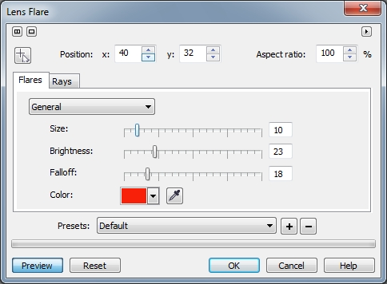

# Фильтры Diffuse (Диффузия) и Lens Flare (Блик объектива)

### Фильтр Diffuse (Диффузия)

Фильтр **Diffuse** (Диффузия) распространяет пиксели изображения для заполнения пустот и удаления шума. В зависимости от выбранного уровня, эффект может представляться сглаживающим, размывающим или приводить к получению смягченного изображения со сдвоенными краями, как если бы на него смотрели через рассеивающий фотообъектив.  
Этот фильтр перекочевал из группы фильтров _Шумов_ (там он был в более ранних версиях), в группу фильтров _Камера_. Я не думаю, что вы будете использовать этот фильтр, т. к. в арсенале Photo-Paint имеется немало средств, на мой взгляд более удачных и эффективных, для борьбы с дефектами фотографий.

### Фильтр Lens Flare (Блик объектива)

Фильтр **Lens Flare** (Блик объектива) отображает на изображении кольца света, которые моделируют блики, появляющиеся на фотографии, если фотоаппарат направлен на прямой яркий свет. В фотоаппарате это происходит из-за того, что свет проходит через ряд линз, каждая из которых влияет на его интенсивность и распространение. Блики от линз будут отличаться друг от друга, завися от фокусного расстояния и коэффициента увеличения каждой линзы. Фильтр **Lens Flare** (Блик объектива) моделирует три различных типа объективов. Используйте этот фильтр для добавления элемента фотографического реализма к изображениям. Поскольку данный фильтр моделирует бьющий в объектив яркий свет, то создаваемый блик преломляется в ряд небольших световых кругов, а также яркую бликовую точку. Следите за тем, чтобы эти вторичные круги света не попали в нежелательную область.

Диалоговое окно фильтра **Lens Flare** (Блик объектива) состоит из двух вкладок: **Flares** (Блики) (рис. 1) и **Rays** (Лучи) (рис. 2).

Нижняя и верхняя части диалогового окна включающие раскрывающийся список **Presets** (Заготовки) (внизу), группу счетчиков **Position** (Положение) и счетчик **Aspect ratio** (Отношение), являются общими для этих двух вкладок.

Я хочу привести определения, которые находятся в самой справочной системе Photo-Paint для того, чтобы была ясность, что означают термины употребляемые в диалоговом окне **Lens Flare** (Блик объектива):

*   Блик: самая яркая часть отраженного света.
*   Ореол: светлый круг, отображаемый вокруг блика.
*   Хвост отражения: ряд маленьких кружков, удаляющихся от блика.
*   Лучи: полоски света, исходящие от блика.
*   Анаморфотный свет: полоска света, проходящая сквозь блик.

**Для создания на изображении блика объектива:**

1\. Выполните команду **Effects > Camera > Lens Flare** (Эффекты > Камера > Блик объектива).  
2\. Установите центр блика, нажав кнопку в виде курсора с крестиком, в верхней левой части окна, а затем щелкнув в окне изображения или области предварительного просмотра. Установить центр блика можно с помощью группы счетчиков **Position** (Положение).  
3\. В раскрывающемся списке **Presets** (Заготовки) выберите тип объектива или заготовку эффекта блика:

*   тип **105 мм Prime** создает эффект блика объектива, типичный для средних фотообъективов;
*   тип **35 мм Prime** создает эффект блика объектива, типичный для средних широкоугольных объективов;
*   тип 5**0-300 mm Zoom** (50-300 мм зум) создает эффект блика объектива, типичный для фокусных расстояний от 50 мм (стандартный объектив, нормальная перспектива) до 300 мм (объективы типа фото/масштабирование, увеличивающая перспектива).

Остальные типы заготовок имитируют различное направление лучей и бликов разного цвета, с определенным набором значений параметров.

На вкладке **Flares** (Блики):  
4\. Выберите цвет фильтра в указателе цвета **Color** (Цвет).  
5\. Переместите ползунок **Size** (Размер) для задания размера блика.  
6\. Переместите ползунок **Brightness** (Яркость) для задания яркости блика.  
7\. Переместите ползунок **Falloff** (Спад) для задания размера самой яркой части блика (фактически его центральной части).

Если вас устраивает получившийся результат, на этом можно закончить создание эффекта _Блика объектива_. Однако для получения определенного эффекта может потребоваться дополнительная настройка параметров в окне фильтра. Photo-Paint предоставляет в наше распоряжение еще целую массу дополнительных настроек.  
На этой же вкладке, **Flares** (Блики), имеется безымянный раскрывающийся список, расположенный над группой ползунков, состоящий из трех параметров:

*   **General** (Общие) – этот параметр дает доступ к настройке общих параметров блика. В этом случае, вкладка **Flares** (Блики) имеет вид показанный на рисунке 1.
*   **Halo** (Ореол) – этот параметр предоставляет доступ к настройкам ореола. При выборе этого параметра, на вкладке **Flares** (Блики) становятся доступными только два ползунка **Size** (Размер) и **Brightness** (Яркость), которые управляют этими параметрами ореола (рис. 3).
*   **Reflection Tail** (Хвост отражения) – этот параметр действует аналогично параметру **Halo** (Ореол), но естественно элементы управления (**Size** (Размер) и **Brightness** (Яркость)) изменяют _Хвост отражения_.

Особого описания все эти элементы управления на вкладке **Flares** (Блики) не требуют, т. к. они интуитивно понятны. Стоит вам немного поэкспериментировать с ними и вы научитесь получать нужный результат. Я бы сказал, что результат применения этого фильтра больше зависит от художественного вкуса пользователя, чем от навыков работы с программой и фильтром. Могу лишь разве что добавить, что часто интересные результаты можно получить разместив центр блика «позади объекта». Тогда можно получить «эффект подсветки», т. е. создается впечатление, что источник света находится сзади (с тыльной стороны объекта), самого блика практически не видно, а виден в основном только ореол.

На вкладке **Rays** (Лучи) находятся элементы управления лучами исходящими от блика (рис 2). Здесь вы можете настроить параметры с помощью ползунков:

*   **Count** (Число) – количество лучей;
*   **Brightness** (Яркость) – яркость лучей;
*   **Rotation** (Поворот) – поворот лучей исходящих от блика;
*   **Streaks** (Полосы) – тоненькие полоски света между лучами или находящиеся в пределах широких лучей;
*   **Sharpness** (Резкость) – определяет резкость луча, однако также определяет форму луча, точнее его ширину

На этой же вкладке можно добавить шумы с помощью счетчиков **RNoise** (Шум R) и **SNoise** (Шум S).

Кроме перечисленных уже элементов управления, в диалоговом окне **Lens Flare** (Блик объектива) имеется еще один элемент управления – счетчик **Aspect ratio** (Отношение). Значения этого параметра могут изменяться от 0 до 200 %. Этот элемент управления отвечает за форму блика. По умолчанию, значение этого параметра равно 100 %, что соответствует круглой форме блика. Однако, если вы хотите сделать форму блика «приплюснутой», то измените это значение. При значениях меньше 100 %, блик сплюснут по бокам, а при значениях больше 100 %, он приплюснут сверху и снизу.