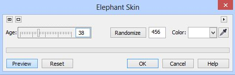
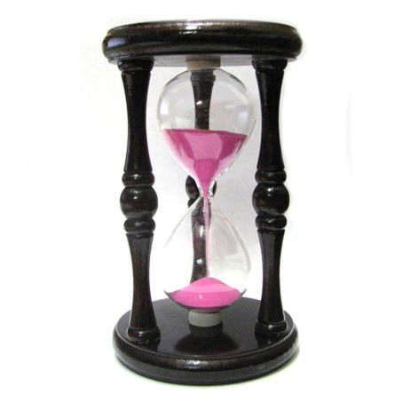
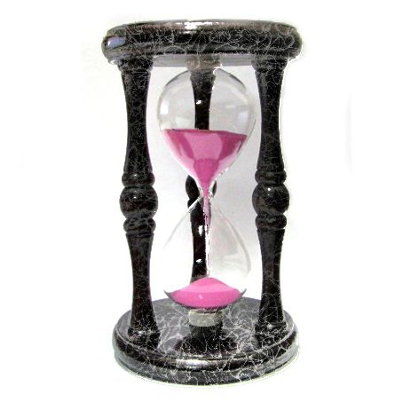
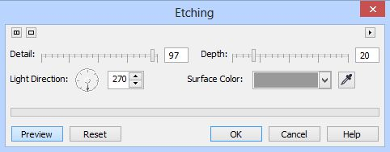
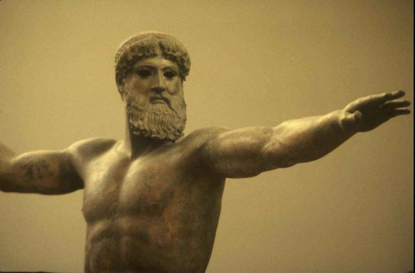
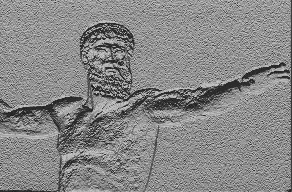
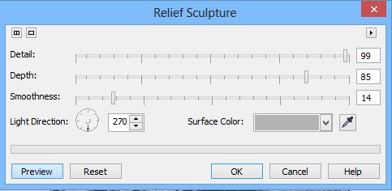
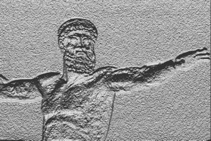

# Фильтры Elephant Skin, Etching и Relief Sculpture

### Фильтр Elephant Skin (Слоновья кожа)

Название этого фильтра может вызвать улыбку. Думаю, что у разработчиков с чувством юмора все в порядке. Если вы загляните в этот фильтр, то думаю, что придется почесать затылок в раздумьях, что же можно эдакого создать с помощью «слоновьей кожи». Но немного пофантазировав, думаю вы все же найдете ему применение. Понятное дело, раз этот фильтр находится в группе эффектов **Texture** (Текстура), то и применять его нужно для создания текстур. Окно фильтра показано на рис. 1.

В окне имеется всего один элемент управления – ползунок **Age** (Срок), хотя наверно правильней было бы его назвать «Возраст», т. к. этот ползунок задает возраст некоего слона. Чем «старше слон», тем более плотный узор создает Photo-Paint. Также можно выбрать цвет этого «узора» с помощью _Указателя цвета_ или с помощью _Пипетки_.

Итак, давайте попробуем найти применение этому фильтру. На рис. 2 показано исходное изображение.

Я хочу этим симпатичным песочным часам придать вид, как будто они сделаны из мрамора или чего-то подобного, другими словами добавить некую текстуру.

Выделите сначала стойку песочных часов. Выполните команду **Effects > Texture > Elephant Skin** (Эффекты > Текстура > Слоновья кожа). Настройки в фильтре сделайте, как на было показано на рис. 1\. Но чтобы текстура выглядела более контрастно, воспользуемся фильтром **Local Equalization** (Местное выравнивание) и установим значения **Width** (Ширина) и **Height** (Высота) равными 100\. Получим такую текстуру (рис 3).

Как видите, даже этому замысловатому эффекту можно найти неплохое применение.

### Фильтры Etching (Гравировка) и Relief Sculpture (Рельефная скульптура)

Эти фильтры предназначены для получения рельефного изображения.  
Фильтр **Etching** (Гравировка) дает результат напоминающего гравировку. На мой взгляд, это несколько грубоватый фильтр и применять его целесообразно в соответствующих случаях. Не на всех изображениях он будет давать хороший результат. Поэтому эффект будет во многом зависеть от исходного изображения. Для вызова диалогового окна фильтра выполните команду **Effects > Texture > Etching** (Эффекты > Текстура > Гравировка) (рис. 4).

Ползунок **Detail** (Деталь) управляет силой проявления эффекта. Если выбрать малые значения этого параметра, то часть изображения может вообще исчезнуть или лучше сказать «сгладиться», как бы слившись с фоном. Увеличивая его значение, вы заметите, как постепенно проявляются детали изображения.

Ползунок **Depth** (Глубина) влияет на «рельефность» изображения. Чем больше значение, тем более глубокой (или рельефной) кажется гравировка. При малых значениях, действие этого параметра аналогично действию параметра **Detail** (Деталь), т. е. изображение сглаживается, часть деталей изображения просто исчезает.

Элемент управления **Light Direction** (Направление света) задает направление света. От значений этого параметра также достаточно сильно зависит конечный результат. При изменении **Light Direction** (Направления света) части изображения могут выглядеть в итоге выпуклыми или вдавленными.

Назначение _Указателя цвета_ и _Пипетки_ понятно без комментариев. Чтобы увидеть результат воздействия фильтра на изображение, рассмотрим пример.  
На рис. 5 показано исходное изображение.

Применим к этому изображению фильтр **Etching** (Гравировка). Значения параметров показаны на рис. 4 выше (цвет выбран – 40 % черного). Получаем в результате такую гравировку (рис. 6).

Результат чем-то напоминает не то чеканку, не то барельеф. Но как я уже говорил, результат работы фильтра несколько грубоват.

Фильтр **Relief Sculpture** (Рельефная скульптура) практически является дубликатом фильтра **Etching** (Гравировка). Мне, например, не совсем понятно, зачем нужно было делать два фильтра дающих одинаковый результат.  
Посмотрите на диалоговое окно фильтра **Relief Sculpture** (Рельефная скульптура) (рис. 7).

Сравните теперь рисунки 7 и 4… М-да… это сравнение навивает мне мысль, что у разработчиков иссякла фантазия и они добавив один ползунок **Smoothness** (Сглаживание), создали новый фильтр. Чтобы убедиться в этом, применим фильтр **Relief Sculpture** (Рельефная скульптура) (настройки, как на рисунке 7) к тому же изображению (рис. 5). Итог на рис. 8.

И как вам такой результат? Точная копия рисунка 6\. Однако, как раз наличие ползунка **Smoothness** (Сглаживание) позволяет улучшить получаемый эффект. Как видите, скульптура выглядит так, как будто по ней стреляли дробью или над ней долго работала коррозия, что иногда как раз то, что и нужно, а вот избавиться от этой шероховатости и позволяет элемент управления **Smoothness** (Сглаживание). При увеличении значений этого параметра, картинка сглаживается, но не сливается с фоном, от чего изображение действительно начинает больше напоминать чеканку. Но несмотря на это, все же результаты получаются тоже грубоватыми и для получения более или менее приемлемого эффекта, необходимо долго возиться с подбором параметров.