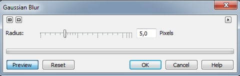
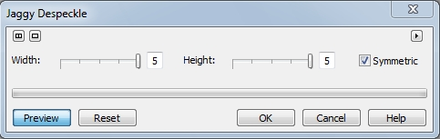
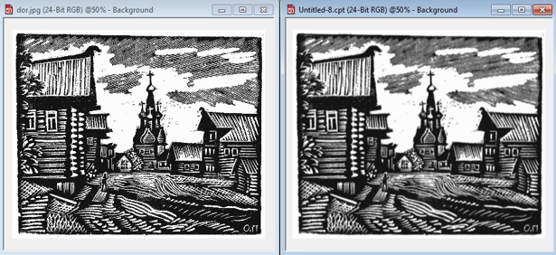
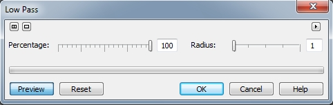
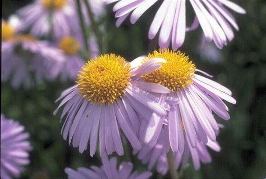
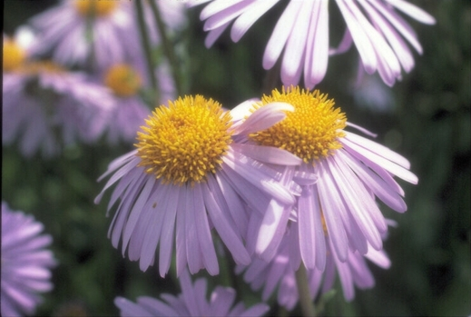

# Фильтры: Gaussian Blur; Jaggy Despeckle и Low Pass

### Фильтр Gaussian Blur (Размытость по Гауссу)

Этот фильтр обеспечивает эффект дымки, размывая изображение в соответствии с _распределением Гаусса_, которое позволяет передавать во внешнюю зону информацию, содержащуюся в пикселях, используя _гауссовы_ (колоколообразные) кривые. Диалоговое окно фильтра **Gaussian Blur** (Размытость по Гауссу) представлено на рис. 1.

Ползунок **Radius** (Радиус) задает интенсивность эффекта. Как я уже говорил в начале этой главы, применение фильтров _Размывания_ крайне разнообразно. И практически везде используется именно фильтр **Gaussian Blur** (Размытость по Гауссу). Если бы собрать только те примеры, где задействован этот фильтр, то уже получилась бы не одна книга. Этот фильтр используется гораздо чаще всех остальных. Естественно, он не используется, как единственный инструмент при коррекции. Таких ситуаций очень мало. Как правило, он используется в сочетании с множеством других фильтров и инструментов на разных этапах работы по коррекции изображений.

Еще одна особенность применения этого фильтра заключается в том, что при различных ситуациях, значения параметра **Radius** (Радиус) должны колебаться в узких пределах. Не зря его значение устанавливается с точностью до десятых.

### Фильтр Jaggy Despeckle (Подчистка)

Фильтр **Jaggy Despeckle** (Подчистка) распространяет цвета в изображении, создавая мягкий эффект размывки с минимальным искажением. Он наиболее эффективен для удаления краев с зазубринами, которые могут появиться в гравюрах, либо в высококонтрастных изображениях. Диалоговое окно **Jaggy Despeckle** (Подчистка) (рис. 2) имеет функции для управления значениями высоты и ширины. Эти значения можно менять независимо друг от друга или поддерживать одинаковыми. Раздельная установка этих значений позволяет вносить в изображение эффект легкого рассеивания с минимальной потерей деталей.

**Для применения Подчистки:**

1\. Выполните команду **Effects > Blur > Jaggy Despeckle** (Эффекты > Размытость > Подчистка).  
2\. Переместите ползунки **Width** (Ширина) и **Height** (Высота), чтобы задать интенсивность проявления и направление эффекта. Установите флажок **Symmetric** (Симметрия) для поддержания равенства между значениями этих параметров.  
Опять еще один случай неудачной русификации. Этот флажок когда-то так и назывался – _**Одинаковые значения**_.

Пример использования фильтра J**aggy Despeckle** (Подчистка) показан на рис. 3.

На рис. 3, слева – исходное изображение, справа – результат. Значения: **Width** (Ширина) = 4, **Height** (Высота) = 5

Хотя на скриншоте изображение уменьшено, все равно видно, что линии стали более размытыми, а тучи выполненные в виде штриховки, стали более «однородными». И все изображение стало более «мягким». Например, если бы к этому изображению применить фильтр **Gaussian Blur** (Размытость по Гауссу), то оно просто стало бы размытым с потерей некоторых деталей, в отличие от результатов полученных с помощью фильтра **Jaggy Despeckle** (Подчистка).

### Фильтр Low Pass (Размывка края)

Фильтр **Low Pass** (Размывка края) удаляет резкие края и детали изображения, оставляя сглаженные градиенты. Управление силой проявления и радиусом действия эффекта осуществляется при помощи ползунков. При высоких установках фильтр **Low Pass** (Размывка края) создает эффект размывки, стирающий большинство деталей изображения. Диалоговое окно фильтра **Low Pass** (Размывка края) показано на рис. 4.

**Для удаления деталей:**

1\. Выполните команду **Effects > Blur > Low Pass** (Эффекты > Размытость > Размывка края).  
2\. Переместите ползунок **Percentage** (Процент) для задания интенсивности проявления эффекта.  
3\. Переместите ползунок **Radius** (Радиус) для задания диапазона воздействия эффекта.

Рассмотрим пример действия фильтра. На рис. 5 показано исходное изображение цветов снятых крупным планом.

С целью подчеркивания красоты и фокусирования внимания на группе цветов переднего плана, исходное изображение уже имело размытый задний план. Наша задача смягчить границы лепестков и тычинок в центре цветков. После применения фильтра **Low Pass** (Размывка края), получился такой результат (рис. 6).

Т. к. рисунки в книге уменьшены против оригинального изображения, то на рис. 5 и 6, изображения немного смазались. Однако несмотря на это разница все же видна. Фильтр был применен со следующими значениями параметров: **Percentage** (Процент)=33; **Radius** (Радиус) = 5.