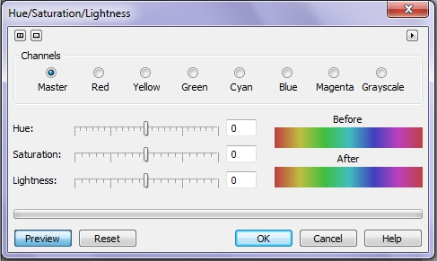
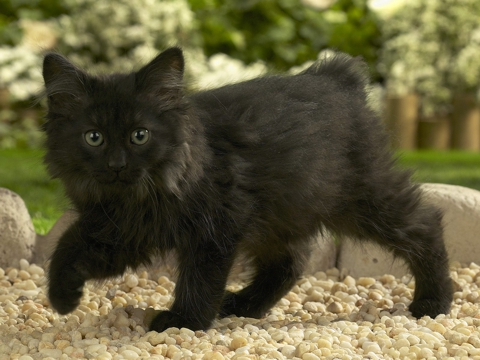
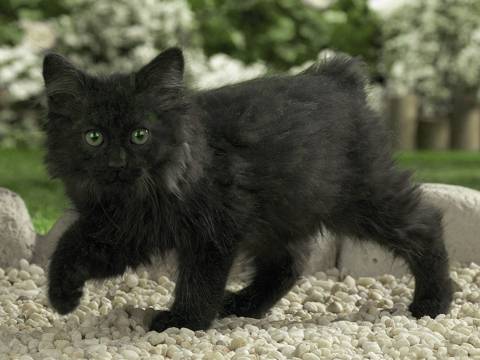
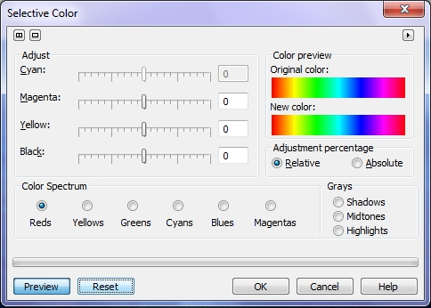
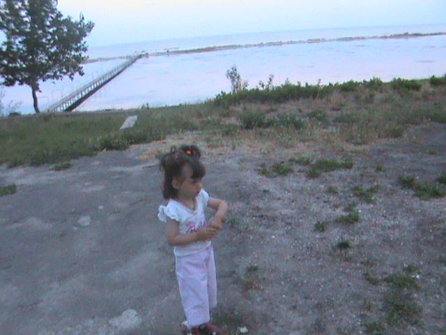
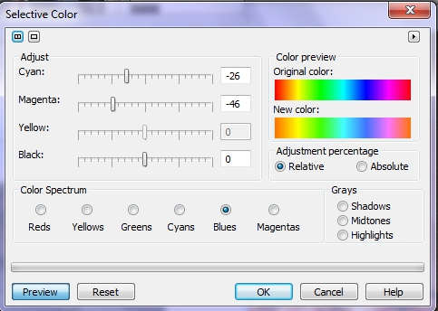
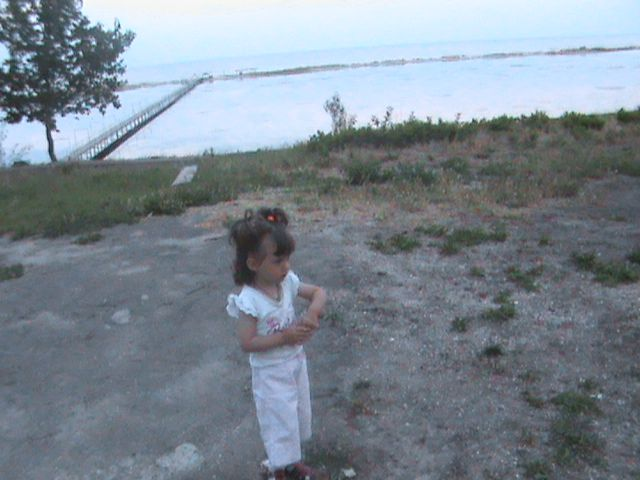

# Фильтры Hue/Saturation/Lightness и Selective color в Photo-Paint

### Фильтр Hue/Saturation/Lightness (Оттенок/Насыщенность/Яркость)

Фильтр **Hue/Saturation/Lightness** (Оттенок/Насыщенность/Яркость) управляет яркостью, насыщенностью и цветовым тоном изображений. Настройки этих характеристик представлены в виде ползунков в левой нижней части диалогового окна. Правее располагаются две прямоугольных области **Before** (До) и **After** (После) с цветовым спектром, показывающие цвета на цветовом круге _До_ и _После_ коррекции.  
Верхнюю часть диалогового окна занимает переключатель **Channels** (Каналы) (рис. 1). Он задает цвет, который вы подвергаете коррекции.

Смещая ползунок **Hue** (Оттенок), вы изменяете цветовой тон всех цветов изображения, последовательно проходя каждый из них по спектру. Ползунок **Saturation** (Насыщенность) управляет насыщенностью изображения. При увеличении насыщенности все цвета становятся более яркими, а при уменьшении – блеклыми. В крайнем левом положении изображение становится полутоновым.  
Ползунком **Lightness** (Яркость) вы можете регулировать общую яркость изображения.  
В положении переключателя **Master** (Шаблон) действию инструмента подвергаются все цвета изображения в равной степени. Хотя в локализованной русской версии, переключатель **Master** назван _Шаблон_, на самом деле его нужно было назвать _Основной_ или составной канал, но никак не _Шаблон_. Но оставим это на совести переводчиков… Установив переключатель **Channels** (Каналы) в положение одного из цветовых каналов, вы защищаете от изменений все цвета изображения, кроме выбранного. Установка переключателя в положение **Grayscale** (Оттенки серого) приводит к воздействию только на пикселы нейтрального серого цвета.

Посмотрим действие фильтра на примере.  
Посмотрите на рис. 2, как видите, галька на дорожке, камни по краям дорожки и сам черный котенок имеют желтоватый отлив. Это конечно значит, что в изображении присутствует избыточное количество желтого цвета. Выполните команду **Adjust > Hue/Saturation/Lightness** (Оттенок/Насыщенность/Яркость), чтобы открыть диалоговое окно.

Я переключился на канал **Yellow** (Желтый) и установил там значения: **Hue** (Оттенок) 41; **Saturation** (Насыщенность) -77; **Lightness** (Яркость) 0\. Затем установил переключатель на **Green** (Зеленый) канал и установил там следующие значения параметров: **Hue** (Оттенок) 0; **Saturation** (Насыщенность) 45; **Lightness** (Яркость) 12\. Это было сделано потому, что после изменения параметров в канале **Yellow** (Желтый), зеленые цвета на заднем плане стали мало насыщенными и тусклыми. Результат показан на рис. 3.

Обратите внимание, что после корректировки, цвет гальки и камней, стал ближе к нейтрально-серому, как и должно быть, а котенок стал более черным, без желтых цветовых отливов на шерсти.

### Фильтр Selective color (Селективный цвет)

Этот фильтр предназначен для выборочной тоновой коррекции. С помощью параметров в этом фильтре можно настраивать значения цветов **CMYK** (синий, пурпурный, желтый и черный) для определенного цвета в вашем изображении, даже если изображение в цветовой модели **RGB**. И позволяет отдельно настраивать интервалы яркостей полутонового канала.

В области **Adjust** (Настройка) можно выбрать корректируемый цвет и определить с помощью ползунков его новые параметры (рис. 4).

Эти ползунки определяют добавление к выбранному интервалу синего, пурпурного, желтого и черного компонентов. В области **Color preview** (Просмотр цвета) размещены две полоски с цветами спектра и переключатель режима добавления цвета. В режиме **Relative** (Относительный) процент добавляемого цвета считается от имеющегося. Например, если вы добавите к точке с содержанием 50% пурпурного 10 процентов пурпурного цвета, то содержание пурпурного в этой точке становится 55%. В режиме **Absolute** (Абсолютный) добавляется или отнимается абсолютный процент цвета от выбранного. Добавление к точке с содержанием 50% пурпурного 10 процентов пурпурного цвета, даст 60% пурпурного.

Один из недостатков получения фотографий на улице - то, что цветовой оттенок часто, появляется всюду по изображению. Часто это вызвано ясным синим небом. Синий оттенок, который это вызывает, изменяет даже настоящий вид других цветов в фотографии, что делает этот побочный эффект особенно противным. Фильтр **Selective color** (Селективный цвет) может помочь вам решить эту проблему.

Типичный синий отлив часто состоит из различных оттенков синего. В терминах цвета, синее небо состоит из голубого и пурпурного. Фильтр **Selective color** (Селективный цвет) дает вам возможность изменить определенные значения **CMYK** синего или голубого, или обеих. Таким образом, это два цвета, которые вам нужно корректировать. Значения настроек основаны на процентном диапазоне в пределах от -100 до 100 процентов. Отрицательные значения уменьшают определенный цвет, тогда как положительные значения увеличивают его.

Рассмотрим выше сказанное на примере. На рис. 5 показан берег, на котором явно виден синий оттенок и море, имеющее пурпурный оттенок. Данная любительская фотография к сожалению не блещет качеством, в плане резкости и контраста, но в данном конкретном случае, не будем обращать на это внимание.

В данном примере для устранения небольшого синего оттенка на асфальте и грунте, а также штанах девочки и пурпурного оттенка на море, в фильтре **Selective color** (Селективный цвет) были выбраны параметры, как показано на рис. 6.

Полученный результат показан на рис. 7

