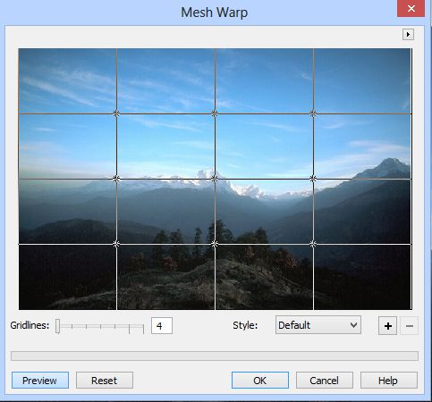
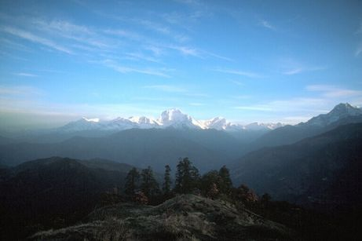
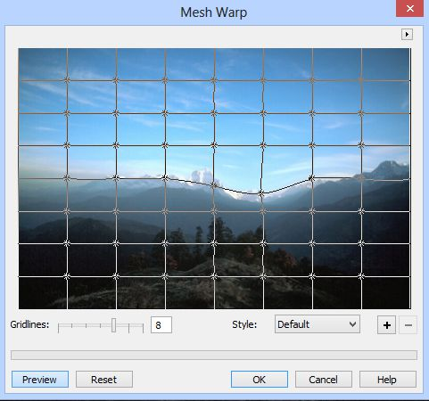
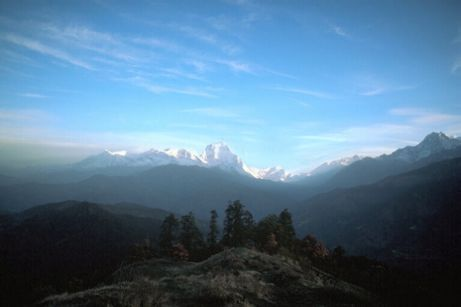
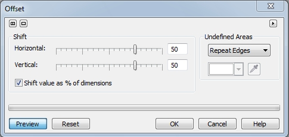
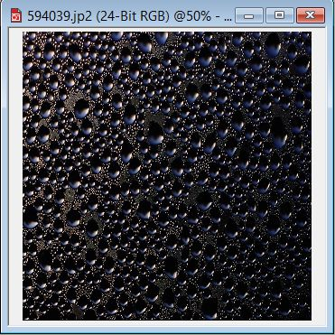
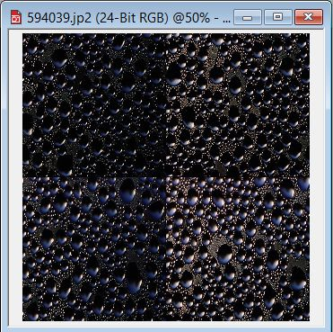
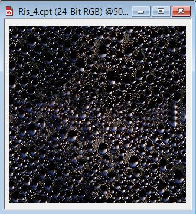

# Фильтры Mesh Warp и Offset

### Фильтр Mesh Warp (Деформация по сетке)

Фильтр **Mesh Warp** (Деформация по сетке) (рис. 1) искажает изображение в результате изменения узлов на сетке. При работе с фильтром задается число узлов сетки. Более плотная сетка с большим числом узлов обеспечивает более тонкое управление мелкими деталями изображения. Перемещение узла не влияет на расположение любого другого узла. Тем не менее изменение одного узла влияет на все связанные строки сетки.

Перемещайте ползунок **Gridlines** (Линии таблицы) для задания количества клеток сетки. Затем перетащите узлы в окне предварительного просмотра для получения желаемого искажения. Вы также можете сохранить настроенную сетку в виде стиля, нажав кнопку со знаком «**+**», рядом со списком **Style** (Стиль).  
Однако вас может поджидать сюрприз, как меня например. При нажатии кнопки со знаком «**+**» Photo-Paint открывает окно **Save Meshwarp Files** (Сохранение файлов деформации по сетке). По умолчанию заготовку предлагается сохранить в папке C:\Program Files\Corel\CorelDRAW Graphics Suite X5\Custom Data\MeshWarp. Когда я перешел на Windows 8, то сохранить в данную папку не удалось, т. к. Windows сообщил мне, что у меня нет для этого достаточно прав. Но на этом сюрпризы не закончились. Когда вы все-таки сохраните заготовку, то она все равно не появится в списке **Style** (Стиль). Почему так происходит сложно сказать. Я думаю, что это какой-то баг в программе. Но т. к. обычно работать с фильтром не сложно, то можно обойтись и без сохранения стилей.  
Хотя к этому фильтру не часто приходится обращаться, но все же иногда с его помощью можно довольно неплохо исказить исходное изображение. Рассмотрим короткий пример использования этого фильтра. На рис. 2 показано исходное изображение.

Применим фильтр **Mesh Warp** (Деформация по сетке) (рис. 3).

Получим пейзаж, как на рис. 4.

Как видите, можно без труда изменить рельеф местности и при этом создается впечатление, что так и должно быть. Правда я немного восстановил небо над горами, т. к. было заметно, что небо имеет изгиб в месте деформации.

### Фильтр Offset (Смещение)

Фильтр **Offset** (Смещение) (рис. 5), позволяет корректировать позиционирование изображения. Он смещает изображение в соответствии со значениями, установленными горизонтальным и вертикальным ползунками смещения. После смещения изображения, на том месте, где оно размещалось, остается пустая область. Есть три варианта заполнения этой пустой области: можно заполнить ее цветом используемой краски, использовать функцию **Wrap Around** (Обтекание) для получения эффекта мозаики или применить функцию **Repeat Edges** (Повтор краев) для получения эффекта растяжения.

**Для смещения изображения:**

1\. Выполните команду **Effects > Distort > Offset** (Эффекты > Искажение > Смещение).  
2\. Для просмотра координат смещения в процентах, установите флажок **Shift value as % of dimensions** (Величина сдвига в процентах).  
3\. Переместите ползунки в области **Shift** (Сдвиг), для задания горизонтального и вертикального смещения.  
4\. В области **Undefined Areas** (Неопределенные области) выберите в раскрывающемся списке один из вариантов:  
> **Wrap Around** (Обтекание) – производит заполнение открытых областей содержимым противоположной стороны изображения;  
> **Repeat Edges** (Повтор краев) – растягивает края изображения, чтобы заполнить открытые области;  
> **Color** (Цвет) – заполняет открытые области текущим цветом краски. Однако можно задать и другой цвет с помощью _Указателя цвета_ или _Пипетки_.

Фильтр **Offset** (Смещение) можно эффективно использовать для создания бесшовных узоров с последующим использованием в качестве растровой заливки.

_Давайте рассмотрим следующий сценарий:_

Вы используете Corel Draw и хотите создать растровый фон (или залить объект) используя для этого **Pattern Fill** (Заливку узором).

Что будет, если используемое вами растровое изображение имеет гораздо меньший размер, чем размер листа (или заливаемая часть рисунка)?

В этой ситуации Corel Draw попытается повторить растровое изображение, чтобы заполнить все необходимое пространство, в результате чего вы получите мозаику, либо растянутое растровое изображение. Вот тут и может пригодиться помощь Photo-Paint. И фильтр **Offset** (Смещение) как нельзя лучше справится с такой задачей. Перед рассмотрением примера использования фильтра, сделаю маленькое замечание. Если вы хотите создать бесшовный узор для однократного использования, то можете сохранить его в любом месте на жестком диске. Если же вы планируете сделать заготовку для неоднократного использования в будущем, то сохраните результат вашей работы в формате **.cpt**, в папке C:\Program Files\Corel\CorelDRAW Graphics Suite X5\Custom Data\Tiles. Также, заготовки в папке _Tiles_ имеют размеры 640х640 **px** и разрешение 300 **dpi**, так что лучше придерживаться этих параметров. Еще одно замечание – в качестве исходного изображения необходимо брать такое изображение, чтобы при создании «мозаики» не создавалось ощущение повторения. Примером такого изображения, может быть изображение кофейных зерен, где при повторении изображения, не будет создаваться ощущение повторяемости зерен и узорчатости.

В качестве примера возьмем изображение показанное на рис. 6.

Изначальный размер изображения был 768х512 **px** и имел разрешение 72 **dpi**. Сначала я изменил размер и разрешение в диалоговом окне **Resample** (Изменить разрешение). Теперь пришла очередь заняться созданием бесшовного узора. Выполните команду **Effects > Distort > Offset** (Эффекты > Искажение > Смещение). Переместите ползунки в области **Shift** (Сдвиг), установив значения горизонтального и вертикального смещения равными 50\. Флажок **Shift value as % of dimensions** (Величина сдвига в процентах) должен быть установлен. В области **Undefined Areas** (Неопределенные области) выберите в раскрывающемся списке вариант **Wrap Around** (Обтекание). Получим «мозаику», как на рис. 7.

Чтобы убрать эффект повторяемости и добавить что-то типа «хаотичности», используем инструмент **Clone** (Клонирование). В данном случае я использовал круглую мягкую кисть размером 50 **px**. В качестве источника для клонирования используйте не только ближайшие участки к швам, но и более отдаленные. В результате у меня получилось изображение, как на рис. 8.

Если с первой попытки не удастся полностью избавиться от эффекта повторяемости, можно еще немного подправить изображение инструментом **Clone** (Клонирование). Теперь это изображение можно использовать для создания бесшовного фона.