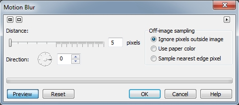
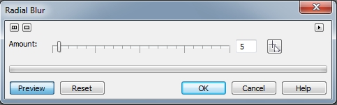
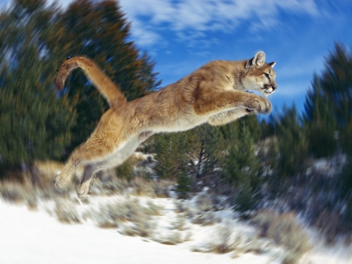
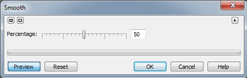
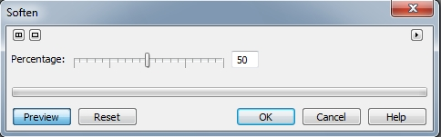
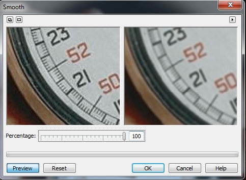

# Фильтры Motion Blur, Radial Blur, Smooth и Soften

### Фильтр Motion Blur (Размытость движением)

Фильтр **Motion Blur** (Размытость движением) создает в изображении иллюзию движения. Направление перемещения задается при помощи диска **Direction** (Направление) (рис. 1). Может также регулироваться интенсивность проявления эффекта: чем больше соответствующее значение, тем сильнее будет размывка.

**Для создания видимости скоростного движения через размывку:**

1\. Выполните команду **Effects > Blur > Motion Blur** (Эффекты > Размытость > Размытость движением).  
2\. Щелкните в точке на окружности диска **Direction** (Направление) для задания направления движения.  
3\. Переместите ползунок **Distance** (Расстояние) для задания интенсивности проявления эффекта.  
4\. Включите один из переключателей области **Off-image sampling** (Области вне изображения).

Данный фильтр лучше всего использовать при обработке изображений со спортивных соревнований, например, когда нужно подчеркнуть эффект скорости или придать иллюзию движения.

### Фильтр Radial Blur (Радиальная размытость)

Фильтр **Radial Blur** (Радиальная размытость) позволяет создавать эффект размывки, распространяющийся наружу из центральной точки. При работе с фильтром может изменяться положение центральной точки и устанавливаться интенсивность проявления эффекта. Для задания центральной точки, нажмите кнопку установки центра и щелкните на нужной позиции в окне просмотра или изображения, для задания точки центра. Для задания интенсивности проявления эффекта, переместите ползунок **Amount** (Величина) (рис. 2).

Нужно дополнительно отметить, что фильтр **Radial Blur** (Радиальная размытость), довольно мощный фильтр, в том смысле, что даже при малых значениях параметра **Amount** (Величина), размытие становится очень сильным. Результат применения фильтра **Radial Blur** (Радиальная размытость) показан на рис. 4, а исходное изображение на рис. 3\. Значение параметра **Amount** (Величина) было выбрано равным 3\. После применения фильтра, пришлось правда восстановить резкость задних лап и хвоста, т. к. они тоже попали в «зону действия» фильтра.

### Фильтры Smooth (Сглаживание) и Soften (Смягчение)

Оба фильтра дают примерно одинаковый эффект, поэтому я их объединил в один подраздел. Диалоговые окна фильтров представлены на рис. 5 и 6.

Как видно из рисунков, диалоговые окна этих фильтров также идентичны и имеют всего по одному элементу управления – ползунок **Percentage** (Процент).  
Эффект **Smooth** (Сглаживание) изображения смягчает различия между смежными пикселями, что приводит лишь к небольшой потере деталей при осуществлении сглаживания всего изображения или его выделенной области. Используйте ползунок **Percentage** (Процент) для определения интенсивности проявления эффекта сглаживания. Это очень тонкий эффект: для его просмотра придется выбрать боле крупный масштаб. Попытайтесь применить его несколько раз, чтобы увеличить интенсивность его проявления.

Как было сказано выше – эффект от применения фильтра **Smooth** (Сглаживание) малозаметен, особенно при отсутствии четких переходов между деталями изображения. На рис. 7 показано окно фильтра, в котором на циферблате секундомера видно его действие.

Фильтр **Soften** (Смягчение) осуществляет сглаживание и смягчает различия шероховатых краев лишь с минимальной потерей деталей изображения. При работе с фильтром может задаваться интенсивность проявления эффекта. Разница между фильтрами **Smooth** (Сглаживание) и **Soften** (Смягчение) является малозаметной и может проявиться только при использовании более высокого разрешения.