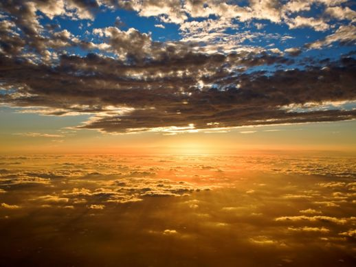
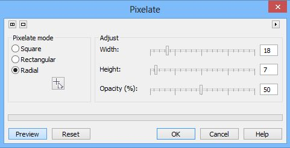
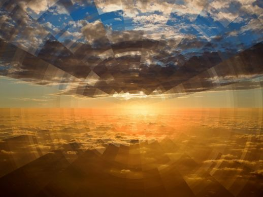
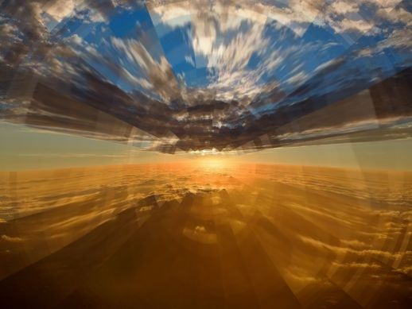
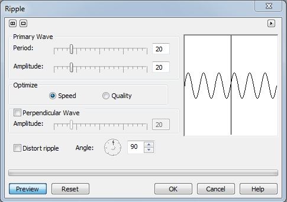
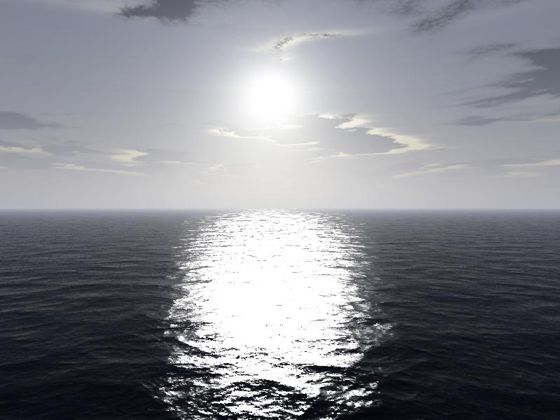
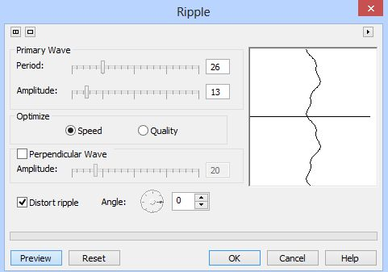
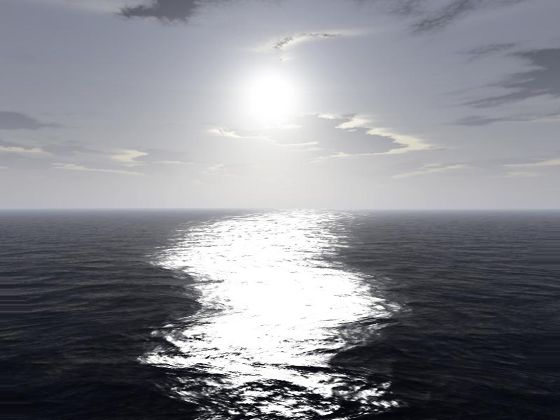

# Фильтры Pixelate и Ripple в Photo-Paint

### Фильтр Pixelate (Пикселизация)

Фильтр **Pixelate** (Пикселизация) разбивает изображение на квадратные, прямоугольные или круглые ячейки. Используйте функции **Square** (Прямые) или **Rectangular** (Прямоугольные) для создания блочного, массивного вида или функцию **Radial** (Радиальные) для получения эффекта паутины. Ползунок **Opacity (%)** (Непрозрачность (%)) задает прозрачность эффекта.

К использованию фильтра **Pixelate** (Пикселизация), скорее всего вы будете прибегать очень редко, т. к. он частенько дает довольно грубоватый и примитивный эффект, который может пригодиться в очень редких случаях. К тому же для его эффективного применения подойдут далеко не все изображения. Давайте рассмотрим пример, где с помощью этого фильтра все же можно получить относительно неплохой результат.

На рис. 1 показано исходное изображение.

Наверняка многие из вас видели в фантастических фильмах моменты, когда перед прыжком звездолета в пространстве или во времени, создавалась иллюзия искривления пространства. Давайте попробуем изобразить что-то наподобие такого искривления. Но предварительно скажу, что при подборе параметров будет иметь значение размер изображения. Чем больше размер изображения, тем большие значения необходимо установить в окне фильтра. Данное изображение имеет размер 518х389 **px**.  
Выполните команду **Effects > Distort > Pixelate** (Эффекты > Искажение > Пикселизация) (рис. 2).

Щелкните в окне фильтра кнопку в виде указателя с крестиком и затем щелкните чуть ниже и левее центра изображения (рис. 3).

Теперь применим фильтр **Pinch/Punch** (Вдавливание/Выдавливание) из группы фильтров **3D Effects** (Трехмерные эффекты). В окне фильтра **Pinch/Punch** (Вдавливание/Выдавливание) установите значение **Pinch/Punch** (Вдавливание/Выдавливание) равным 100 и щелкните **ОК** (рис. 4).

Чтобы устранить в некоторых местах видимую пикселизацию, которая на небе выглядит, как прямые границы между секторами неба, обработайте эти места инструментом **Effect** (Эффект). Я для этой цели использовал кисть **Smudge** (Размазывание). Подбирая параметры на _Панели свойств_, можно избавиться от эффекта пексилизации в нужных местах, чтобы деформация везде выглядела плавной. На рис. 5 показан результат частичной обработки инструментом **Smudge** (Размазывание), я не стал обрабатывать все необходимые участки, чтобы можно было видеть на одном изображении результаты до и после обработки.

Кстати, можно также улучшить результат, добавив немного искажения с помощью фильтра **Mesh Warp** (Деформация по сетке), о котором я рассказывал выше.

### Фильтр Ripple (Рябь)

Фильтр **Ripple** (Рябь) создает на изображении вертикальные или горизонтальные волны ряби. Могут быть выбраны расстояние между периодами волны, угол, под которым волны перемещаются по изображению, и величину смещения, создаваемого волнами.

Диалоговое окно фильтра **Ripple** (Рябь) приведено на рис. 6.

**Для применения фильтра Рябь:**

1\. Выполните команду **Effects > Distort > Ripple** (Эффекты > Искажение > Рябь).  
2\. В области **Primary Wave** (Первичная волна) переместите один из ползунков:  
> **Period** (Период) – служит для регулировки расстояния между циклами волн;  
> **Amplitude** (Амплитуда) – служит для задания величины смещения, создаваемого рябью.  
3\. Для создания перпендикулярной волны установите флажок **Perpendicular Wave** (Перпендикулярная волна).  
4\. Щелкните на круге **Angle** (Угол) для задания направления эффекта.  
5\. Для применения волн с зубчатыми краями установите флажок **Distort ripple** (Случайная рябь).

Фильтр **Ripple** (Рябь) – довольно мощный фильтр, в том смысле, что он позволяет очень сильно исказить изображение. Даже при небольших значениях параметров, изображение искажается до неузнаваемости. Но в отдельных случаях его можно применить для получения нужного результата. На рис. 7 показано исходное изображение.

Предположим, вы хотите изменить форму дорожки света на воде. Это несложно сделать с помощью фильтра **Ripple** (Рябь). Но чтобы избежать деформации неба, выделим часть изображения занятую океаном с помощью инструмента **Rectangle Mask** (Прямоугольная маска). Теперь применим фильтр **Ripple** (Рябь) с параметрами, как на рис. 8.

В итоге получим другую форму дорожки света (рис. 9).

