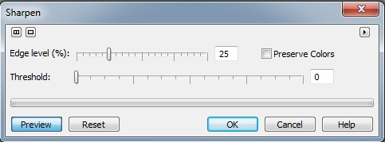

# Фильтры Sharpen и Unsharp Mask

### Фильтр Sharpen (Повышение резкости)

Фильтр **Sharpen** (Повышение резкости) (рис. 1), подчеркивает края изображения посредством нахождения краев и увеличения контрастности между смежными пикселями.

При работе с фильтром переместите ползунок **Edge level** (Уровень края), чтобы установить интенсивность проявления эффекта. Переместите ползунок **Threshold** (Порог), чтобы определить, насколько велико будет изменение значения пикселя, прежде чем эффект будет применен. Для предотвращения изменения цветов, установите флажок **Preserve Colors** (Сохранять цвета).

### Фильтр Unsharp Mask (Понижение резкости маски)

Как я уже говорил, русифицированный вариант названия фильтра оставляет желать лучшего. Иногда можно было раньше встретить вариант русский названия этого фильтра, как _Нерезкая маска_. Но как бы там ни было, даже английское название фильтра **Unsharp Mask** (Понижение резкости маски), может ввести в заблуждение. Если вы никогда не работали в традиционной темной комнате, вы вряд ли сможете понять, каким образом что-то, являющееся нечетким, может оказаться полезным при повышении резкости.

Фильтр **Unsharp Mask** (Понижение резкости маски) выявляет края объектов и подчеркивает разницу, в результате чего изображение выглядит резче. При работе с фильтром **Unsharp Mask** (Понижение резкости маски) доступны три параметра (рис. 2), которые можно использовать для повышения резкости.

Параметр **Percentage** (Процент) – служит для задания увеличения резкости. Чем больше его значение, тем более выраженным оказывается увеличение резкости изображения. В зависимости от того, для чего предназначено изображение, для вывода на печать или для Web, следует выбирать разные значения этого параметра.

Параметр **Threshold** (Порог). Диапазон значений этого параметра – от 0 до 255\. Используйте его для указания Photo-Paint о необходимости игнорировать близкие оттенки. Например, если задать значение 5, программа будет игнорировать все оттенки, отличающиеся меньше чем на 5 уровней. Для обеспечения плавных переходов рекомендуется задавать значение в диапазоне от 3 до 6\. Это особенно полезно, если необходимо избежать увеличения резкости в области теней, а также на таких участках, как поры кожи или морщины.

Параметр **Radius** (Радиус). Данный параметр контролирует, насколько широкие края объектов принимает во внимание Photo-Paint при анализе изображений. Это наиболее важный параметр, так как чрезмерное увеличение его значения приводит к появлению темных или светлых ореолов в изображении.

Давайте рассмотрим на примере влияние этих параметров на изображение. Исходное изоб-ражение показано на рис. 3.

Это изображение цветов на опушке леса, довольно неплохой кандидат для демонстрации работы фильтра **Unsharp Mask** (Понижение резкости маски), т. к. имеет размытый задний план и темные области. Посмотрим сначала на влияние параметра **Percentage** (Процент) (рис. 4).

На рис. 4: Применение фильтра **Unsharp Mask** (Понижение резкости маски) к изображению. Слева – значения всех параметров по умолчанию, **Percentage** (Процент) = 100; справа – значение **Percentage** (Процент) = 300

Применение фильтра со значениями по умолчанию привело к небольшому (мягкому) увеличению резкости, что в целом благоприятно отразилось на изображении. Увеличение значения **Percentage** (Процент) до 300 привело в некоторых местах, к появлению на границах цветков белого ореола и излишнего контраста. Остальные параметры фильтра не изменялись. Дальнейшее увеличение значения **Percentage** (Процент) до 500 не привело к каким-то заметным изменениям.

Теперь рассмотрим влияние параметра **Threshold** (Порог). К исходному изображению был применен фильтр с значениями **Percentage** (Процент) = 200, **Radius** (Радиус) = 1\. Изменялось только значение **Threshold** (Порог) (рис. 5).

На рис. 5 результат влияния параметра **Threshold** (Порог). Слева – **Threshold** (Порог) = 3; справа – **Threshold** (Порог) = 10.

Как видно из рис. 5, малое значение параметра **Threshold** (Порог), привело к повышению резкости, в то время, как увеличение значения, наоборот привело к потере резкости. Дальнейшее увеличение значения **Threshold** (Порог) не повлекло значительных изменений, хотя резкость в небольшой степени все же снизилась.

Теперь посмотрим влияние на результат параметра **Radius** (Радиус). Конечно, при применении любого фильтра и фильтр **Unsharp Mask** (Понижение резкости маски) не исключение, подбираются значения всех параметров, но даже из этих примеров можно сделать некоторые выводы о работе с фильтром. На рис. 6 приведено влияние параметра **Radius** (Радиус), при этом значения остальных были приняты следующими: **Percentage** (Процент) = 100; **Threshold** (Порог) = 4.

На рис. 6 показано влияние параметра **Radius** (Радиус). Слева – **Radius** (Радиус) = 3; по центру – **Radius** (Радиус) = 10; справа – **Radius** (Радиус) = 20.

Несмотря на маленькие размеры скриншотов, хорошо заметно, насколько сильно параметр **Radius** (Радиус) влияет на конечный результат.  
При средних и больших значениях этого параметра, начинается довольно нежелательное искажение изображения.