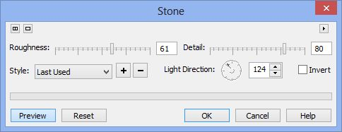
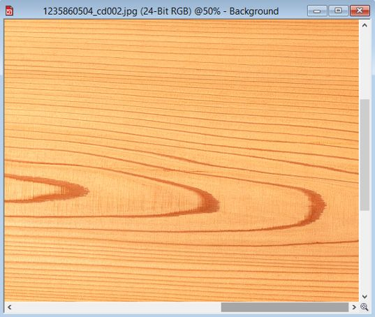
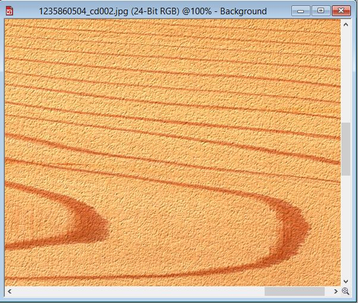
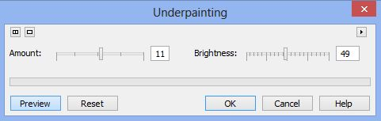
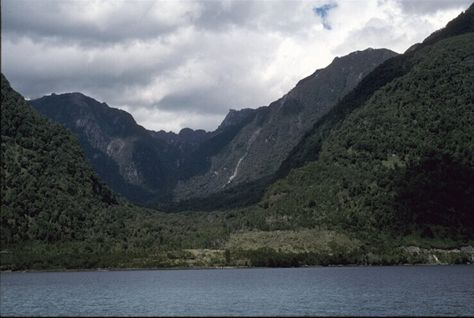
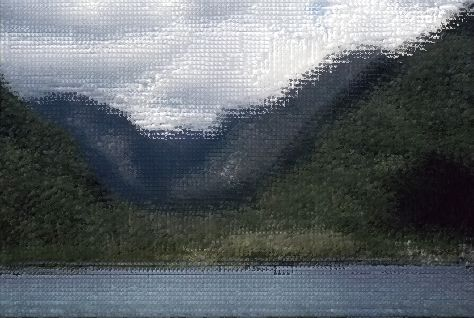
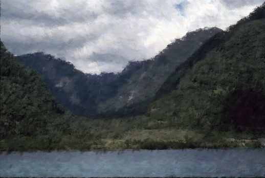

# Фильтры Stone (Камень) и Underpainting (Грунтовка)

### Фильтр Stone (Камень)

Фильтр **Stone** (Камень) в какой-то мере оправдывает свое название. Согласно справочной системе, этот фильтр придает изображению текстуру камня. На самом деле, он не создает такую текстуру, а лучше сказать придает изображению шероховатость характерную для камня. Окно фильтра показано на рис. 1\. Для вызова окна фильтра воспользуйтесь командой **Effects > Texture > Stone** (Эффекты > Текстура > Камень).

Основными элементами управления в окне фильтра являются два ползунка, **Roughness** (Шероховатость) и **Detail** (Деталь), которые собственно и отвечают за шероховатость поверхности или другими словами, за текстуру камня. При малых значениях любого из этих параметров, текстура сглаживается и никакого изменения в изображении вы не увидите.

Фильтр **Stone** (Камень) имеет в своем распоряжении несколько заготовок текстуры, доступ к которым можно получить из раскрывающегося списка **Style** (Стиль). Можно добавлять в этот список свои собственные настройки, нажав кнопку с знаком «**+/strong>».**

Остальные элементы управления в меньшей степени оказывают влияние на текстуру. Например, счетчик **Light Direction** (Направление света) лишь изменит видимость «направления» текстуры, что не очень сильно влияет на ее вид.

Хотя фильтр носит название **Stone** (Камень), это вовсе не означает, что его нельзя применить для других материалов. Рассмотрим краткий пример. На рис. 2 показан фрагмент текстуры дерева.

Хотя это лишь фрагмент и к тому же уменьшенный, но все же видно, что текстура среза довольно гладкая, что например, при создании среза древесины почти никогда не бывает. В таких случаях поверхность практически всегда достаточно шершавая. Давайте придадим такую шершавость с помощью фильтра **Stone** (Камень). Вызовите окно фильтра и примените настройки, как на рис. 1\. В итоге получим такую текстуру дерева (рис. 3).

При создании скриншота для рис. 3, я сделал масштаб изображения 100 %. Теперь отчетливо видны некоторые неровности на текстуре, что более характерно для дерева до его окончательной обработки и покрытия, например, лаком.

Этот маленький пример можно считать в каком-то смысле показательным для эффекта **Stone** (Камень), т. к. он дает именно такие результаты в различных вариациях, в зависимости от принятых настроек.

### Фильтр Underpainting (Грунтовка)

Применение этого фильтра довольно неоднозначно. В справочной системе его действие описано, что он придает изображению вида картины, нарисованной на холсте, который затем был покрыт слоями краски. Однако такое описание может завести в заблуждение. Дело в том, что далеко не все изображения подойдут для применения этого фильтра. К тому же результат тоже оставляет желать лучшего. Что касается придания изображению видимости холста, то этот фильтр чем-то напоминает действие фильтра **Screen Door** (Экранная дверь). Окно фильтра показано на рис. 4.

Здесь в распоряжении пользователя всего два элемента управления: **Amount** (Количество) и **Brightness** (Яркость). Первый из них, собственно и управляет силой проявления эффекта.  
Посмотрим теперь на работу фильтра. На рис. 5 показано исходное изображение.

После применения фильтра с настройками, как на рис. 4, получим следующий результат (рис. 6).

Лично меня такой результат не сильно впечатляет. Если уж есть желание или необходимость придать изображению видимость картины, то лучше это сделать с помощью фильтра **Alchemy** (Алхимия) (рис. 7).

Как на мой вкус, то результат на рис. 7 гораздо лучше, чем на рис. 6, но в любом случае, выбор остается за вами, какой фильтр для вас более предпочтителен.