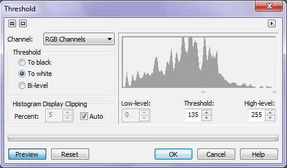
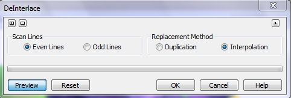

# Фильтры Threshold, Posterize и DeInterlace

### Фильтр Threshold (Порог)

Фильтр **Threshold** (Порог) (рис. 1), преобразует определенные оттенки каждого цвета изображения в черный, белый цвет или цвета двухуровневого режима. Это нужно для управления процессом преобразования изображения в черно-белое. Этот фильтр позволяет задать пороговое значение яркости. Пиксели, имеющие значение яркости выше или ниже порога, отображаются белым или черным цветом в зависимости от выбранного параметра порога.

**Преобразование оттенков в черный цвет:**

1\. Выполните команду **Image > Transform > Threshold** (Изображение > Преобразование > Порог).  
В диалоговом окне **Threshold** (Порог) будет показана гистограмма значений яркости пикселей изображения. Значения яркости изменяются слева направо от 0 (черный) до 255 (белый цвет). Выступы на гистограмме обозначают количество пикселей в изображении на каждом уровне яркости.  
2\. Выберите нужный канал из списка **Channel** (Канал). Какие каналы появятся в списке, зависит от цветового режима изображения. Выберите название цветового режима, чтобы изменить все каналы одновременно.  
3\. В области **Threshold** (Порог) установите переключатель **To black** (В черный).  
При этом для отображения пикселей, яркость которых ниже значения в счетчике **Threshold** (Порог), будет использоваться черный цвет. Значение **Threshold** (Порога) задается позже в этой же процедуре.  
4\. Установите флажок **Auto** (Авто) в области **Histogram Display Clipping** (Обрезка гистограм-мы). См. примечание ниже.  
5\. Под гистограммой выберите уровень яркости, который будет пороговым:

*   задайте число от 0 до 255 в счетчике **Threshold** (Порог)

либо

*   передвиньте в нужное положение треугольный ползунок, расположенный непосредственно над счетчиком **Threshold** (Порог).

6\. В счетчике **Low-level** (Тени) введите уровень яркости черного, который будет использован для отображения пикселей, затрагиваемых значением, установленным в счетчике **Threshold** (Порог).  
Значение 0 означает черный цвет. Более высокие значения представляют оттенки серого. Можно задать значение, передвигая треугольный ползунок, расположенный непосредственно над счетчиком **Low-level** (Тени).

_**Примечание:**_  
Обрезка гистограммы изменяет уровень ее чувствительности, гарантируя, что все уровни яркости будут видны на экране одновременно.

**Преобразование оттенков в белый цвет:**

1\. Выполните команду **Image > Transform > Threshold** (Изображение > Преобразование > Порог).  
2\. В области **Threshold** (Порог) установите переключатель **To white** (В черный).  
При этом для отображения пикселей, яркость которых ниже в счетчике **Threshold** (Порог), будет использоваться белый цвет. Значение **Threshold** (Порога) задается позже в этой же процедуре.  
3\. Установите флажок **Auto** (Авто) в области **Histogram Display Clipping** (Обрезка гистограммы).  
4\. Под гистограммой выберите уровень яркости, который будет пороговым:

*   задайте число от 0 до 255 в счетчике **Threshold** (Порог)

либо

*   передвиньте в нужное положение треугольный ползунок, расположенный непосред-ственно над счетчиком **Threshold** (Порог).

5\. В счетчике **High-level** (Света) введите уровень яркости белого, который будет использован для отображения пикселей, затрагиваемых значением, установленным в счетчике **Threshold** (Порог).  
Значение 255 означает белый цвет. Меньшие значения представляют оттенки серого. Можно задать значение, передвигая треугольный ползунок, расположенный непосредственно над полем **High-level** (Света).

**Преобразование в двухуровневый режим:**

1\. Выполните команду **Image > Transform > Threshold** (Изображение > Преобразование > Порог).  
2\. В области **Threshold** (Порог) установите переключатель **Bi-level** (Двухуровневый).  
При этом цвета пикселей делятся на светлые и темные (белые и черные) значения.  
3\. Под гистограммой выберите уровень яркости, который будет пороговым:

*   задайте число от 0 до 255 в счетчике Threshold (Порог)

либо

*   передвиньте в нужное положение треугольный ползунок, расположенный непосред-ственно над счетчиком Threshold (Порог).

Используйте этот фильтр в режиме **Bi-level** (Двухуровневый), чтобы подготовить изображение к преобразованию в Черно-белый цветовой режим.

### Фильтр Posterize (Постеризовать)

Фильтр **Posterize** (Постеризовать) преобразует цветовой диапазон изображения в блоки сплошных цветов, превращая переходы оттенков в резкие края между цветовыми областями. Используйте этот фильтр, чтобы превращать группы цветов в сплошные цвета и выделять края цветовых областей изображения. Диалоговое окно фильтра **Posterize** (Постеризовать) содержит всего один элемент управления – ползунок **Level** (Уровень).

**Постеризация изображения:**

1\. Выполните команду **Image > Transform > Posterize** (Изображение > Преобразование > Постеризовать).  
2\. Переместите ползунок **Level** (Уровень) для задания уровня, на котором начинается постеризация. Можно установить значения от 2 до 32\. Уровень 2 означает наиболее радикальную постеризацию, а уровень 32 на большинстве изображений не дает заметного эффекта (рис. 2).

На рис. 2 показано применение фильтра **Posterize** (Постеризовать). Слева – исходное изображение; по центру – значение параметра **Level** (Уровень) = 4; справа – значение параметра **Level** (Уровень) = 10.

Как видно из рисунка, уже при значении параметра **Level** (Уровень) = 10, результат применения фильтра становится малозаметным.

### Фильтр DeInterlace (Устранить чересстрочную развертку)

Фильтр **DeInterlace** (Устранить чересстрочную развертку) удаляет горизонтальные линии пикселей из сканированного изображения или линии чересстрочной развертки из кадра. Corel Photo-Paint использует два метода для заполнения пустых областей: копирование соседних пикселей для заполнения пробелов и интерполяционную заливку цветами, созданными усреднением соседних пикселей. Выбор метода выполняется с помощью переключателей **Duplicaion** (Дублирование) и **Interpolation** (Интерполяция), в области **Replacement Method** (Метод замены). Диалоговое окно фильтра **DeInterlace** (Устранить чересстрочную развертку) показано на рис. 3.

