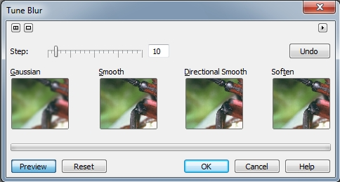
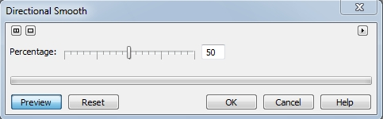
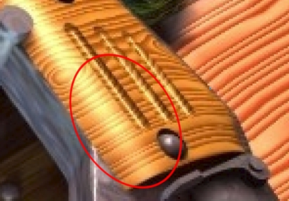
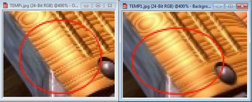

# Фильтры Tune Blur (Настройка размытости) и Directional smooth (Направленное сглаживание)

### Фильтр Tune Blur (Настройка размытости)

Диалоговое окно **Tune Blur** (Настройка размытости) (рис. 1) в Corel Photo-Paint позволяет скорректировать смягчение резкости, нажимая на кнопку миниатюры примера. Кнопки отображают, как будет выглядеть изображение после применения эффекта. Ползунок **Step** (Шаг) управляет интенсивностью эффекта. Эффект аккумулируется при нажатии кнопки, т.е. эффект применяется к результату предыдущих воздействий эффектов. Кнопка **Undo** (Отменить) служит для отмены действия, а кнопка **Reset** (Сброс) для сброса настроек диалогового окна к значениям по умолчанию. Это диалоговое окно, обеспечивает доступ сразу к четырем эффектам размывки.

**Для смягчения резкости:**

1\. Выполните команду **Effects > Blur > Tune Blur** (Эффекты > Размытость > Настройка размытости).  
2\. Переместите ползунок **Step** (Шаг) для настройки степени воздействия эффекта. Более высокие значения дают более заметный эффект.  
3\. Выберите эффект размывки, нажимая кнопку примера. Интенсивность эффекта повышается при каждом нажатии кнопки.

### Фильтр Directional smooth (Направленное сглаживание)

Фильтр **Directional smooth** (Направленное сглаживание) анализирует значения пикселей, имеющих близкую тональность, с целью определения направления приложения максимального сглаживания. С его помощью обеспечивается тонкое сглаживание краев и поверхностей без искажения самого изображения. Диалоговое окно фильтра **Directional smooth** (Направленное сглаживание) показано на рис. 2.

В диалоговом окне фильтра имеется всего один элемент управления – ползунок **Percentage** (Процент). Переместите ползунок **Percentage** (Процент) для задания интенсивности проявления эффекта.

Фраза «тонкое сглаживание краев и поверхностей», сказанная выше, пожалуй еще очень мягко сказана. Чтобы увидеть действие данного фильтра («тонкость сглаживания»), вам придется очень постараться. Слишком уж незаметное это сглаживание. Однако, его все же можно увидеть.  
На рис. 3 показано исходное изображение.

На рис. 4 показан увеличенный фрагмент (масштаб 400 %) исходного фото, где мы должны хоть как-то разглядеть результат работы этого фильтра. Я обвел специально ту область, где мы должны будем увидеть результат размытия.

Выполните команду **Effects > Blur > Directional smooth** (Эффекты > Размытость > Направленное сглаживание). Установим значение **Percentage** (Процент) на максимум, т. е. равным 100 и нажмите **ОК**.  
Вы можете ничего и не увидеть при обычном просмотре. Но я специально увеличил нужные области и обвел их красными кружками (рис. 5). Даже при увеличении, нужно присмотреться, чтобы увидеть, что при максимальном действии этого фильтра, была немного размыта текстура ручки автомата. Это заметно на темных полосах текстуры, они стали чуть размыты. Так что прибегая к помощи этого фильтра, вы должны понимать, что действует он (размывает) слишком уж мягко.

