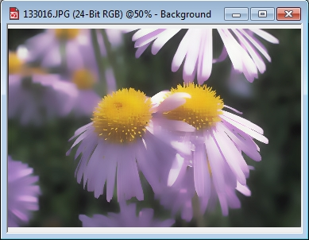

# Фильтры Zoom и Smart Blur

### Фильтр Zoom (Масштаб)

Это довольно занятный фильтр. По области его применения, его можно сравнить с фильтрами **Radial Blur** (Радиальная размытость) и **Motion Blur** (Размытость движением). Все три фильтра применяются в основном для создания определенных эффектов, а не для борьбы с дефектами, как например фильтр **Gaussian Blur** (Размытость по Гауссу). Применять этот фильтр можно в самых различных ситуациях. Пример использования фильтра **Zoom** (Масштаб), я пожалуй приведу ниже, когда мы дойдем до рассмотрения фильтров группы **Distort** (Искажение). Тогда это будет уместней сделать, чем сейчас. Вообще же, фильтр **Zoom** (Масштаб) выполняет размытие пикселей изображения в направлении от центральной точки наружу. Чем ближе пиксели расположены к центральной точке, тем меньше степень их размытости. Центральную точку можно задать с помощью кнопки установки центра, в виде указателя с крестиком (рис. 1).

На рис. 2 показано исходное изображение,

а на рис. 3 один из примеров применения фильтра **Zoom** (Масштаб). Конечно, здесь использовались и другие инструменты Photo-Paint. но для придания размытости небу вверху и в левой части изображения, применялся фильтр **Zoom** (Масштаб).

Интенсивность проявления эффекта задается ползунком **Amount** (Количество). Эффект от применения фильтра показан на рис. 4, значение параметра **Amount** (Количество) было выбрано равным 70.

### Фильтр Smart Blur (Интеллектуальная размытость)

Фильтр **Smart Blur** (Интеллектуальная размытость) изображения при сохранении деталей по краям. Данный эффект применяется для сохранения четких линий и краев. Сравните результаты применения фильтров **Zoom** (Масштаб) (рис. 4) и **Smart Blur** (Интеллектуальная размытость) (рис. 5).

