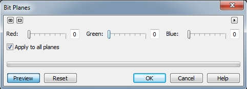
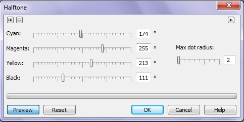
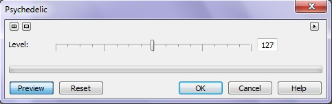
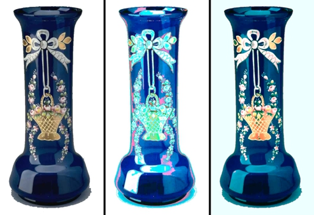
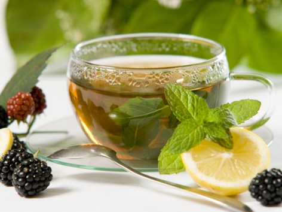
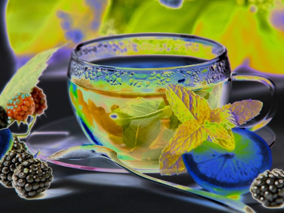
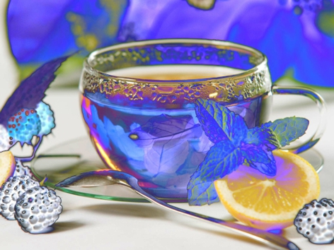
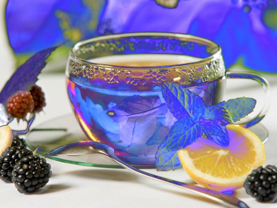

# Фильтры группы Color Transform (Преобразование цвета)

### Фильтр Bit Planes (Градиентный анализ)

Фильтр **Bit Planes** (Градиентный анализ) является мощным инструментом анализа градиентов в изображениях. Этот фильтр ограничивает изображение базовыми световыми компонентами **RGB** и подчеркивает тональные изменения. Например, некоторые области предстают в виде однородных блоков, поскольку имеющиеся тональные изменения являются незначительными. Градиентная заливка имеет высокую степень тонального изменения цвета, поэтому фильтр **Bit Planes** (Градиентный анализ) очень полезен для анализа числа шагов в градиентах. Диалоговое окно фильтра **Bit Planes** (Градиентный анализ) показано на рис. 1.

**Для применения градиентного анализа к изображению:**

1\. Выполните команду **Effects > Color Transform > Bit Planes** (Эффекты > Преобразование цвета > Градиентный анализ).  
2\. Переместите ползунки **Red** (Красный), **Green** (Зеленый), **Blue** (Синий). Установите флажок **Apply to all planes** (Применять ко всем) для поддержания равенства между значениями этих параметров.

Ползунки **Red** (Красный), **Green** (Зеленый) и **Blue** (Синий) управляют чувствительностью эффекта. Более высокие значения отображают меньше тональных изменений и шагов градиентной заливки. При самой высокой установке изображение содержит большое число черных и белых областей, так как эффект отображает лишь экстремальные изменения тона. Более низкие значения отображают больше тональных изменений и градиентов. При самой низкой установке изображение представляется покрытым цветовым шумом.

### Фильтр Halftone (Полутон)

Фильтр **Halftone** (Полутон) придает изображению вид цветового полутона. Как и в случае цветной печати в типографии, заданные пользователем углы растра определяют, как выстраиваются на экране полутоновые точки, и как осуществляется перетекание цвета, когда все растры просматриваются совместно. Углы растра могут быть настроены таким образом, чтобы можно было получить более широкий диапазон цветов. Диалоговое окно фильтра **Halftone** (Полутон) показано на рис. 2.

**Для придания изображению вида цветового полутона:**

1\. Выполните команду **Effects > Color Transform > Halftone** (Эффекты > Преобразование цвета > Полутон).  
2\. Переместите ползунок **Max dot radius** (Максимальный радиус точки), для задания максимального радиуса полутоновой точки.  
3\. Переместите ползунки: **Cyan** (Голубой), **Magenta** (Пурпурный), **Yellow** (Желтый), **Black** (Черный), чтобы задать угол каждого из цветовых растров.

Следует отметить, что ползунок **Black** (Черный) становится активным, если изображение было создано или преобразовано в модель **CMYK**. Также, на мой взгляд лучшие результаты получаются при работе именно с этой цветовой моделью.

### Фильтр Psychedelic (Психоделика)

Фильтр **Psychedelic** (Психоделика) изменяет цвета изображения на яркие, электрические - такие, как оранжевый, ярко розовый, циановый и лимонно-зеленый. Диалоговое окно фильтра **Psychedelic** (Психоделика) представлено на рис. 3.

В этом диалоговом окне имеется всего один элемент управления – ползунок **Level** (Уровень), который служит для задания интенсивности проявления эффекта. Хотя этот фильтр и дает весьма экстравагантные результаты, иногда с его помощью можно получить неплохой эффект, например, как на рис.4.

На рис. 4 показан результат применения фильтра **Psychedelic** (Психоделика):  
слева – исходное изображение; по центру – значение параметра **Level** (Уровень) = 127; справа – значение параметра **Level** (Уровень) = 33

### Фильтр Solarize (Соляризация)

Фильтр **Solarize** (Соляризация), как и фильтр инвертирования, трансформирует цвета таким образом, чтобы они напоминали цвета фотонегатива. В терминах фотографии соляризация является методом темной комнаты, в которой используется неожиданная вспышка света для затемнения незаполненных областей отпечатка. С помощью фильтра **Solarize** (Соляризация), в отличие от фильтра инвертирования (который действительно инвертирует цвета изображения), осуществляется управление интенсивностью проявления данного эффекта. Интенсивность эффекта регулируется в окне фильтра единственным ползунком **Level** (Уровень).

Хотя применение фильтра **Solarize** (Соляризация) может показаться не совсем очевидным, однако с его помощью можно получить довольно оригинальные результаты. Давайте рассмотрим пример с использованием этого фильтра.  
На рис. 5 представлено исходное изображение.

Выполните команду **Effects > Color Transform > Solarize** (Эффекты > Преобразование цвета > Соляризация). В диалоговом окне **Solarize** (Соляризация) установите значение параметра **Level** (Уровень) равным 208 и щелкните **ОК**. Изображение станет напоминать чем-то негатив (рис. 6).

Теперь выполните команду **Image > Transform > Invert** (Изображение > Преобразование > Инвертировать), инвертировав таким образом все изображение (рис. 7).

Картинка стала довольно оригинальной. Однако мне бы хотелось вернуть прежний вид ягод. Для этого я выбрал инструмент **Clone From Saved** (Клонирование из сохраненного) и аккуратно обработал мягкой кистью ягоды. Результат показан на рис. 8.

