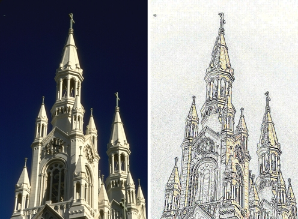

# Фильтры группы Contour (Контур)

### Фильтр Edge Detect (Обнаружение краев)

Фильтр **Edge Detect** (Обнаружение краев), как и фильтры _Трассировка контура_ и _Поиск краев_, находит края элементов изображения, затем конвертирует их в линии на фоне одиночного цвета, позволяя добавлять различные контурные эффекты к изображению. Опять же, на мой взгляд, более удачным вариантом русского названия, было название этого фильтра – _Определение краев_. Диалоговое окно фильтра **Edge Detect** (Обнаружение краев), показано на рис. 1.

Ползунок **Sensitivity** (Чувствительность) определяет величину усиления края. Для заполнения областей изображения, не являющихся частью контура, может использоваться белый, черный или другой цвет, который можно выбрать в _Указателе цвета_. Для достижения наилучших результатов используйте фильтр **Edge Detect** (Обнаружение краев) на высококонтрастных изображениях.

Пример использования фильтра **Edge Detect** (Обнаружение краев) приведен на рис. 2.

На рис. 2: результат применения фильтра **Edge Detect** (Обнаружение краев), с значением **Sensitivity** (Чувствительность) равным 4\. Слева– исходное изображение.

### Фильтр Find Edges (Поиск краев)

Фильтр **Find Edges** (Поиск краев), как и другие фильтры группы **Contour** (Контур) определяет контуры изображения и преобразует их для смягчения или ужесточения линий. Диалоговое окно фильтра показано на рис. 3.

**Для преобразования краев:**

1\. Выполните команду **Effects > Contour > Find Edges** (Эффекты > Контур > Поиск краев).  
2\. Включите переключатель **Soft** (Нерезкая) или **Solid** (Сплошная).  
3\. Переместите ползунок **Level** (Уровень), чтобы определить значение чувствительности. Чем выше это значение, тем большее число краев будет усилено.

Пример использования фильтра **Find Edges** (Поиск краев) показан на рис. 4.

На рис. 4: Значения параметра **Level** (Уровень) равно 25.

### Фильтр Trace Contour (Трассировка контура)

Фильтр **Trace Contour** (Трассировка контура) создает края изображения, прорисованные с различной интенсивностью, путем нанесения элементов изображения с использованием 16 цветов стандартной палитры VGA. При его использовании устанавливается значение порогового уровня, а также определяется, верхние или нижние края будут подвергаться трассировке. Фильтр **Trace Contour** (Трассировка контура) работает наилучшим образом при наличии на изображении выступающих частей. Диалоговое окно фильтра **Trace Contour** (Трассировка контура) показано на рис. 5.

**Для оконтуривания краев изображения:**

1\. Выполните команду **Effects > Contour > Trace Contour** (Эффекты > Контур > Трассировка контура).  
2\. Переместите ползунок **Level** (Уровень) для задания порогового уровня. Этот уровень определяет, какие пиксели будут затронуты (с учетом уровня яркости пикселя, в диапазоне от 1 до 255).  
3\. В группе переключателей **Edge Type** (Тип кромки) включите один из переключателей.

*   Переключатель **Lower** (Вниз) трассирует значения цвета, значения яркости которых ниже порогового для края уровня.
*   Переключатель **Upper** (Вверх) трассирует значения цвета, значения яркости которых превышают пороговый для края уровень.