# Фильтры группы Custom (Настройка)

### Фильтр Alchemy (Алхимия)

Фильтр **Alchemy** (Алхимия) – очень сложный фильтр, предназначенный для имитации  
живописных произведений, выполненных в разной технике.

Фильтр **Alchemy** (Алхимия) содержит 30 определяемых пользователем параметров и множество заготовок стилей. Результаты применения этих заготовок стилей к изображениям свидетельствуют о невероятной гибкости данного фильтра и наличии многочисленных возможностей преобразования изображения. Параметры представлены пятью группами, каждая из которых идентифицируется вкладкой: **Brush** (Кисть), **Соlог** (Цвет), **Size** (Размер), **Angle** (Угол) и **Тгапsрагепсу** (Прозрачность). Помните, что небольшое изменение одного параметра может повлечь существенные изменения в проявлении эффекта в целом. Меняйте каждый раз по одному параметру, чтобы познакомиться с эффектами, характерными для каждой из представляемых ими функций. Сложность эффекта **Alchemy** (Алхимия) иногда замедляет его работу по сравнению с другими эффектами; тем не менее, результаты стоят того, чтобы подождать. Результаты применения фильтра **Alchemy** (Алхимия) в чем-то схожи с применением фильтров группы **Art Strokes** (Художественные мазки).

Вкладка **Brush** (Кисть) диалогового окна **Alchemy** (Алхимия) представлена на рис. 1.

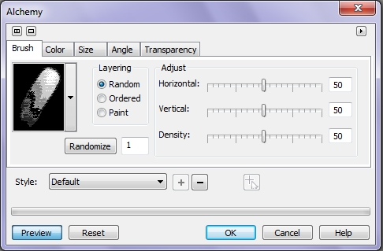

**Для применения натуральных мазков кисти к изображению:**

1\. Выполните команду **Effects > Custom > Alchemy** (Эффекты > Настройка > Алхимия).  
На вкладке **Brush** (Кисть):  
2\. Включите один из переключателей раздела **Layering** (Слои).

*   Переключатель **Random** (Произвольные) – выберите этот переключатель для применения эффекта со случайными мазками;
*   Переключатель **Ordered** (Упорядоченные) – выберите этот переключатель для применения эффекта с наложением мазков на мазки, находящиеся справа и снизу;
*   Переключатель **Paint** (Кисть) – выберите этот переключатель для наложения мазков так, чтобы была видна самая яркая часть.

3\. Выберите тип кисти из раскрывающегося списка образцов кисти.  
4\. В области **Adjust** (Настройка) переместите ползунки:

*   **Horizontal** (По горизонтали) – перемещение ползунка управляет горизонтальным отклонением кисти;
*   **Vertical** (По вертикали) – перемещение ползунка управляет вертикальным отклонением кисти;
*   **Density** (Плотность) – этот ползунок устанавливает плотность мазков кисти

5\. Кнопка **Randomize** (Случайные) – служит для выбора случайного числа. Это число будет использовано фильтром **Alchemy** (Алхимия), как основа для вычисления мазков кисти. Используйте кнопку **Randomize** (Случайные) для изменения числа, когда вы в основном удовлетворены результатом, но хотели бы немного изменить мазки кисти.  
На вкладке **Color** (Цвет) (рис. 2):

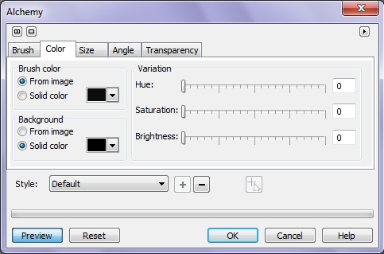

6\. Включите один из переключателей области **Brush color** (Цвет кисти). При выборе параметра **Solid color** (Сплошной цвет), выберите цвет из _Указателя цвета_.  
7\. Включите один из переключателей раздела **Background** (Фон). При выборе параметра **Solid color** (Сплошной цвет), выберите цвет из _Указателя цвета_.  
8\. Переместите ползунок **Hue** (Оттенок), чтобы установить изменение оттенка в мазках кисти.  
9\. Переместите ползунок **Saturation** (Насыщенность), чтобы установить изменение насыщенности в мазках кисти.  
10\. Переместите ползунок **Brightness** (Яркость), чтобы установить изменение уровней яркости мазков кисти.  
На вкладке **Size** (Размер) (рис. 3):

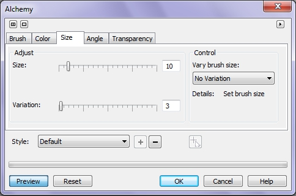

11\. Выберите шаблон из раскрывающегося списка **Vary brush size** (Изменение размера кисти).  
12\. Переместите ползунки в области **Adjust** (Настройка), чтобы отрегулировать размер мазков кисти.  
> Ползунок **Size** (Размер) – функция этого ползунка зависит от значения выбранного в списке **Vary brush size** (Изменение размера кисти). Кроме того, состав и названия ползунков на этой вкладке изменяются в зависимости от значения выбранного в этом списке:  
• **No Variation** (Без вариации) – двигайте ползунок **Size** (Размер) для регулировки размеров кисти;  
• **Randomly** (Случайно) – двигайте ползунок для случайного изменения размеров кисти. Ползунок **Size** (Размер) заменяется ползунками **This** (Этот) и **That** (Тот);  
• **By Radial Distance** (По радиальному расстоянию) –ползунок **Size** (Размер) заменяется ползунками **Center** (Центр) и **Edge** (Край).  
**Center** (Центр) – двигайте ползунок для регулировки размеров мазков к центру радиального шаблона.  
**Edge** (Край) – двигайте ползунок для регулировки размеров мазков по краям радиального шаблона;  
• **By Vertical Position** (По вертикальному положению) – ползунок **Size** (Размер) заменяется ползунками **Top** (Сверху) и **Bottom** (Снизу).  
**Top** (Сверху) – двигайте ползунок для регулировки размеров мазков по вершине вертикального уровня;  
**Bottom** (Снизу) – двигайте ползунок для регулировки размеров мазков по нижней стороне вертикального уровня;  
• **By Horizontal Position** (По горизонтальному положению) – ползунок **Size** (Размер) заменяется ползунками **Left** (Слева) и **Right** (Справа).  
**Left** (Слева) – двигайте ползунок для регулировки размеров мазков по левой стороне горизонтального уровня;  
**Right** (Справа) – двигайте ползунок для регулировки размеров мазков по правой стороне горизонтального уровня;  
• **By Hue** (По оттенку) – ползунок **Size** (Размер) заменяется ползунками **Warm** (Теплый) и **Cool** (Холодный).  
**Warm** (Теплый) – двигайте ползунок для регулировки размеров теплых мазков;  
**Cool** (Холодный) – двигайте ползунок для регулировки размеров холодных мазков;  
• **By Saturation** (По насыщенности) – ползунок **Size** (Размер) заменяется ползунками **Unsaturated** (Ненасыщенный) и **Saturated** (Насыщенный).  
**Unsaturated** (Ненасыщенный) – двигайте ползунок для регулировки размеров ненасыщенных мазков;  
**Saturated** (Насыщенный) – двигайте ползунок для регулировки размеров насыщенных мазков;  
• **By Brightness** (По яркости) – ползунок **Size** (Размер) заменяется ползунками **Dark** (Темный) и **Bright** (Светлый).  
**Dark** (Темный) – двигайте ползунок для регулировки размеров темных мазков;  
**Bright** (Светлый) -- двигайте ползунок для регулировки размеров ярких мазков.  
> Ползунок **Variation** (Вариация) – служит для управления величиной отклонения в размерах мазков кисти.  
13\. Щелкните вкладку **Angle** (Угол) и переместите ползунки в области **Adjust** (Настройка), чтобы отрегулировать угол мазков кисти.  
14\. Щелкните вкладку **Тгапsрагепсу** (Прозрачность) и переместите ползунки в разделе области **Adjust** (Настройка), чтобы определить степень прозрачности мазков кисти.

Надо отметить, что при выборе различных параметров в списке области **Control** (Управление), на вкладках **Angle** (Угол) и **Тгапsрагепсу** (Прозрачность), состав ползунков меняется аналогично тому, как было описано для вкладки **Size** (Размер). Назначение соответствующих ползунков сходно описанным выше, только естественно они влияют на угол наклона и прозрачность мазков.  
В нижней части окна фильтра расположен список **Style** (Стиль), с заготовками стилей. Вы можете сохранить настройки фильтра **Alchemy** (Алхимия) в качестве заготовки стиля. Также, с помощью кнопки в виде курсора с крестиком, можете указать центр относительно которого будет применяться эффект.

### Фильтр Band Pass (Зональная фокусировка)

Фильтр **Band Pass** (Зональная фокусировка) позволяет подчеркнуть области с равномерной заливкой и выделить границы. Области равномерной заливки сглаживаются и получается темно-серый оттенок, а границы подчеркиваются толстыми черными линиями. Диалоговое окно фильтра **Band Pass** (Зональная фокусировка) показано на рис. 4.

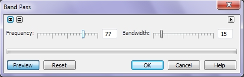

Давайте рассмотрим на примере работу фильтра **Band Pass** (Зональная фокусировка) и влияние значений параметров в диалоговом окне. На рис. 5 показано исходное изображение.

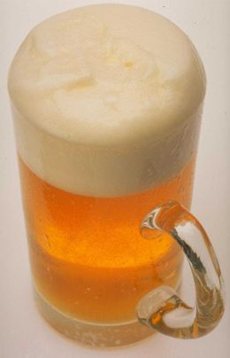

Наша задача, с помощью фильтра **Band Pass** (Зональная фокусировка) сделать более привлекательным изображение, сделав более отчетливыми пузырьки в бокале. Но сначала мы немного исправим изображение с помощью фильтра **Tone curve** (Цветовая кривая) (рис. 6).

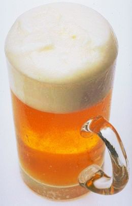

Теперь выполните команду **Effects > Custom > Band Pass** (Эффекты > Настройка > Зональная фокусировка). Сначала, я сразу приведу нужные значения параметров, а потом немного поэкспериментируем с ними. В диалоговом окне **Band Pass** (Зональная фокусировка) установите значения: **Frequency** (Линеатура) = 77, а **Bandwidth** (Полоса пропускания) = 50\. Результат показан на рис. 7.

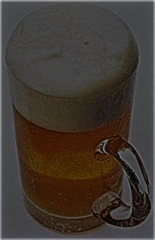

Как видите, изображение потемнело и приобрело темно-серый оттенок. Из-за этого потемнения увидеть проявление эффекта от применения фильтра практически невозможно. В таком виде, это не сильно похоже на какое-либо улучшение, поэтому применим еще фильтр **Brightness/Contrast/Intensity** (Яркость/Контрастность/Интенсивность) (рис. 8).

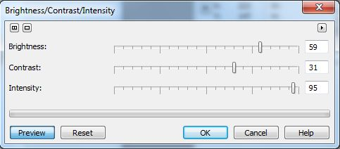

В итоге получим изображение на рис. 9.

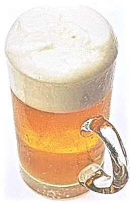

Сравнивая рисунки 5, 6 и 9, мы видим, что пузырьки в бокале стали более отчетливыми, а стекающая по стенкам бокала пена получилась «рельефной», если можно так выразиться. Понятное дело – это не шедевр, но в данном примере не ставилась задача получить результат, как в рекламном проспекте (особенно исходя из качества оригинала).  
Теперь давайте поэкспериментируем и посмотрим, как влияют значения параметров на конечный результат (рис. 10). Оба параметра, **Frequency** (Линеатура) и **Bandwidth** (Полоса пропускания) могут изменять свои значения от 0 до 100\. Увеличение значения **Bandwidth** (Полоса пропускания) приводит к размыванию и затемнению изображения, а **Frequency** (Линеатура) – к подчеркиванию границ областей и затемнению. Подчеркивание границ областей с равномерной заливкой получается, когда оба параметра имеют значения отличные от 0, а лучше когда они больше 50\. Однако, значения всегда подбираются индивидуально, исходя из исходного изображения и поставленной задачи.

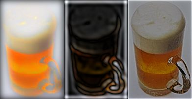

На рис. 10 показаны результаты применения фильтра (слева направо) при следующих значениях: **Frequency** (Линеатура) = 0, **Bandwidth** (Полоса пропускания) = 100; **Frequency** (Линеатура) = 25, **Bandwidth** (Полоса пропускания) = 100; **Frequency** (Линеатура) = 50, **Bandwidth** (Полоса пропускания) = 50.

### Фильтр Bump-map (Рельефная карта)

Фильтр **Bump-map** (Рельефная карта), это фильтр для придания изображениям произвольной текстуры (рис. 11). Вкладки окна определяют параметры текстуры – саму текстуру, ее освещение и рельеф.

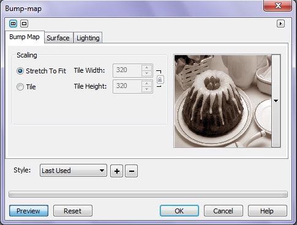

Чтобы использовать фильтр **Bump-map** (Рельефная карта) необходим удачный подбор исходного изображения и четкое представление того, что вы хотите в итоге получить. Не так уж и часто есть необходимость придания текстуры тому или иному объекту, к тому же зачастую такую задачу можно выполнить с помощью фильтра **Canvas** (Холст). Однако в некоторых случаях, сил фильтра **Canvas** (Холст) недостаточно. Давайте посмотрим, что можно выполнить с помощью фильтра **Bump-map** (Рельефная карта). На рис. 12 показано исходное изображение.

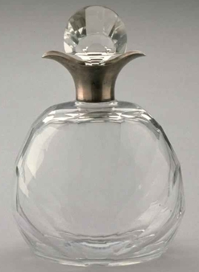

На первый взгляд – симпатичный сосуд… Но я хочу немного «приукрасить» крышечку, точнее ее металлическую часть. Понятно, что сначала придется ее выделить. Выделенная часть показана на рис. 13.

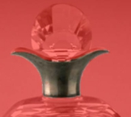

Выполните команду **Effects > Custom > Bump-map** (Эффекты > Настройка > Рельефная карта). Настройки на вкладках фильтра показаны на рис. 14, 15 и 16\. На рис. 14 показана выбранная текстура из списка текстур входящих в стандартный набор фильтра.

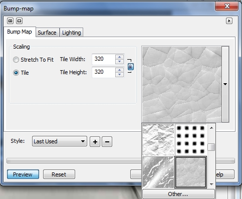

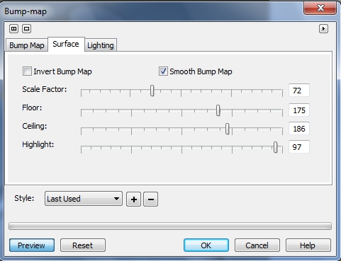

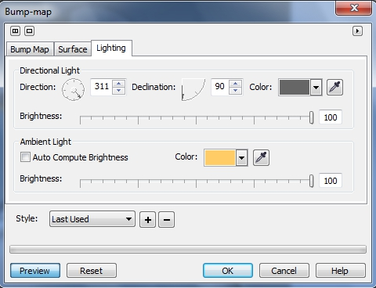

Результат показан на рис. 17.

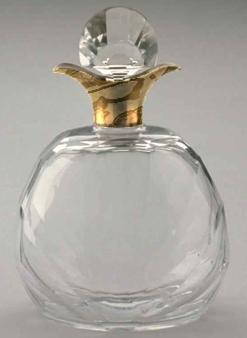

В заключение скажу, что результат в первую очередь зависит от удачного подбора параметров на вкладке **Surface** (Поверхность). Особенно сильно влияют на результат элементы управления **Floor** (Пол) и **Ceiling** (Потолок). Хотя в некоторых случаях, влияние этих параметров начинает проявляться при значениях близких к максимальным. Поэтому нужна некоторая тренировка для освоения этого фильтра, несмотря на то, что работать с ним довольно легко.

### Фильтр User Defined (Пользовательский)

Фильтр **User Defined** (Пользовательский) помогает пользователю создавать свои собственные специальные эффекты. Диалоговое окно содержит матрицу из 25 ячеек (5 Х 5). Она представляет отдельный одиночный пиксель изображения (центральное окно) и соседние с ним пиксели (окна вокруг центра). Вводимые в матрицу значения определяют тип и диапазон создаваемого эффекта. В матрицу могут вводиться положительные и отрицательные значения в произвольном порядке. Если окошко остается пустым, его значение является нулевым.

В Согеl Рното-Раint имеется ряд примеров определяемых пользователем эффектов: нажмите кнопку **_Загрузить_** для просмотра имеющихся образцов. Эти эффекты были включены для демонстрации соответствия между вводимыми в матрицу значениями и получаемым результатом. Диалоговое окно фильтра **User Defined** (Пользовательский) показано на рис. 18.

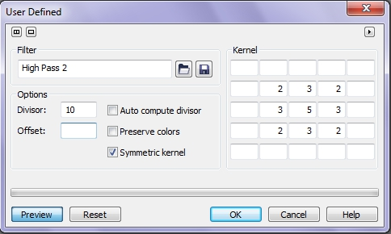

**Для загрузки образцов фильтров пользовательских эффектов:**

1\. Выполните команду **Effects > Custom > User Defined** (Эффекты > Настройка > Пользовательский).  
2\. Нажмите кнопку **Загрузить** (кнопка в виде папки).  
3\. Выберите из списка образец эффекта.  
4\. Нажмите кнопку **Открыть**.

**Для создания фильтра пользовательского эффекта:**

1\. Выполните команду **Effects > Custom > User Defined** (Эффекты > Настройка > Пользовательский).  
2\. Наберите значение в центральном окошке матрицы. Это значение будет умножено на текущий пиксель.  
3\. Наберите значения в окошках, окружающих центральное окошко. Все значения в матрице умножаются на соответствующие пиксели изображения и складываются для получения нового значения текущего пикселя.  
4\. Введите число в поле **Devisor** (Делитель).  
После того, как новое значение для текущего пикселя вычислено, Согеl Рното-Раint делит его на это число. Результат определяет окончательное значение цвета RGB для текущего пикселя - значение, заключенного между 1 и 255 (более высокие и более низкие значения обрезаются до значений этого диапазона).  
5\. Установите флажок **Auto compute divisor** (Пересчитывать автоматически).  
Функция **Auto compute divisor** (Пересчитывать автоматически) обеспечивает поддержание общей яркости изображения. Автоматическое вычисление устанавливает значение делителя таким образом, что результат всегда будет находиться в диапазоне от 1 до 255\. Это позволяет смещать отдельные цвета, не влияя на общую яркость изображения  
6\. Наберите значение в попе **Offset** (Смещение).  
Смещение сдвигает окончательный результат вычислений вверх или вниз по шкале яркости. Положительные значения усиливают яркость всего изображения, а отрицательные значения затемняют его.