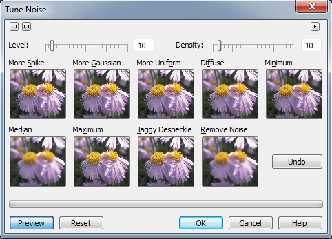
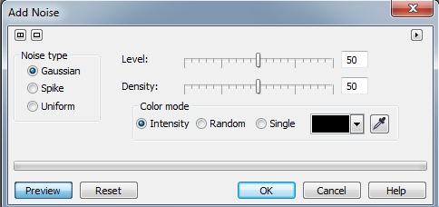
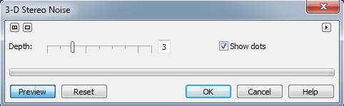
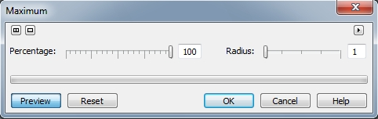
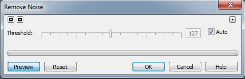

# Фильтры группы Noise (Шумы)

Перед рассмотрением фильтров этой группы, я хочу привести определения терминов, приведенные самими разработчиками в справочной системе.  
**Муар** – Нежелательный волнообразный узор, возникающий в изображении путем наложения двух повторяющихся узоров. Они возникают в случае наложения на одном изображении полутоновых растров с двумя различными линеатурами. Например, при сканировании полутонового изображения весьма вероятно появление муара на экране монитора, поскольку линеатура исходного растра отличается от линеатуры (dpi) сканируемого изображения.  
**Шумы** – При редактировании растровых изображений: случайные пиксели на поверхности растрового изображения, напоминающие помехи на экране телевизора.

Так вот, фильтры в подменю **Noise** (Шумы) используются для создания, управления и избавления от эффекта шумов. В отличие от фильтров _Размывки_, фильтры _Шумов_ используются реже, т. к. применяются только для борьбы с данными видами дефектов и практически никогда, за некоторым исключением, для создания определенных эффектов.

### Фильтр Tune Noise (Настройка)

Фильтр **Tune Noise** (Настройка) по своему устройству схож с фильтром **Tune Blur** (Настройка размытости) (рис. 1).

Диалоговое окно **Tune Noise** (Настройка) позволяет скорректировать шум в изображении, просто нажимая на кнопки с эскизами примеров. Эти кнопки показывают, как будет выглядеть изображение, после применения каждого конкретного эффекта. Ползунок **Level** (Уровень) управляет действием эффекта. Ползунок **Density** (Плотность) влияет на плотность пикселей, используемых эффектами. Каждый раз при нажатии кнопки с эскизом, эффект применяется к результату предыдущих воздействий эффектов.

### Фильтр Add Noise (Добавить шум)

Фильтр **Add Noise** (Добавить шум) создает эффект зернистости поверхности, добавляя текстуру в изображение с большой степенью смешивания. В фильтре, в области **Noise type** (Тип шумов), представлено три типа шумов: тип **Gaussian** (По Гауссу) устанавливает приоритеты цветов вдоль _кривой Гаусса_. Тип **Gaussian** (По Гауссу) соответствует появлению большего числа светлых и темных пикселей, чем тип **Uniform** (Однородный). Тип **Spike** (Пик) использует цвета, которые распределяются вдоль узкой кривой. Он производит тонкое окрашенное в светлые тона зерно. Тип **Uniform** (Однородный) обеспечивает общий зернистый вид изображения. Используйте этот тип для случайного подбора цветов. Диалоговое окно фильтра **Add Noise** (Добавить шум) показано на рис. 2.

Ползунок **Level** (Уровень) регулирует интенсивность эффекта, а ползунок **Density** (Плотность) задает плотность добавочного шума. Также можно выбрать один из цветовых режимов шума в области **Color mode** (Цветовой режим). При выборе параметра **Single** (Один), можно выбрать цвет шума с помощью **Указателя цвета** или взять образец цвета непосредственно из изображения с помощью пипетки.

### Фильтр 3-D Stereo Noise (Трехмерный стереошум)

Лично для меня, это самый пожалуй непонятный фильтр. Чтобы рассмотреть эффект от применения этого фильтра, нужно еще очень сильно постараться, хотя по утверждению самих же разработчиков, некоторые люди вообще не способны его рассмотреть. Так что могу смело утверждать, что вы вообще врядли будете к нему прибегать. Диалоговое окно фильтра **3-D Stereo Noise** (Трехмерный стереошум) представлено на рис. 3.

Ползунок **Depth** (Глубина) служит для задания интенсивности проявления эффекта глубины. Установите флажок **Show dots** (Показывать реперные точки), если хотите, чтобы к изображению были добавлены две точки. Эти точки помогают правильно сфокусировать зрение на изображении. Настройте фокусировку глаз таким образом, чтобы эти две точки превратились в три, а затем перемещайте взгляд вниз по странице к изображению.

### Фильтр Maximum (Максимум)

Фильтр **Maximum** (Максимум) (рис. 4) удаляет шум посредством настройки значений пикселя на основании максимального значения цвета соседних пикселей. Этот фильтр вызывает также эффект мягкой размывки, если применяется при больших значениях процента или более одного раза.

Ползунок **Percentage** (Процент) служит для установки интенсивности проявления эффекта. Переместите ползунок **Radius** (Радиус), чтобы определить число соседних пикселей, включаемых в процесс работы фильтра.

### Фильтр Median (Медиана)

Фильтр **Median** (Медиана) удаляет шум и мелкие детали путем усреднения цветов смежных пикселей в изображении. Он определяет усредненное значение соседних пикселей для сглаживания изображения. Единственный элемент управления в окне фильтра – ползунок **Radius** (Радиус), предназначен чтобы определить число соседних пикселей, которые использует фильтр для вычисления медианы.

### Фильтр Minimum (Минимум)

Фильтр **Minimum** (Минимум) затемняет изображение посредством настройки значений пикселя на основании минимального значения соседних пикселей. Ползунок **Radius** (Радиус) управляет количеством соседних пикселей, которые последовательно выбираются и оцениваются в процессе работы фильтра **Minimum** (Минимум). Большое радиальное значение приведет к более глубокому эффекту, нежели маленькое. Используйте ползунок **Percentage** (Процент) для управления объемом затемнения. Высокие значения или многократное применение, снизит степень детальности изображения.

### Фильтр Remove Noise (Удалить шум)

Диалоговое окно фильтра **Remove Noise** (Удалить шум) показано на рис. 5.

Фильтр **Remove Noise** (Удалить шум) смягчает изображение и уменьшает эффект «крапчатости», который может проявиться во время сканирования или съемки. Фильтр **Remove Noise** (Удалить шум) сравнивает каждый пиксель с окружающими пикселями и вычисляет среднее значение. Каждый пиксель, значение яркости которого превышает заданное, при помощи ползунка пороговое значение удаляется. Кроме того, фильтр **Remove Noise** (Удалить шум) удаляет шум случайных пикселей в изображении.

Переместите ползунок **Threshold** (Порог), чтобы установить уровень яркости, при котором осуществляется удаление шума. Установите флажок **Auto** (Авто), если хотите, чтобы данная операция выполнялась Corel Photo-Paint.