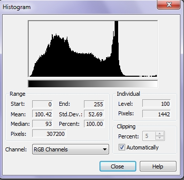
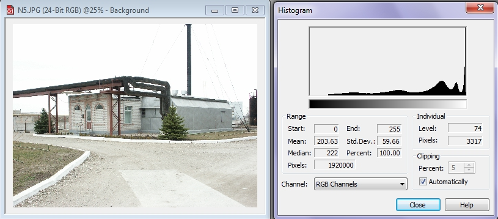
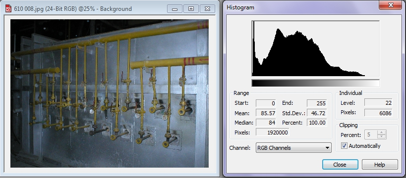
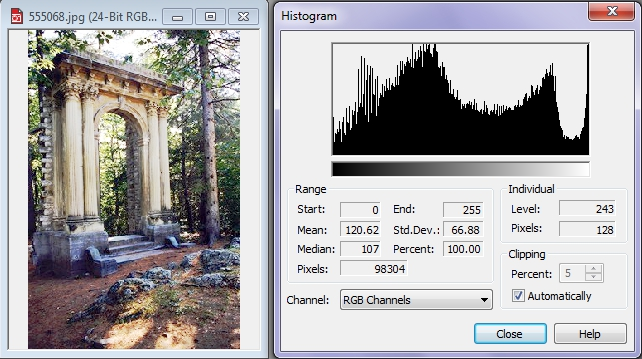

# Гистограмма

Многие инструменты, которые предназначены для тоновой коррекции изображений, имеют в своем составе элемент, называемый _Гистограмма_. _Гистограмма_ позволяет оценить распределение тональностей в изображении.

_Гистограмма_ – это линейчатая диаграмма, представляющая диапазон тональностей в растровом изображении. Тональные значения отображаются на гистограмме по порядку от темных до светлых, при этом «пики» представляют относительное число пикселей заданного уровня.  
Для анализа изображения в Photo-Paint имеется отдельный инструмент – **Histogram** (Гистограмма). Этот инструмент не является инструментом или фильтром, в привычном смысле этого слова. Инструмент **Histogram** (Гистограмма) является скорее информативным, т. е. он сам по себе не выполняет никаких действий. Гистограмма служит для получения информации о распределении тональностей в изображении. Несмотря на то, что _Гистограмма_ не вносит никаких изменений в изображение, ее значимость не нужно недооценивать. Поэтому вам следует внимательно изучить все элементы этого инструмента, т. к. гистограммы широко используются при тональной коррекции изображений.

Чтобы отобразить гистограмму, откройте любое изображение и выполните команду **Image > Histogram** (Изображение > Гистограмма). На экране появится диалоговое окно с отображением гистограммы вашего изображения (рис. 1).

Как видно из рисунка, гистограмма – это горизонтальная диаграмма, отображающая яркость каждого пикселя в изображении и является графическим представлением полутонов изображения, построенное от черного цвета (слева) к белому (справа). Диапазон значений от 0 до 255\. Гистограмма отображает количество пикселей каждого уровня яркости. Используется гистограмма для анализа проблем тонов и определения методов их исправления. Гистограмма каждого изображения содержит некоторое количество пиков и спадов. Очевидно, что изображение с несколькими резкими пиками нужно корректировать (но не во всех случаях, поскольку изображение может содержать много белого и черного). Если пиксели сосредоточены около одного из краев гистограммы, может потребоваться сжать диапазон тонов или перераспределить пиксели в диапазоне. Если есть большие провалы между полями, возможно, произошла постеризация. Чем больше пикселей в изображении относится к одной категории, тем уже и выше будет гистограмма. Таким образом, изучив гистограмму, вы можете получить общее представление о цветовом насыщении изображения.

Как показано на рис. 2, для светлого изображения гистограмма смещается вправо, поскольку оно состоит преимущественно из светлых пикселей.

На рис. 2 фото промышленного объекта и гистограмма изображения. На данной фотографии практически отсутствуют тени и мало средних тонов.

Для темного изображения гистограмма смещается влево, поскольку оно состоит преимущественно из темных пикселей (рис. 3)

На рис. 3 показан пример темной фотографии, сделанной при недостаточном освещении и гистограмма данного изображения.

Для сбалансированного изображения гистограмма оказывается равномерной, поскольку количество светлых и темных пикселей в нем приблизительно одинаково (рис. 4). Конечно же, существуют н изображения с неравномерной гистограммой, например, если большая часть изображения находится в тени, но это не является дефектом или искажением.

Итак, рассмотрев примеры различных изображений и соответствующих им гистограмм, давайте ближе познакомимся с элементами этого окна. При построении графика (гистограммы), по оси **Х** откладываются значения яркости в диапазоне от 0 (черный) до 255 (белый), а по оси **Y** -- количество пикселей, имеющих соответствующее значение яркости. В областях **Range** (Диапазон) и **Individual** (Индивидуальный) находятся поля с указанием следующих статистических данных об изображении:

*   В полях **Start** (Начало) и **End** (Конец) указываются значения уровней яркости, начальный и конечный;
*   Поле **Mean** (Среднее) – в этом поле выводится средняя яркость всех точек изображения;
*   Поле **Std. Dev** (Стандартное отклонение) – отображает величину отклонения от среднего значения. Это число показывает, насколько велики пределы изменения яркостных значений изображения или его фрагмента.
*   Поле **Median** (Медиана) – дает информацию о положении середины тонального диапазона изображения или его фрагмента.
*   Поле **Percent** (Процент) – количество пикселей в изображении или фрагменте в процентах от общего числа пикселей.
*   Поле **Pixels** (Пиксели) в области **Range** (Диапазон) – показывает общее число пикселей в изображении.
*   Поле **Level** (Уровень) – показывает яркость в отдельной точке или диапазон яркостей некоторого интервала. В первом случае требуется просто навести мышку на некоторую точку выше горизонтальной оси. Во втором надо выделить интересующий диапазон. Для этого требуется, удерживая левую кнопку, провести мышью по горизонтали.
*   Поле **Pixels** (Пиксели) в области **Individual** (Индивидуальный) – показывает число пикселей в конкретной точке.

В области **Clipping** (Обрезка) находится всего два элемента управления, счетчик **Percent** (Процент) и флажок **Automatically** (Авто). Счетчик **Percent** (Процент) показывает текущий процент обрезки, т. е. процент экстремальных значений диапазона яркости, которые Photo-Paint будет игнорировать при определении наиболее светлых и наиболее темных значений пикселей на гистограмме. Для изменения процента введите значение в поле или настройте его при помощи стрелок прокрутки. Это можно сделать, если сброшен флажок **Automatically** (Авто).

Раскрывающийся список **Channel** (Канал) позволяет просмотреть гистограмму, как всех каналов, так и каждого в отдельности.  
При обращении к гистограмме и ее анализе, надо помнить, что «идеальной» формы гистограммы не существует. Форма гистограммы определяется самим изображением и не стоит переживать, если она смещена в какую-либо сторону. Нужно следить за внешним видом гистограммы при редактировании оттенков изображения.