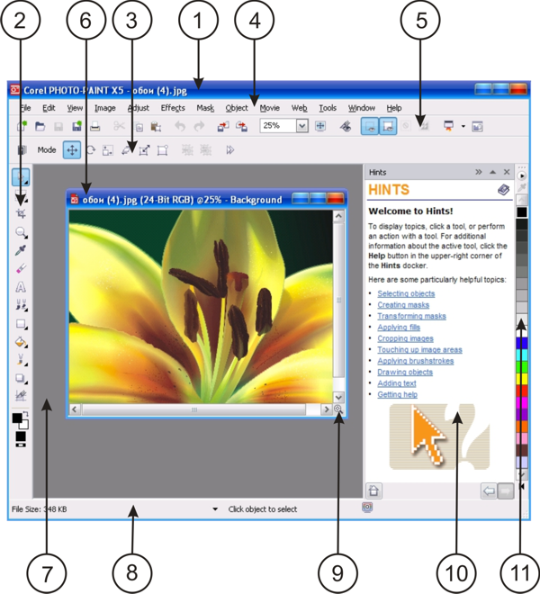

# Главное окно приложения Corel PHOTO-PAINT

Когда вы открываете один из растровых документов, он размещается в отдельном окне документа, которое находится внутри главного окна программы.

Главное окно PHOTO-PAINT содержит следующие основные элементы:

1.  **Строка заголовка**. В строке заголовка отображается название самого приложения и имя открытого в данный момент файла.
2.  **Toolbox** (Набор инструментов). Панель Toolbox содержит инструменты, с помощью которых в среде PHOTO-PAINT собственно и выполняется основная часть всей работы над изображением.
3.  **Property Bar** (Панель свойств). Это контекстно зависимая панель, состав которой меняется в зависимости от выбранного вами инструмента.
4.  **Menu Bar** (Строка меню). Этот элемент основного окна программы имеет стандартный и привычный для всех пользователей вид, что в свою очередь значительно облегчает знакомство с PHOTO-PAINT для начинающих пользователей.
5.  **Панель Standard** (Стандартная панель инструментов). Набор команд на этой панели типичен для большинства программ, работающих в среде Windows (за исключением нескольких кнопок, имеющихся только в программе PHOTO-PAINT).
6.  **Title bar** (Строка заголовка окна изображения). В строке заголовка отображается кроме названия самого документа еще и информация о цветовой модели изображения. На рис. 1.7\. видно, что открытое изображение имеет цветовую модель RGB.
7.  **Image Window** (Окно документа). Каждый открываемый документ в PHOTO-PAINT, открывается в своем собственном окне, структура которого также является стандартной для большинства приложений, работающих в среде Windows.
8.  **Status bar** (Строка состояния). Область, в которой отображается информация об изображении, системная информация и советы.
9.  **Navigator** (Навигатор). Кнопка, которая позволяет вам просматривать изображение целиком, чтобы сфокусировать окно изображения на определённой области. Navigator (Навигатор) доступен только тогда, когда все изображение невозможно просмотреть в окне документа.
10.  **Docker** (Докер). Окно, обеспечивающее доступ к дополнительным командам и информации об изображении. Докеры Hints (Советы) и Objects (Объекты) отображаются по умолчанию.
11.  **Color palette** (Цветовая палитра). Предназначена для выбора цвета краски (Foreground color), цвета фона (Background color) и цвета заливки (Fill).

_Новшеством в новой версии стал еще один элемент — окно **Image Palette** (Палитра Документа) для выбора цвета непосредственно из открытого изображения._

Рассмотрим вкратце перечисленные выше элементы главного окна программы. Мы не будем слишком скрупулезно и дотошно изучать эти элементы в данном разделе книги. На мой взгляд в этом нет особой надобности, т. к. подробное описание любого из элементов, когда еще нет представления о его возможностях и способах применения, только занимает время и совершенно не откладывается в памяти. Особенности каждого элемента или инструмента будут описаны в соответствующих разделах книги, а об их использовании будет рассказано на примерах.