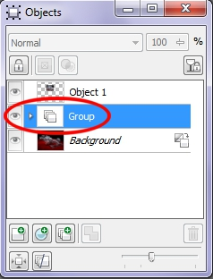
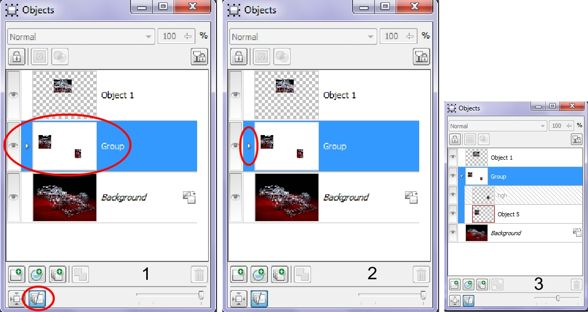

# Группирование и объединение объектов в Photo-Paint

### Группирование

Группирование объектов позволяет выделять и трансформировать их как единый объект. При выделении одного элемента группы появляется единое окно подсветки всей группы. В докере **Objects** (Объекты) миниатюры объединенных в группу объектов отображаются в виде стопки объектов (рис. 1). Группе объектов автоматически присваивается название – **Group** (Группа).

Если вас не устраивает вид миниатюры по умолчанию, в виде стопки, вы можете изменить ее вид в докере, нажав кнопку **Groups View Mode** (Режим просмотра групп), в нижней части докера (рис. 2 (1)).

Кроме этого, вы при желании можете просмотреть, какие объекты входят в состав группы, щелкнув на миниатюрном значке, между значком в виде глаза и миниатюрой группы (рис. 2 (2)). Группа в докере «развернется» в виде древовидной структуры, отобразив входящие в нее объекты (рис. 2 (3)).

После объединения объектов в группу любая команда или операция, примененная к группе, воздействует на все объекты группы. Группу можно удалить или скопировать в буфер. Помимо этого, к ней можно применить наклон, вращение, отражение, а также изменить ее масштаб, исказить или придать перспективу.  
Объединение объектов в группу легко отменить, тогда можно индивидуально выделять и редактировать каждый объект.

**Для группирования объектов:**

1\. В панели **Toolbox** (Набор инструментов) выберите инструмент **Object Pick** (Указатель объектов).  
2\. Нажав клавишу **Shift**, щелкните на каждом объекте, который хотите выделить.  
3\. Выполните команду **Object > Arrange > Group** (Объект > Упорядочить > Сгруппировать).  
Эти же действия можно выполнить в докере **Objects** (Объекты), после выделения объектов, щелкнуть на них правой кнопкой мыши и выбрать в меню команду **Group** (Сгруппировать).

**Для добавления объекта к существующей группе:**

1\. Выделите группу объектов.  
2\. Нажмите клавишу **Shift**, и щелкните на объекте, который хотите добавить к группе.  
3\. Выполните команду **Object > Arrange > Group** (Объект > Упорядочить > Сгруппировать).  
Две или более существующих групп можно объединить в одну, представляющую собой единое целое.

**Разгруппирование объектов:**

1\. В панели **Toolbox** (Набор инструментов) выберите инструмент **Object Pick** (Указатель объектов).  
2\. Щелкните на одном из объектов в группе  
Группа выделена.  
3\. Выполните команду **Object > Arrange > Ungroup** (Объект > Упорядочить > Разгруппировать).  
Эту же команду можно найти в контекстном меню группы, в докере **Objects** (Объекты).  
Объекты разгруппированы, но все они пока выделены. Чтобы убрать манипуляторы щелкните вне пределов группы. Теперь можно выделять и редактировать отдельные объекты.

### Объединение

Объекты можно слить или объединить с фоном изображения или друг с другом. При слиянии объекта с изображением объект уже не «плавает» над ним, а становится его частью в том месте, где находился в данный момент. Теперь объект уже нельзя выделить и редактировать как от-дельный объект. Обычно объединение объектов производится, если их состояние полностью удовлетворительно, или если были вставлены данные из буфера, которые нужно ввести в изображение.

Объединение двух или более объектов превращает их в единый объект. Новый объект по-прежнему ограничен выделяющей рамкой, однако исходные объекты, используемые для его создания, самостоятельно уже нельзя выделить. Размер файла изображения при объединении объектов уменьшается.

Для объединения объектов с фоном или с другими объектами можно выбрать любой режим наложения. Режим наложения определяет, каким образом объединяется цвет пикселей сливаемых объектов или как цвет пикселей объекта объединяется с цветом расположенных под ними пикселей фона изображения.

**Для объединения объектов друг с другом:**

1\. В панели **Toolbox** (Набор инструментов) выберите инструмент O**bject Pick** (Указатель объектов).  
2\. Нажав клавишу **Shift**, щелкните на каждом подлежащем объединению объекте.  
3\. Выполните команду (при необходимости) **Window > Dockers > Objects** (Окно > Окна настройки > Объекты) или нажмите комбинацию клавиш **Ctrl + F7**.  
4\. Щелкните на значке в виде глаза около фона изображения, чтобы он стал невидимым. Если в выделенных объектах нет перекрывающихся областей, переходите к пункту 5.  
5\. В докере **Objects** (Объекты), в раскрывающемся списке **Merge mode** (Режим слияния) выберите режим наложения.  
Выбранный режим объединения будет применен к перекрывающимся частям объединяемых объектов.  
6\. Если нужно изменить степень прозрачности объектов, установите значение в поле **Opacity** (Непрозрачность). Объекты в окне изображения отображают выбранную степень прозрачности.  
7\. Выполните команду **Object > Combine > Combine Objects Together** (Объект > Объединить > Объединить объекты).  
Теперь выделенные объекты постоянно объединены в один объект.

Объединенные объекты, как любые другие объекты можно перемещать, трансформировать, менять их размер с помощью команд меню **Object** (Объект) или средств управления Панели свойств инструмента **Object Pick** (Указатель объектов).

### Объединение объекта с фоновым изображением

Объединение объектов с фоновым изображением производится в финальной стадии работы, когда их вид точно соответствует тому, что вы хотите в конечном счете получить. Эта процедура исключает риск случайного перемещения объекта. Используя любой из режимов объединения можно воздействовать на то, как будет выглядеть объединение объектов и фонового изображения. Режимы объединения недоступны для объединения черно-белых и цветных изображений.

**Для выбора режима слияния:**

1\. Выполните команду (при необходимости) **Window > Dockers > Objects** (Окно > Окна настройки > Объекты) или нажмите комбинацию клавиш **Ctrl + F7**.  
2\. Выделите объект, щелкнув на его миниатюре.  
3\. В раскрывающемся списке **Merge mode** (Режим слияния) щелкните на режиме слияния.  
В окне изображения цвета объекта изменяются, демонстрируя эффект действия выбранного режима наложения. Это только предварительный просмотр. На этой стадии объект еще не объединен, выделяющая рамка вдоль его контура пока видна, а в докере **Objects** (Объекты) все еще присутствует его миниатюра.

**Для объединения объекта с фоном:**

1\. Выделите объект.  
2\. Выполните команду (при необходимости) **Window > Dockers > Objects** (Окно > Окна настройки > Объекты) или нажмите комбинацию клавиш **Ctrl + F7**.  
Для объединения за один раз нескольких объектов выделите их, нажав клавишу **Shift**.  
3\. Выберите режим наложения в раскрывающемся списке **Merge mode** (Режим слияния).  
4\. Если нужно изменить уровень прозрачности объектов, установите значение в поле **Opacity** (Непрозрачность).  
5\. В окне изображения объект отображает выбранный уровень прозрачности.  
6\. Выполните команду **Object > Combine > Combine Objects With Background** (Объект > Объединить > Объединить объекты с фоном).  
С помощью выбранного режима слияния и выбранного в докере **Objects** (Объекты) уровня прозрачности объект становится частью изображения.

**Для объединения с фоном всех объектов изображения:**

Выполните команду **Object > Combine > Combine All Objects With Background** (Объект > Объединить > Объединить все объекты с фоном).