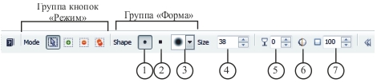
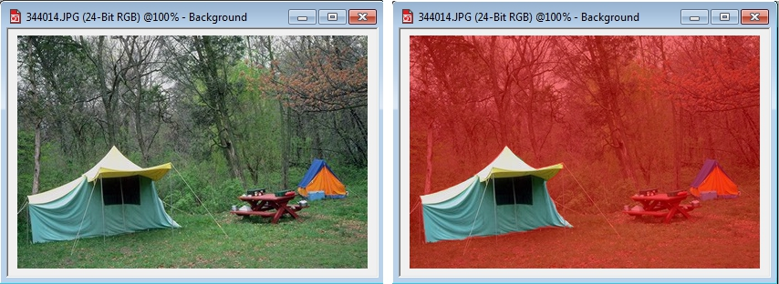

# Инструмент Brush Mask (Маска кисти)

В Photo-Paint для выделения областей произвольной формы есть еще один инструмент – **Brush Mask** (Маска кисти). Опять же, русифицированный вариант названия этого инструмента оставляет желать лучшего. Поэтому в дальнейшем я буду его называть **_Выделение кистью_**, за исключение случаев, когда речь будет идти о командах, где будет использоваться официальное название. Вообще, **_Выделение кистью_** это один из моих любимых инструментов выделения. Гибкость этого инструмента обусловлена тем, что вы можете изменять его размер и форму в широких пределах. Использование этого инструмента напоминает раскрашивание детских «разукрашек», где нужно закрасить цветом определенную часть картинки. Точно также, для выделения определенной области в изображении, нужно ее «закрасить» инструментом Выделение кистью. Инструмент **_Выделение кистью_** очень напоминает инструмент **Paint** (Кисть), только вместо рисования, он создает выделенную область.

Панель свойств инструмента **_Выделение кистью_** представлена на рис. 1.

Как видно из рис. 1, инструменту **_Выделение кистью_** присущи элементы управления характерные, как для инструментов маски, так и для инструмента **Paint** (Кисть):

1\. Кнопка **Round nib** (Круглый кончик) – позволяет переключать инструмент на круглую форму кисти.

2\. Кнопка **Square nib** (Квадратный кончик) – позволяет переключать инструмент на квадратную форму кисти.

3\. Раскрывающийся список **Nib shape** (Форма кончика) – позволяет выбрать форму кисти из набора входящего в состав Photo-Paint. Если вы создали и сохранили свою кисть, она будет также включена в этот список.

4\. Счетчик **Nib Size** (Размер кончика) – задает размеры кисти.

5\. Счетчик **Transparency** (Прозрачность) – задает степень прозрачности выделения.

6\. Кнопка **Anti-aliasing** (Сглаживание) – включает и отключает режим сглаживания, который предотвращает появление зазубренных границ по краям выделения.

7\. Счетчик **Feather** (Размытие) – позволяет задать величину размытия краев выделенной области.

**Для создания выделения при помощи кисти сделайте следующее:**

1\. Откройте всплывающее меню группы инструментов **Mask Tools** (Инструменты маски) на панели **Toolbox** (Набор инструментов) и выберите инструмент **Brush Mask** (Маска кисти).

2\. На Панели свойств выберите режим выделения **Additive mode** (Аддитивный режим) (при необходимости).

3\. Закрасьте кистью нужную для выделения область.

Рамка выделения и выбранная область будут расширяться после каждого мазка кистью.  
Для настройки размера и формы кисти, установите нужные параметры на Панели свойств или в докере **Brush Settings** (Настройки кисти). Также можно изменить размер кончика кисти инструмента **_Выделение кистью_**, удерживая нажатой клавишу **Alt** и перетаскивая курсор в окне изображения до получения нужного размера кончика.

С помощью инструмента **_Выделение кистью_** можно наносить прямые мазки кистью. Для этого нажмите и удерживайте нажатой клавишу **Ctrl** после начала перетаскивания курсора в окне изображения. Удерживая нажатой клавишу **Ctrl**, можно нажать и отпустить клавишу **Shift** для переключения между горизонтальными и вертикальными мазками кисти.

Как видно из рис. 2, инструментом **_Выделение кистью_** можно выделять объекты произвольной формы с криволинейными краями. Во время выделения сложных объектов, часто возникает ситуация, когда вы можете выйти за края объекта и выделить лишнее. Поэтому при работе с инструментом **_Выделение кистью_** приходится часто переключаться между режимами **Additive mode** (Аддитивный режим) и **Subtractive mode** (Режим вычитания). Однако после приобретения определенных навыков, вы сможете быстро создавать сложные маски.

В заключение следует отметить, что инструментом **_Выделение кистью_** можно создавать маски с плавными краями, но выделить объект с краями зубчатой формы, например, башни или крыши соборов, практически невозможно. В этих случаях приходится комбинировать различные инструменты и способы выделения.