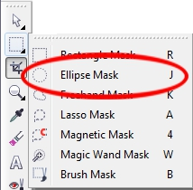
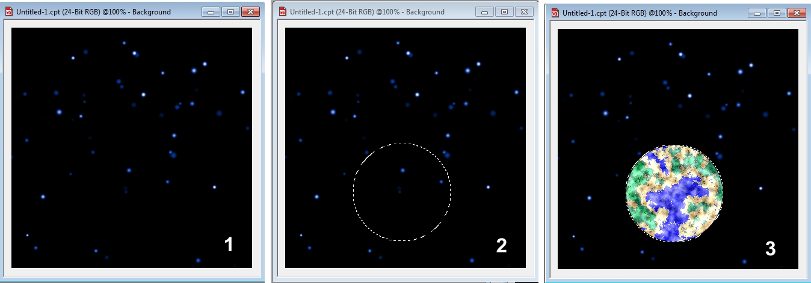
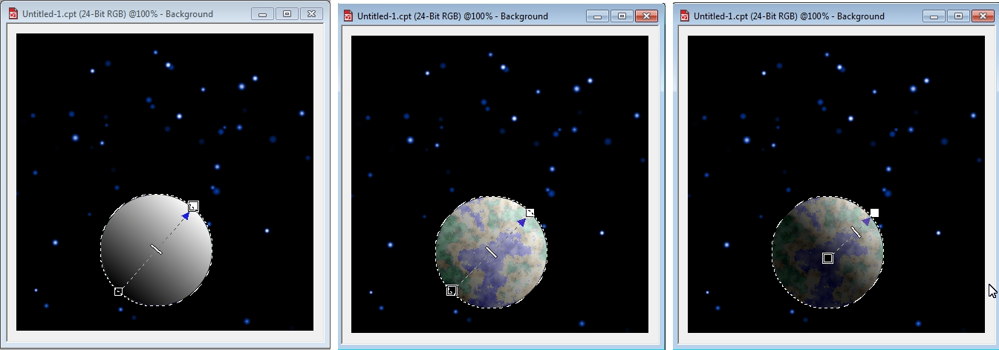

# Инструмент Ellipse Mask (Эллиптическая маска) в PHOTO-PAINT

Инструмент **Ellipse Mask** (Эллиптическая маска) находится в группе инструментов выделения на панели **Toolbox** (Набор инструментов). Этот инструмент второй по счету в этой группе (рис. 1). Этот инструмент практически одинаков по принципу работы с инструментом **Rectangle Mask** (Прямоугольная маска). Единственное отличие в том, что он создает маски круглой формы или в форме эллипса.

Также, как и в случае с инструментом **Rectangle Mask** (Прямоугольная маска), для создания редактируемой области правильной формы, нужно удерживать нажатой клавишу **Ctrl**. При этом будет создана маска в форме окружности, а при одновременном нажатии клавиши **Ctrl** и **Shift**, редактируемая область в виде окружности будет создаваться от центра. Важно помнить, что клавиши нужно нажать уже после того, как вы начнете создавать маску. Это важно потому, что нажатие клавиши **Ctrl** до начала выделения, просто переключит инструмент в режим **Subtractive mode** (Режим вычитания), а нажатие **Shift** в режим **Additive mode** (Аддитивный режим). Все остальные приемы работы точно такие же, как и с _Прямоугольной маской_.

Дополнительные отличительные особенности, это всего два стиля в списке **Style** (Стиль), а также – еще одна кнопка – **Anti-aliasing** (Сглаживание) на Панели свойств. Параметр **Anti-aliasing** (Сглаживание) служит для для скругления краев при использовании инструмента **Ellipse Mask** (Эллиптическая маска) с целью предотвращения появления зазубренных границ.

Инструмент **Ellipse Mask** (Эллиптическая маска), как и другие инструменты маски можно использовать не только для выделения каких-то объектов в изображении, но и при создании новых изображений.

Рассмотрим пример.  
1\. Создайте новый документ, размером 400х400 **пкс** (хотя можете выбрать любой другой размер) с белым фоном.

2\. На панели **Toolbox** (Набор инструментов), выберите инструмент **Fill** (Заливка). На Панели свойств нажмите кнопку **Texture** (Текстура), а потом кнопку **Edit fill** (Изменить заливку), чтобы открыть диалоговое окно **Texture Fill** (Заливка текстурой) и выбрать заливку.

3\. В раскрывающемся списке **Texture library** (Библиотека текстур), выберите **Samples 5** (Примепры 5), а в списке **Texture list** (Список текстур), текстуру **Night Sky** (Ночное небо). Нажмите **ОК**.

4\. Залейте изображение выбранной текстурной заливкой (рис. 2 (1)).

5\. Нажмите клавишу **J**, чтобы выбрать инструмент **Ellipse Mask** (Эллиптическая маска).

6\. Создайте круглую маску произвольного размера (для чего удерживайте при создании нажатой клавишу **Ctrl**), чуть ниже центра изображения. Значения параметров на Панели свойств оставьте без изменения (как по умолчанию) (рис. 2 (2)).

7\. Снова выберите инструмент **Fill** (Заливка), нажав клавишу **F**. Опять выберите на Панели свойств нажмите кнопку **Texture** (Текстура) и кнопку **Edit fill** (Изменить заливку).

8\. Теперь в диалоговом окне **Texture Fill** (Заливка текстурой), в списке библиотек, выберите **Styles** (Стили), а в списке **Texture list** (Список текстур), текстуру **Satellite Photography** (Спутниковая фотосъемка). Щелкните внутри выделенной области, чтобы залить ее (рис. 2 (3)).

9\. Теперь, нам нужно создать впечатление, тени на Земле. Для этого воспользуемся инструментом **Interactive Fill** (Интерактивная заливка). Нажмите клавишу **G**, чтобы выбрать инструмент **Interactive Fill** (Интерактивная заливка).

10\. На Панели свойств, в раскрывающемся списке **Fill type** (Тип заливки), выберите тип **Linear** (Линейная).

11\. Теперь примените заливку к выделенной области, т. е. к изображению Земли. Для этого перетащите мышь по диагонали от левого нижнего, до правого верхнего угла (рис. 3 (1)).

12\. Щелкните мышью на первом указателе заливки и при необходимости задайте черный цвет. В счетчике **Transparency** (Прозрачность) установите значение 9.

13\. Щелкните мышью на конечном указателе заливки и при необходимости задайте белый цвет. В счетчике **Transparency** (Прозрачность) установите значение 20 (рис. 3 (2)).

14\. Чтобы тень на Земле получилась реалистичной, перетащите начальный маркер ближе к центру Земли, а среднюю точку заливки, ближе к конечному указателю заливки (рис. 3 (3)).

15\. Выполните команду **Mask > Remove** (Маска > Удалить) для удаления маски.

Вы можете использовать свои значения прозрачности и по своему усмотрению менять другие настройки. Этот пример был приведен для того, чтобы показать один из способов применения **Ellipse Mask** (Эллиптической маски) и что использование масок расширяет возможности применения других инструментов. Рассматривать этот пример в разделе применения заливки, до изучения масок, на мой взгляд, было бы преждевременным.