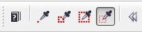

# Инструмент Eyedropper (Пипетка)

При помощи инструмента **Eyedropper** (Пипетка) вы можете определить в качестве цвета краски или фона, цвет выбранного пиксела или средний цвет группы выбранных пикселов изображения. Это хорошо при ретуши, т. к. позволяет устанавливать для рисующих инструментов цвет, максимально близкий к цветам изображения.

Инструмент **Eyedropper** (Пипетка) находится на панели **Toolbox** (Набор инструментов) и выглядит, как кнопка с нарисованной пипеткой. При его активизации, указатель мыши приобретает вид пипетки. Этот инструмент предназначен для взятия образца цвета прямо из изображения и имеет собственный вариант _Панели свойств_, на которой выбирают один из режимов взятия пробы цвета.

Размер области из которой будет взят образец цвета, определяется выбором на _Панели свойств_.

**Пипетка 1х1** – проба берется по цвету пиксела в месте щелчка.

**Пипетка 3х3** – проба берется из области размером 3х3 пикселя. В этом случае в качестве цвета берется усредненное значение цвета области.

**Пипетка 5х5** – проба берется из области размером 5х5 пикселей.

Режим **Select sample** (Выбор образца) рассчитывает пробу цвета как среднее от выделенной инструментом области изображения. Для определения участка следует протащить курсор инструмента. Определенный пипеткой цвет становится цветом краски. Чтобы задавать таким образом цвет заливки, выбирайте образец при нажатой правой кнопке мыши.