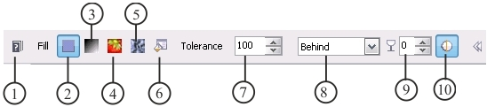
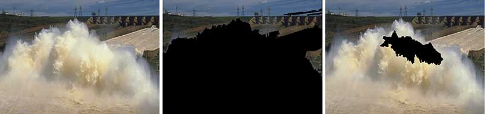
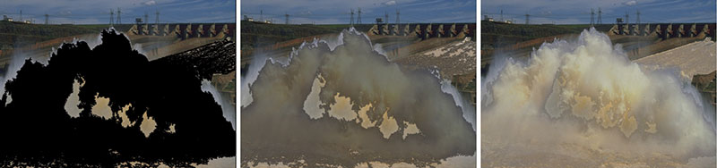
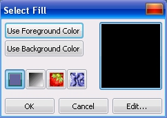
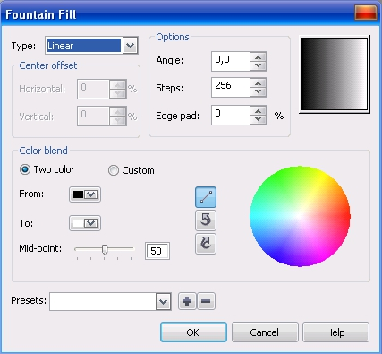
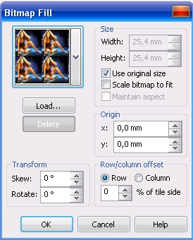
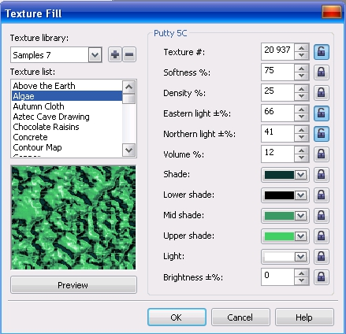
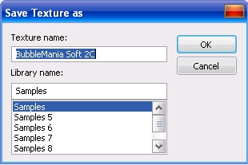

# Инструмент Fill (Заливка) в Corel PHOTO-PAINT

Набор инструментов для заливки в PHOTO-PAINT аналогичен средствам в CorelDRAW, хотя некоторые виды заливки отсутствуют, например **Mesh Fill**. Если вы работали с заливкой в CorelDRAW, то практически все элементы управления будут вам знакомы. В PHOTO-PAINT заливка представлена двумя основными инструментами, **Fill** (Заливка) и **Interactive Fill** (Интерактивная заливка). При работе по обработке фотографий, вы врядли будете часто использовать (а может не будете использовать вовсе) инструменты заливки. Однако при создании собственных изображений эти инструменты будете использовать чаще. В PHOTO-PAINT заливку можно применять не только к части изображения или к объекту, но и ко всему фону, что бывает очень полезно в некоторых случаях. Итак, давайте приступим к рассмотрению свойств этих инструментов.

Не смотря на то, что в PHOTO-PAINT имеется всего один инструмент для обычной заливки, в его состав включены несколько видов заливок, что делает этот инструмент универсальным при работе с заливками. Как и другие инструменты в PHOTO-PAINT, инструмент **Fill** (Заливка) имеет собственную Панель свойств. Именно на Панели свойств вы будете иметь доступ к различным типам заливки. Для активизации инструмента **Fill** (Заливка), щелкните на его кнопке на панели **Toolbox** (Набор инструментов). Панель свойств инструмента **Fill** (Заливка) представлена на рис. 1.

Ниже перечислены элементы управления на Панели свойств:

1\. Кнопка **Help** (Справка) – вызывает соответствующий раздел Справки.  
2\. Кнопка **Uniform** (Однородная) – в качестве текущего устанавливает тип заливки **Uniform** (Однородная);  
3\. Кнопка **Fountain** (Фонтанная) – в качестве текущего устанавливает тип заливки **Fountain** (Фонтанная). Данный вариант русского перевода слова _Fountain_, на мой взгляд не совсем удачен. Более предпочтительным и правильным, как мне кажется, было название _Градиентная_ заливка. В дальнейшем я буду использовать именно это название, за исключением случаев, когда речь будет идти о названиях окон или команд.  
4\. Кнопка **Bitmap** (Растровая) – в качестве текущего устанавливает тип заливки **Bitmap** (Растровая). В более ранних версиях PHOTO-PAINT этот тип заливки назывался Заливка растровым изображением, что больше соответствовало получаемым результатам.  
5\. Кнопка **Texture** (Текстура) – в качестве текущего устанавливает тип заливки **Texture** (Текстура);  
6\. Кнопка **Edit fill** (Изменить заливку) – открывает диалоговое окно соответствующее данному типу заливки, для изменения ее параметров.  
7\. Счетчик **Tolerance** (Допуск) – оказывает влияние на размер заливаемой области. Значения в счетчике указывает на отклонение цвета в диапазоне от 0 до 100\. Заливаемая область определяется следующим образом, нужно щелкнуть мышью на изображении и все пиксели, соседние с тем, на котором вы щелкнули мышью, и попавшие в область отклонения цвета, будут залиты. При установке значения равным 100 будет залита вся выделенная область, объект или изображение.  
8\. Раскрывающийся список **Merge mode** (Режим слияния) – служит для выбора режима наложения заливаемого цвета на изображение или фон.  
9\. Счетчик **Transparency** (Прозрачность) – задает значение прозрачности заливки.  
10\. Кнопка **Anti-aliasing** (Сглаживание) – предотвращает появление неровности краев.

Как говорилось ранее в книге, цвет заливки можно установить либо в области управления цветом, либо щелкнув правой кнопкой мыши на цветовой палитре.

На рис. 2 показано влияние значения счетчика **Tolerance** (Допуск) на размер заливаемой области. Как я уже говорил, при значении 100, заливается все изображение. В качестве цвета заливки был выбран черный. На рис. 2: _слева_ – исходное изображение; _по центру_ – значение **Tolerance** (Допуск) = 50; _справа_ – значение **Tolerance** (Допуск) = 10.

На рис. 3 показано влияние значения **Transparency** (Прозрачности). Исходное изображение было такое же, как на рис. 2, а значение **Tolerance** (Допуск) было принято равным 30:  
_слева_ – **Transparency** (Прозрачность) = 0; _по центру_ – **Transparency** (Прозрачность) = 50; _справа_ – **Transparency** (Прозрачность) = 80.

### Uniform fill (Однородная заливка)

Пример применения и изменения параметров Однородной заливки был показан на рис. 2 и 3\. Однако в данном случае использовался цвет заливки по умолчанию. Так как в _Однородной заливке_ используется только один цвет, то и ее изменение по большому счету, сводится лишь к выбору цвета. Выбрать цвет для однородной заливки можно несколькими способами (часть из которых нам уже известна):

*   выбрав цвет в цветовой палитре, щелкнув правой кнопкой мыши на нужном цвете;
*   нажав кнопку **Edit fill** (Изменить заливку) на Панели свойств;
*   сделав двойной щелчок на цвете заливки в области управления цветом;
*   выбрав цвет заливки в докере **Color** (Цвет).

Работу в докере **Color** (Цвет) мы рассматривали в предыдущей главе. При нажатии кнопки **Edit fill** (Изменить заливку) на Панели свойств, открывается диалоговое окно **Uniform Fill** (Однородная заливка). Это окно, по сути является окном **Select Color** (Выбор цвета), которое мы также рассматривали в предыдущей главе. Поэтому здесь рассматривать работу с этим диалоговым окном мы не будем. При двойном щелчке на цвете заливки в области управления цветом, появляется диалоговое окно **Select Fill** (Выбор заливки) (рис. 4).

С помощью кнопок **Use Foreground Сolor** (Использовать цвет переднего плана) и **Use Background Color** (Использовать цвет фона) можно задать в качестве цвета заливки цвет краски или фона соответственно. Четыре нижерасположенных кнопки соответствуют типам заливки. Справа расположено область просмотра текущего цвета заливки.

Для того, чтобы изменить текущий цвет заливки, щелкните кнопку **Edit** (Изменить). В результате откроется тоже самое диалоговое окно **Uniform Fill** (Однородная заливка), в котором вы можете выбрать нужный цвет.

### Fountain fill (Фонтанная заливка)

Чтобы использовать градиентную заливку, при активном инструменте **Fill** (Заливка), щелкните кнопку **Fountain** (Фонтанная) на Панели свойств. Состав Панели свойств при этом остается неизменным. Градиентная заливка, в отличие от Однородной, использует два цвета. По умолчанию, это черный и белый. Чтобы изменить заливку, нужно щелкнуть кнопку **Edit fill** (Изменить заливку) на Панели свойств или дважды щелкнуть на значке заливки в области управления цветом. В первом случае откроется диалоговое окно **Fountain Fill** (Фонтанная заливка), а во втором – диалоговое окно **Select Fill** (Выбор заливки) (рис. 4). Нажатие кнопки **Edit** (Изменить) в диалоговом окне **Select Fill** (Выбор заливки), также приведет к появлению окна **Fountain Fill** (Фонтанная заливка) (рис. 5).

В отличие от Однородной заливки, Градиентная имеет пять типов заливки, выбор которых осуществляется в раскрывающемся списке **Type** (Тип). При выборе любого типа градиентной заливки, кроме типа **Linear** (Линейной), приводит к активизации счетчиков в области **Center offset** (Сдвиг центра). Устанавливая значения в счетчиках **Horizontal** (По горизонтали) и **Vertical** (По вертикали), вы можете указать новое положение центра градиентной заливки. В области просмотра, в правой части окна, вы можете видеть как влияют изменения параметров на заливку, что позволяет сделать необходимые настройки перед внесением изменений в изображение.

В области **Options** (Параметры) расположены три счетчика, в которых вы можете задать: **Angle** (Угол) – для **Linear** (Линейной) и **Conical** (Конической) заливок; **Steps** (Шаги) – для всех типов заливок; **Edge pad** (Сдвиг края) – для всех типов заливок, кроме **Conical** (Конической). Параметр **Angle** (Угол), задает угол, под которым будет производится заливка; параметр **Steps** (Шаги), определяет (количество градаций) плавность перехода от одного цвета к другому, чем больше значение, тем более плавным будет переход; параметр **Edge pad** (Сдвиг края), задает ширину зон начального и конечного цветов в заливке (в %).

Область **Color blend** (Цветовой переход) содержит элементы управления градиентом цветов в заливке. Для задания градиента цветов, переходящих от одного цвета к другому по цветовому кругу, установите переключатель **Two color** (Двухцветный) и выберите начальный и конечный цвета с помощью указателей цвета **From** (От) и **To** (К). Определите промежуточные цвета, нажав одну из кнопок выбора пути изменения цвета в цветовом круге. Если выбирается по прямой, то промежуточные цвета в заливке изменяются по прямой линии в цветовом круге. Выбор по часовой стрелке и против часовой стрелки указывает направление изменения цвета в цветовом круге. Если задано изменение цвета по прямой, то перемещением ползунка **Mid-point** (Центр) можно установить цвет в средней точке градиента.

Для того чтобы создать градиент собственных цветов, установите переключатель **Custom** (Настройка). Дважды щелкните один из значков конечных точек над окном просмотра цветового градиента и переместите его на линейке градиента. Щелкнув мышью в указателе цвета, добавьте к цветовому переходу новый цвет.

В нижней части окна находится раскрывающийся список **Presets** (Заготовки), в котором вы можете выбрать нужный вам образец градиентной заливки. Вы можете также добавить в качестве заготовки свой образец заливки, для чего щелкните кнопку **Добавить**, кнопка со знаком «**+**». Если вам заготовка уже не нужная, ее можно удалить из списка, нажав кнопку Удалить, кнопка со знаком «**—**».

### Bitmap fill (Растровая заливка)

Еще один тип заливки, имеющийся в вашем распоряжении – **Bitmap Fill** (Растровая заливка). Для выбора этого типа заливки выполняются аналогичные действия, как и при выборе других типов. Для настройки параметров Растровой заливки служит окно **Bitmap Fill** (Растровая заливка) (рис. 6).

Диалоговое окно **Bitmap Fill** (Растровая заливка) содержит все необходимые элементы управления для импорта, выделения и настройки растровых заливок. Можно подогнать узор под размер изображения и залить изображение одним большим элементом мозаики, или изменить размер, количество и смещение элементов мозаики в заливке в соответствии с конкретными требованиями. Для заливок рекомендуется использовать несложные растровые изображения.

Для того, чтобы использовать выбранный образец для заливки, выберите его из раскрывающегося списка и нажмите **ОК**. В этом случае будет применена заливка с настройками по умолчанию.  
Для импорта заливки растровым изображением в диалоговом окне **Bitmap Fill** (Растровая заливка) нажмите кнопку **Load** (Загрузить) и в открывшемся диалоговом окне **Load Bitmap Fill** (Загрузка растровой заливки) выберите файл с растровым изображением.

Для того чтобы настроить размер и контур элементов мозаики в заливке растровым изображением, нажмите на Панели свойств кнопку **Edit fill** (Изменить заливку), откроется диалоговое окно **Bitmap Fill** (Растровая заливка). Выполните любые из следующих действий:

*   Для того чтобы задать размер элемента мозаики сбросьте флажок **Use original size** (Использовать исходный размер) и введите значения в полях **Width** (Ширина) и **Height** (Высота). Для сохранения пропорций растрового изображения, установите флажок **Maintain aspect** (Сохранять пропорции).
*   Для того чтобы задать смещение первого элемента мозаики, в области **Origin** (Начало ко-ординат) введите значения в полях **x** и **y**. Смещение определяется по левому верхнему углу области заливки.
*   Для задания значения сдвига строк и столбцов плиток от центра, в области **Row/column offset** (Сдвиг строк/столбцов) введите значения в счетчике **% of tile side** (% от размера).
*   Для наклона или поворота плиток, в области **Transform** (Преобразовать), установите значения в счетчиках **Skew** (Наклон) или **Rotate** (Поворот) соответственно.
*   Для того чтобы залить изображение одним большим элементом мозаики, установите флажок **Scale bitmap to fit** (Подгонять масштаб).

### Texture Fill (Текстурная заливка)

Активизируйте инструмент **Fill** (Заливка) и нажмите на Панели свойств кнопку **Texture** (Текстура). Для получения доступа к диалоговому окну **Texture Fill** (Заливка текстурой), щелкните на кнопке **Edit fill** (Изменить заливку) на Панели свойств. Диалоговое окно **Texture Fill** (Заливка текстурой) (рис. 7) предоставляет возможности выбора текстур для просмотра и настройки разнообразными способами. Здесь можно выбрать стиль текстуры, разблокировать и изменить любые параметры текстуры. Щелкните мышью **Preview** (Просмотр) и наблюдайте результаты изменения текстуры, основанные на заданных параметрах.

Для настройки и сохранения текстурной заливки выполните следующие действия:

*   Откройте диалоговое окно **Texture Fill** (Заливка текстурой).
*   Выберите библиотеку текстур в раскрывающемся списке **Texture library** (Библиотека текстур).
*   Выберите текстуру в списке **Texture list** (Список текстур).
*   Если замок рядом с атрибутом текстуры, который хотите изменить, заперт, щелкните на нем мышью, переведя его в отрытое положение.
*   Установите требуемое значение атрибута или щелкните мышью **Preview** (Просмотр), при этом атрибут изменится случайным образом.
*   Нажмите кнопку **Добавить заливку**, кнопка со знаком «**+**». Откроется диалоговое окно **Save Texture as** (Сохранение текстуры) (рис. 8).
*   Введите имя в поле **Texture name** (Имя текстуры) и выберите библиотеку в списке **Library name** (Имя библиотеки), в которую хотите включить новую текстуру.

Текстурные заливки масштабируются в соответствии с размером изображения или областью изображения, для которой они применяются.