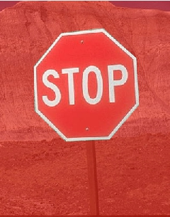

# Инструмент Freehand Mask (Маска свободной формы) в PHOTO-PAINT

Далеко не все объекты характеризуются геометрической формой, такой как круг или квадрат. Для создания выделенных областей неправильной геометрической формы целесообразно использовать инструмент **Freehand Mask** (Маска свободной формы), находящийся в группе инструментов выделения на панели **Toolbox** (Набор инструментов). Панель свойств этого инструмента содержит элементы управления аналогичные элементам Панели свойств инструмента **Ellipse Mask** (Эллиптическая маска), за исключением списка стилей и счетчиков для задания размеров выделенной области.

Техника создания маски с помощью инструмента **Freehand Mask** (Маска свободной формы) отличается от рассмотренных выше методик для _Прямоугольной_ и _Эллиптической_ масок. При создании выделения сложной формы можно комбинировать отрезки прямых и кривых линий. Если используются только отрезки линий, то для создания выделения требуется задание только трех точек.

Для создания выделенной области произвольной формы выполните следующие шаги:

1\. Выберите инструмент **Freehand Mask** (Маска свободной формы) на панели **Toolbox** (Набор инструментов).

2\. Выберите режим **Normal mode** (Обычный режим).

3\. В счетчике **Feather edge** (Край размытия) на Панели свойств введите значение ширины размытия в пикселях (необязательно).

4\. В окне изображения щелкните мышью в месте начала рисования рамки.

5\. Затем выполните следующее:  
• Для создания отрезка прямой между новой точкой и точкой, определенной на предыдущем шаге, переместите курсор в другое место и щелкните мышью.  
• Для рисования произвольного отрезка кривой, удерживая кнопку, перетащите мышь.

6\. Используя один из вышеперечисленных методов, повторите шаг 5, пока не будет завершено создание выделения. Попеременно пользуясь двумя методами, можно создать комбинированное выделение, состоящее из отрезков как прямых линий, так и произвольных кривых.  
Для присоединения отрезка прямой линии к отрезку произвольной кривой, нарисуйте произвольную кривую и отпустите кнопку мыши там, откуда нужно начать отрезок прямой линии, а затем переместите курсор в точку, где нужно закончить отрезок прямой и щелкните.

7\. Чтобы закончить создание выделения, дважды щелкните кнопкой мыши или выполните один щелчок при нажатой клавише **Alt**.

Если точка, в которой произведен двойной щелчок мышью по завершении создания формы выделения, не соприкасается с первой точкой, то Corel PHOTO-PAINT автоматически соединяет точки отрезком прямой, чтобы выделение было замкнутым. Пример использования инструмента **Freehand Mask** (Маска свободной формы) приведен на рис. 1.

Для создания прямолинейных участков, удерживайте нажатой клавишу **Ctrl** при создании рамки.